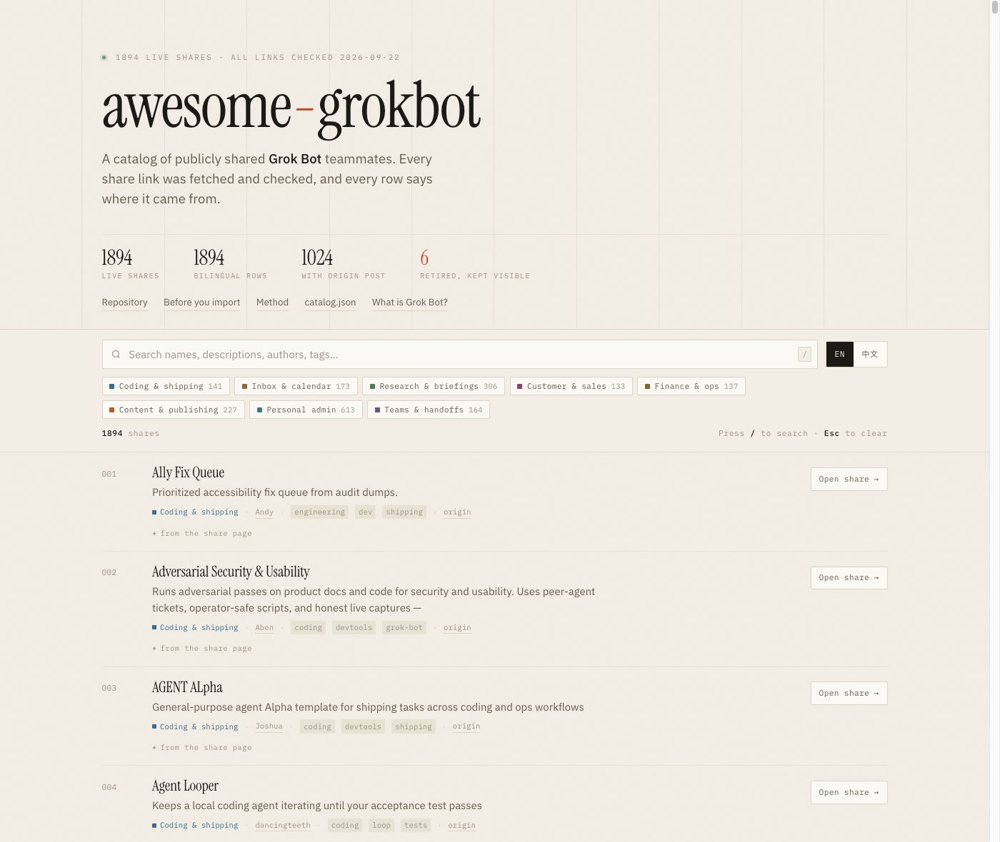

<h1 align="center">awesome-grokbot</h1>

<h3 align="center">730 live <code>x.ai/bot</code> shares for Grok Bot. Every link status-checked. Every row attributed to where it came from.</h3>

  
  
  
  
  
  
  

  <strong>English</strong> | <a href="./README.zh-CN.md">简体中文</a>

> [Grok Bot](https://docs.x.ai/grok-bot/overview) gives named AI teammates their own always-on cloud computer. This repo is not Grok Bot, not an installer, and not source code — it is the index of public bot configurations you can preview on `x.ai` and add to your own account in one click.

## ⚡️ What's different

<table>
  <tr><td align="right"><b>730</b></td><td>live shares, every link fetched on 2026-09-10 — not copied from another list</td></tr>
  <tr><td align="right"><b>daily</b></td><td>re-checked and synced against four upstream catalogs by <a href=".github/workflows/daily-update.yml">a scheduled job</a>, not a one-off scrape</td></tr>
  <tr><td align="right"><b>5</b></td><td>dead links quarantined in <a href="retired.json"><code>retired.json</code></a>, not left rotting in place</td></tr>
  <tr><td align="right"><b>730</b></td><td>rows with a hand-written Chinese summary</td></tr>
  <tr><td align="right"><b>730</b></td><td>rows naming the catalog they came from — 566 also link the original post</td></tr>
  <tr><td align="right"><b>42</b></td><td>rows whose name had drifted from the live page, kept searchable as <code>aka</code></td></tr>
</table>

Names and blurbs are read from the live share page, not from another catalog. How the catalog was built, and what it does **not** verify: [docs/method.md](docs/method.md).

## 🌐 Browse it as a site

  

  <a href="https://kydlikebtc.github.io/awesome-grokbot/"><strong>kydlikebtc.github.io/awesome-grokbot</strong></a> 
  Instant search over all 730 rows · eight category filters · EN/中文 · shareable filtered URLs · no build step, no tracking, no cookies

**Every filter lives in the URL.** These links open a pre-filtered view — and stay shareable:

  <a href="https://kydlikebtc.github.io/awesome-grokbot/#cat=coding-shipping">🛠️ Coding&nbsp;&amp;&nbsp;shipping <b>68</b></a> · <a href="https://kydlikebtc.github.io/awesome-grokbot/#cat=inbox-calendar">📥 Inbox&nbsp;&amp;&nbsp;calendar <b>34</b></a> · <a href="https://kydlikebtc.github.io/awesome-grokbot/#cat=research-briefings">🔍 Research&nbsp;&amp;&nbsp;briefings <b>126</b></a> · <a href="https://kydlikebtc.github.io/awesome-grokbot/#cat=customer-sales">🤝 Customer&nbsp;&amp;&nbsp;sales <b>37</b></a> 
  <a href="https://kydlikebtc.github.io/awesome-grokbot/#cat=finance-ops">💰 Finance&nbsp;&amp;&nbsp;ops <b>48</b></a> · <a href="https://kydlikebtc.github.io/awesome-grokbot/#cat=content-publishing">✍️ Content&nbsp;&amp;&nbsp;publishing <b>101</b></a> · <a href="https://kydlikebtc.github.io/awesome-grokbot/#cat=personal-admin">🏠 Personal&nbsp;admin <b>211</b></a> · <a href="https://kydlikebtc.github.io/awesome-grokbot/#cat=teams-handoffs">🧭 Teams&nbsp;&amp;&nbsp;handoffs <b>105</b></a>

## 📖 Quick links

| Go to | For |
| --- | --- |
| 🌐 [**Browse as a site**](https://kydlikebtc.github.io/awesome-grokbot/) | Search and filter all 730 rows in the browser |
| 📦 [`catalog.json`](catalog.json) | All 730 live entries, schema-validated |
| 🪦 [`retired.json`](retired.json) | 5 shares that stopped resolving |
| 🔐 [Before you import](docs/vetting.md) | Safety checklist. Read this before adding anything |
| 🧪 [Data & method](docs/method.md) | How the catalog was built and how to reproduce it |
| 🤖 [Scout routine](docs/routine.md) | A Grok Bot routine that finds new shares on X, first-hand |
| 🙏 [Sources & credits](docs/sources.md) | Upstream catalogs this merges, with licences |
| 🤝 [Contributing](CONTRIBUTING.md) | Add a bot in one JSON object |

## 🚀 How to use

1. [Install Grok Bot](https://docs.x.ai/grok-bot/get-started) on Mac, Windows or iPhone. There is no official Linux desktop build — the bot's own computer is already Linux, in the cloud.
2. Open any share link below and read the public preview **before** you add it.
3. Press **Add to Grok Bot**. That copies the name, instructions, skills, routines and first-party plugin ids.
4. It does **not** copy the author's computer, files, logins or API keys. Reconnect connectors yourself, one at a time.
5. Run one read-only task first. Only then enable routines or anything that writes.

> [!WARNING]
> A community share is untrusted third-party software. All bots on one account **share a single computer** — a second bot is not a security boundary. Full checklist: [docs/vetting.md](docs/vetting.md).

## 🗂️ Categories

<table>
  <tr>
    <td width="25%" valign="top">
<strong><a href="#cat-coding-shipping">🛠️ Coding &amp; shipping</a></strong> 68 bots
Write code, review PRs, babysit coding agents, keep the box healthy.  <a href="https://kydlikebtc.github.io/awesome-grokbot/#cat=coding-shipping">filter on the site ↗</a></td>
    <td width="25%" valign="top">
<strong><a href="#cat-inbox-calendar">📥 Inbox &amp; calendar</a></strong> 34 bots
Triage mail, draft replies, defend the calendar, run the weekday rhythm.  <a href="https://kydlikebtc.github.io/awesome-grokbot/#cat=inbox-calendar">filter on the site ↗</a></td>
    <td width="25%" valign="top">
<strong><a href="#cat-research-briefings">🔍 Research &amp; briefings</a></strong> 126 bots
Watch a beat, verify claims, and hand back one short brief.  <a href="https://kydlikebtc.github.io/awesome-grokbot/#cat=research-briefings">filter on the site ↗</a></td>
    <td width="25%" valign="top">
<strong><a href="#cat-customer-sales">🤝 Customer &amp; sales</a></strong> 37 bots
Prospecting, outbound drafts, call support, and account follow-through.  <a href="https://kydlikebtc.github.io/awesome-grokbot/#cat=customer-sales">filter on the site ↗</a></td>
  </tr>
  <tr>
    <td width="25%" valign="top">
<strong><a href="#cat-finance-ops">💰 Finance &amp; ops</a></strong> 48 bots
Receipts, subscriptions, invoices, spend audits, and back-office chores.  <a href="https://kydlikebtc.github.io/awesome-grokbot/#cat=finance-ops">filter on the site ↗</a></td>
    <td width="25%" valign="top">
<strong><a href="#cat-content-publishing">✍️ Content &amp; publishing</a></strong> 101 bots
Drafting, editing, design, video, and the queue that ships it.  <a href="https://kydlikebtc.github.io/awesome-grokbot/#cat=content-publishing">filter on the site ↗</a></td>
    <td width="25%" valign="top">
<strong><a href="#cat-personal-admin">🏠 Personal admin</a></strong> 211 bots
Groceries, household logistics, family schedules, health, and shopping.  <a href="https://kydlikebtc.github.io/awesome-grokbot/#cat=personal-admin">filter on the site ↗</a></td>
    <td width="25%" valign="top">
<strong><a href="#cat-teams-handoffs">🧭 Teams &amp; handoffs</a></strong> 105 bots
Bots that run other bots: rosters, delegation, budgets, and handoffs.  <a href="https://kydlikebtc.github.io/awesome-grokbot/#cat=teams-handoffs">filter on the site ↗</a></td>
  </tr>
</table>

| Category | Bots |
| --- | ---: |
| [🛠️ Coding & shipping](#cat-coding-shipping) | 68 |
| [📥 Inbox & calendar](#cat-inbox-calendar) | 34 |
| [🔍 Research & briefings](#cat-research-briefings) | 126 |
| [🤝 Customer & sales](#cat-customer-sales) | 37 |
| [💰 Finance & ops](#cat-finance-ops) | 48 |
| [✍️ Content & publishing](#cat-content-publishing) | 101 |
| [🏠 Personal admin](#cat-personal-admin) | 211 |
| [🧭 Teams & handoffs](#cat-teams-handoffs) | 105 |
| **Total** | **730** |

## 🛠️ Coding & shipping

*Write code, review PRs, babysit coding agents, keep the box healthy.* — 68 bots

- [Agent Looper](https://x.ai/bot/AETdGbRRNWfckrRGv22LD) — Keeps a local coding agent iterating until your acceptance test passes. by [dancingteeth](https://x.com/dancingteeth) · [origin](https://x.com/dancingteeth/status/2093868415542845628)
- [Agent Smith](https://x.ai/bot/JcFj23aaufNWkuiiJTX0j) — A janitor for multi-bot workspaces that stops cruft piling up. by [Chip](https://x.com/chiplay) · [origin](https://x.com/chiplay/status/2093502053037293650)
- [AI Harness Assistant](https://x.ai/bot/oq-mYZXM23ShlY7UbJWeB) — Keeps every AI coding tool on your machines up to date. by [Alan](https://x.com/gheeunit) · [origin](https://x.com/gheeunit/status/2093427364973695253)
- [Alchemist](https://x.ai/bot/JjO20_oGKrE_Ys5Uz4efj) — Experiments its way to a method for undocumented problems. by [Aman](https://x.com/2onism) · [origin](https://x.com/2onism/status/2093723713279803515)
- [Apps](https://x.ai/bot/OPLop__-mqSsyQheR5JYv) — Describe an app in one sentence and get a running build back. by [Wayne](https://x.com/waynesutton) · [origin](https://x.com/waynesutton/status/2093835122231722366)
- [Baut](https://x.ai/bot/NuFI0dF9FgvO8FfMPHKzx) — A copilot for shipping Grok.me games and making cash-honest product calls. by [𝕏](https://x.com/XAmandaMoore) (@XAmandaMoore)
- [BeTree](https://x.ai/bot/2PSNlIROOJPj9qZlfRy0w) — Turns a plan spread across several bots into one live graph. by [Nicolas](https://x.com/NicoChauvin74) · [origin](https://x.com/NicoChauvin74/status/2093778235054031136)
- [Blockchain Data Expert](https://x.ai/bot/eyFr_G8h9UmrQHNpZpNfx) — Answers on-chain questions by querying The Graph's subgraphs directly. by [Derek](https://x.com/data_nexus) (@data_nexus) · [origin](https://x.com/data_nexus/status/2094265024227192946)
- [CarmackBot](https://x.ai/bot/B5UMQzelNds6Iy2nuFrka) — A first-principles game-engine and firmware specialist for small hobby games. Ships the smallest stack that runs. by Marcus · [origin](https://github.com/doanbactam/awesome-grok-bots)
- [Changelog Stand-down](https://x.ai/bot/T27nv3vIy89yKldqELWbn) — Every Monday, a plain summary of what the team shipped. by [Andrea](https://x.com/acolombiadev) (@acolombiadev) · [origin](https://x.com/acolombiadev/status/2096015833449349211)
- [Claude Code](https://x.ai/bot/71PSQ4KBs-hNYBsH05X_n) — A dedicated coding agent that runs all software work through the Claude Code CLI. by [Daniel](https://x.com/DanielZambrini) (@DanielZambrini)
- [Claudey](https://x.ai/bot/OR72i4SNc0_F1IzbCfg-D) — Hands frontend and architecture jobs to the Claude Code CLI, then opens the PR. by [Farzad](https://x.com/farzyness) (@farzyness) · [origin](https://x.com/farzyness/status/2094240859243913669)
- [Code Red](https://x.ai/bot/4y3jlvwxFNqcP76eJgpuD) — A rehearsed emergency stop for systems you own, gated behind your own confirmation. by [Knock](https://x.com/SuddenlyJon) · [origin](https://x.com/SuddenlyJon/status/2094970870871585096)
- [Code Team Spawn](https://x.ai/bot/NuOSHSdCZPVkM78K0HkB3) — Sits idle until you need a coding team, then interviews and spawns a hidden five-person crew. by [Bryan](https://x.com/bryanofearth) (@bryanofearth)
- [Code Team Spawn](https://x.ai/bot/_G3maEq_3-ijcQJ1Efr4X) — Updated spawn that interviews, then stands up a Conductor plus a hidden five-person coding crew. by [Bryan](https://x.com/bryanofearth) (@bryanofearth)
- [CodeDR - ExamBot](https://x.ai/bot/qocgykNssAv63yc1kdNnN) — Runs CodeDR exams on vibe-coded apps and delivers the report. by [Gavin](https://x.com/codedrai) (@codedrai)
- [Critiquito](https://x.ai/bot/rt9m-FTkJoGsZzAjsKLPM) — A design critic that reviews your UI screenshots and only has notes. by [Manuel](https://x.com/mamuso) (@mamuso) · [origin](https://x.com/mamuso/status/2093549356364501338)
- [Cursor Agent](https://x.ai/bot/z4r7D8iILsTQDf7r7DwKR) — Runs the cursor-agent CLI locally for experiments and shop-floor work. by [Ryan](https://x.com/ryanthawks) (@ryanthawks) · aka *Cursor Agent (Local)* · [origin](https://x.com/ryanthawks/status/2093425622282375169)
- [Design Expert](https://x.ai/bot/H2WEoHRGKv_6a3j6lsHiG) — Reviews AI-made interfaces the way a design lead would. by [Ashish](https://x.com/inqusit) (@inqusit) · [origin](https://x.com/inqusit/status/2093765735197851709)
- [dr eggbot](https://x.ai/bot/93gOz3op1UQdBdbekQFLK) — A bot that builds other Grok bots for you. by [Lauren](https://x.com/poteto) · [origin](https://x.com/poteto/status/2093392701005946931)
- [Dr.Binary](https://x.ai/bot/Pc2T7udSjGxv9pd9Spkyc) — Reverse-engineering help for malware, firmware, and vuln-research binaries. by [Deepbits](https://x.com/drbinaryai) (@drbinaryai)
- [Engineering QA](https://x.ai/bot/b2tS8BNj8BhoQNDcB081S) — Guards the merge bar on repos you pick, escalating only the real judgment calls. by [Andre](https://x.com/andreleibovici) (@andreleibovici) · [origin](https://x.com/andreleibovici/status/2095035963978522719)
- [Examiner](https://x.ai/bot/rBnJhXhks-_7n1zhZCN3E) — When something breaks it shows you what changed just before. by [Liam](https://x.com/liam_fallen) (@liam_fallen) · [origin](https://x.com/liam_fallen/status/2093383146599301252)
- [Fable 5.1 Oracle](https://x.ai/bot/tLSg4HxepSclMqbZUTRnX) — Thinks the build through and checks the work, but never writes the code itself. by [Matt](https://x.com/bossriceshark) (@bossriceshark) · [origin](https://x.com/bossriceshark/status/2095151692706967931)
- [Feedback](https://x.ai/bot/_-3KKbHbnSRzrS_8KFugU) — Turns a bug you have already confirmed into a clean report, filed with the right team. by [NYTEMODE](https://x.com/nytemodeonly) (@nytemodeonly) · [origin](https://x.com/nytemodeonly/status/2094225527984820492)
- [Flowsery](https://x.ai/bot/tOP05p0n0XVUcpJDfPH0k) — Turns session recordings into a ranked list of things to fix. by [Taras](https://x.com/tarasshyn) (@tarasshyn) · [origin](https://x.com/tarasshyn/status/2093730218145976437)
- [Forge](https://x.ai/bot/uF_uodOFUz9mdv6XDWE70) — One keyword in, a production-ready Grok Bot recipe out. by [Robert](https://x.com/rryssf) (@rryssf) · aka *Forge (Template Foundry)* · [origin](https://x.com/rryssf/status/2093423943243747773)
- [Forge](https://x.ai/bot/7GgZtqkhyLzKKMNUa7dhd) — Hand it a spec you have signed off, and collect the pull request in the morning. by [Daniel](https://x.com/DanKillenberger) (@DanKillenberger) · [origin](https://x.com/DanKillenberger/status/2094819020193022397)
- [Frontier Model Watch](https://x.ai/bot/YHqn0iTQuvI-8LC01IP6S) — One verified daily digest of releases from ten frontier AI labs. by [Amina](https://x.com/GuleidAmina) · [origin](https://x.com/GuleidAmina/status/2093400067617309106)
- [Gardener](https://x.ai/bot/oH3eR4YWtsljcz0W4HUBp) — Pulls provable dead code in tiny behaviour-preserving pull requests. by [Tyler](https://x.com/tylerklose) · [origin](https://x.com/tylerklose/status/2093483701480866210)
- [Grimoire](https://x.ai/bot/luPJeAxuAjhqO97wU3wm0) — A 50-skill coding wizard with a 20-member advisory council. by [Nick](https://x.com/NickADobos) (@NickADobos) · aka *Grimoire's Tome & The Grim Council* · [origin](https://x.com/NickADobos/status/2093400318063284581)
- [Grok Build](https://x.ai/bot/eydijdzrfgtnmlnUyPSI-) — Gives the Grok Build CLI its own machine to work on. by [Bill](https://x.com/BillZanetti) (@BillZanetti) · [origin](https://x.com/BillZanetti/status/2094534653646356788)
- [Grok Build](https://x.ai/bot/AY2y4oPL_VgcttCt8OFqm) — Grok Build variant for shipping client sites with preview links. by [B](https://x.com/DAssetBuzz) (@DAssetBuzz) · [origin](https://x.com/DAssetBuzz)
- [Grok Build](https://x.ai/bot/iwa3WaHZn385jfZrsQngL) — Builds client websites, deploys a Vercel preview, and emails the client the link. by [Beau](https://x.com/beaudenison) (@beaudenison) · [origin](https://x.com/beaudenison)
- [Grok VM maintenance](https://x.ai/bot/9UZp5k0Fp0LYmkyos5swQ) — Sysadmin sidekick for the Linux VM behind your bot: health, disk, services, packages. by [Will](https://x.com/old_pgmrs_will) (@old_pgmrs_will) · [origin](https://x.com/old_pgmrs_will/status/2094360885884322286)
- [GTM Outbound](https://x.ai/bot/zY0fbKG9UqTMWIu1NcudB) — Adds screen recording, screenshots and UI input to your registered Macs. by [Brandon](https://x.com/brandon_ai) (@brandon_ai) · aka *Peekaboo Mac* · [origin](https://x.com/brandon_ai/status/2093410540559470920)
- [Helidon Engineer](https://x.ai/bot/5mReUHPYTBA6nJ2aNvlqn) — Writes and reviews Helidon 4 code on modern Java. by [Suren](https://x.com/TheSurenk) (@TheSurenk) · [origin](https://x.com/TheSurenk/status/2093548918806122764)
- [Interaction Designer](https://x.ai/bot/fWnNa6cA-nPjehIsaUZI1) — Designs the flow and every screen state before the visuals. by [UCDOps](https://x.com/ucdco) (@ucdco) · [origin](https://x.com/ucdco/status/2096525660311208204)
- [Korean Public API](https://x.ai/bot/ohL9kGur6IRBTCWqhxBWJ) — Suggests Korean government open-data APIs for your build. by [Moon](https://x.com/reallygood83) (@reallygood83) · [origin](https://x.com/reallygood83/status/2096586211909664899)
- [lgtm the pr closer](https://x.ai/bot/vGk7yV-vF92ZegpNF3NPo) — Wakes up each morning and burns down your open pull requests. by [Claire](https://x.com/clairevo) · [origin](https://x.com/clairevo/status/2093496605488083203)
- [Linky](https://x.ai/bot/zcHEE4_hbqw3cZsy7X2Vk) — Send it any file, folder or bot output and it hands back a shareable URL. by [Adam](https://x.com/adamludwin) (@adamludwin) · [origin](https://x.com/adamludwin/status/2093402167394914392)
- [loops](https://x.ai/bot/Ub3T7usX-c6yRQibQq83P) — An engineering outer loop that sits above your coding agents. by [Matt](https://x.com/mattyp) (@mattyp) · [origin](https://x.com/mattyp/status/2093380201128595966)
- [Multi-model consensus](https://x.ai/bot/PrgTl_LbGkXg5d2IcdLvc) — Runs Claude Code, Codex, and Grok on the same hard question until they agree. by [Austen](https://x.com/Austen)
- [Night Shift](https://x.ai/bot/5VF_-GBnruE-tNxmhQygI) — After-hours toy maker that builds one tiny playable joke or text game per night. by [Phantom](https://x.com/FantomBuildz) (@FantomBuildz)
- [Nightly Audit Engineer](https://x.ai/bot/hkGSHcqKjGc5dm3ugNc2U) — Reads your repository overnight and lands one small cleanup per area. by [Lingxi](https://x.com/lingxi) · [origin](https://x.com/lingxi/status/2094489412537327828)
- [Omnibot](https://x.ai/bot/OzZrG8ek4AhutfTVhBCI0) — Runs any Cursor CLI model from Grok Bot after setup writes your intent table. by [Eric](https://x.com/ericzakariasson) (@ericzakariasson)
- [overnight shipper](https://x.ai/bot/aaqCOb-3SE48_7qAEAzAf) — Drop an idea before bed and review the pull request in the morning. by [Josh](https://x.com/joshkim) · [origin](https://x.com/joshkim/status/2093582410638311676)
- [Overwatch](https://x.ai/bot/7u3XiRiTYw4GVZmuZboyP) — Housekeeper for your Grok Bot VM so a shared machine does not rot. by [Andrej](https://x.com/scheemunai) · [origin](https://x.com/scheemunai/status/2093397147882229897)
- [PR Reviewer](https://x.ai/bot/rt629UEZFtE4Wz0A_0c37) — Reviews pull requests risk-first. by [mustafa](https://x.com/mustafaergisi) · [origin](https://x.com/mustafaergisi/status/2093393924870058039)
- [Repo Engineer](https://x.ai/bot/iXfxVelc85rIxgZ9hLeXD) — Ships small GitHub fixes as pull requests through Cursor cloud agents; never merges itself. by [Rustam](https://x.com/RustamAtuev) (@RustamAtuev) · [origin](https://x.com/RustamAtuev)
- [Rutin](https://x.ai/bot/o4gWkNGmffEaVtOhaEsA7) — A Monday tune-up for every routine across your fleet of bots. by [Naoufal](https://x.com/naoufal_elh) · [origin](https://x.com/naoufal_elh/status/2093710581354135607)
- [Sable: Game Art](https://x.ai/bot/oSvAMKX_ahD56ZmgwtRys) — Generates 2D game art and sprite sheets in a style you pick. by [Danny](https://x.com/DannyLimanseta) (@DannyLimanseta) · [origin](https://x.com/DannyLimanseta/status/2093381938484810054)
- [Sanity](https://x.ai/bot/qR7nq7v3w0bwpojx2LgQx) — A specialist for Sanity content models, schemas and GROQ. by [Adam](https://x.com/ahdumgray) (@ahdumgray) · [origin](https://x.com/ahdumgray/status/2093504459741794550)
- [SAP Technical Consultant](https://x.ai/bot/O08yUdBz6vFFqYITvWPPi) — An S/4HANA advisor for clean-core design decisions. by [Lalit](https://x.com/beinglalit21) (@beinglalit21) · [origin](https://x.com/beinglalit21/status/2093783196488061076)
- [Security Bot](https://x.ai/bot/Ci1UvQUguruSmxhiGmMI6) — Scans a GitHub repo from chat via Midkernel and returns a report plus full log. by [James](https://x.com/mdashjames) (@mdashjames)
- [SEOAgent](https://x.ai/bot/scYgD9jdFhooaSHihRzy7) — Autonomous SEO engineer that bootstraps SEOAgent in your site repo and grows organic traffic. by [alexander.v.lindsay@gmail.com](https://x.com/SEOAgent_) (@SEOAgent_) · [origin](https://x.com/SEOAgent_)
- [Skill Bot](https://x.ai/bot/WdKtVYWvxVEDmc7xp8zO2) — A librarian for your bot's skills that dedupes and keeps them current. by [Dave](https://x.com/davespeers) · [origin](https://x.com/davespeers/status/2093703778872496292)
- [SmallPE-Managing-Partner](https://x.ai/bot/Opp17hS9gyOg8xEsQIcU8) — Managing partner for a SmallPE community building collaborative private-equity tooling. by [Abhishek](https://x.com/parolkar) (@parolkar)
- [Speed Lab](https://x.ai/bot/LEbVr_WZ-cym7XwIm7xf5) — Runs a research loop on your site's render speed and keeps the wins. by [Jacob](https://x.com/pwnies) (@pwnies) · [origin](https://x.com/pwnies/status/2093494257105379569)
- [Stack Sentinel](https://x.ai/bot/osZS1pAzdIESMk33WNir0) — Pings you the moment a provider your build depends on admits a problem. by [sat0xshi](https://x.com/sat0xshi) · [origin](https://x.com/sat0xshi/status/2096802965676016066)
- [substreams](https://x.ai/bot/4ZzeuafN9Z1boU8smYIXv) — Build and run Substreams blockchain data pipelines from chat. by [Graphtronauts](https://x.com/graphtronauts_c) (@graphtronauts_c) · [origin](https://x.com/graphtronauts_c/status/2094476749052555631)
- [Tally Desk](https://x.ai/bot/m-qZ-OIA6Nt2LZeb2bKg5) — Builds Tally forms, reads the responses, fills one on request. by [Josh](https://x.com/joshkim) (@joshkim) · [origin](https://x.com/joshkim/status/2093795274598817946)
- [Tech Lead](https://x.ai/bot/RfFPxQ_rfEGcUncrJ6g_W) — Gates the merge on what the diff and the tests actually show. by [Ashish](https://x.com/inqusit) (@inqusit) · [origin](https://x.com/inqusit/status/2094021157213348277)
- [template generator](https://x.ai/bot/9oKJDID_EKLacIXpKfFAq) — Scans local Claude, Cline, and Grok Bot sessions, then offers templates you can generate and share. by [Jarett](https://x.com/STACCoverflow) · [origin](https://github.com/cs68614-hash/awesome-grokbot-templates)
- [Testbench](https://x.ai/bot/jbcYU5l_7qsLl49AIzh5q) — Gives a job too heavy for shared hardware its own GPU, then bills you the runtime. by [Prism](https://x.com/useprismnetwork) (@useprismnetwork) · [origin](https://x.com/useprismnetwork/status/2094790128296239563)
- [UI/UX/Designer. Product Engineer 1000x](https://x.ai/bot/sQDD87Gp6VLT0m99tFpzu) — A full-stack product engineer that ships Convex, TanStack and React apps. by [Thomas](https://x.com/TomZarebczan) · aka *1000x Product Engineer* · [origin](https://x.com/TomZarebczan/status/2093387240479051938)
- [Webhook Guide](https://x.ai/bot/Q__pHX8RB4jsF5U3JtC66) — Walks you through setting up and triggering Grok Bot webhook routines step by step. by [Tobi](https://x.com/tobiasztop) (@tobiasztop)
- [WhatsApp-Bot](https://x.ai/bot/t-Axu4DmT9x2DEPa1eNW1) — Turns repeat WhatsApp Web chores into scripts you can replay. by [Alexandre](https://x.com/alexhawat) (@alexhawat)

<a href="#section-categories">↑ back to categories</a>

## 📥 Inbox & calendar

*Triage mail, draft replies, defend the calendar, run the weekday rhythm.* — 34 bots

- [bookworm](https://x.ai/bot/KPpT1F6tP4Q5GZ2BH2hBH) — Drafts and sends founder-voiced beta invites for a reading app. by [Navya](https://x.com/NavyaM89482) (@NavyaM89482) · [origin](https://x.com/NavyaM89482/status/2093524788761248166)
- [Boost](https://x.ai/bot/Ka18PTTKUNtDDPg0HpYva) — Reads work Gmail and files the real work as Asana tasks. by [Wayne](https://x.com/wikiwayne) (@wikiwayne) · aka *Inbox to Asana* · [origin](https://x.com/wikiwayne/status/2095991720060014888)
- [Bot inbox](https://x.ai/bot/RHSd-aq6KC84xxUnvBXSl) — A one-line digest of every bot and group chat with something new. by [Wayne](https://x.com/waynesutton) · [origin](https://x.com/waynesutton/status/2093835123498340611)
- [CampusOps](https://x.ai/bot/vluD5Z1bUux-onnEk1Alg) — Turns your syllabi into a week-by-week study plan you can actually follow. by [Michael](https://x.com/klytron_dev) (@klytron_dev) · [origin](https://x.com/klytron_dev/status/2096332349306781934)
- [Chief](https://x.ai/bot/QIfSY8pPwjqBSIdal-5CI) — Weekday-morning triage of your inbox, your calendar and your replies. by [SmoresBoy](https://x.com/jxckvibe) · [origin](https://x.com/jxckvibe/status/2093821098315882620)
- [Dewey](https://x.ai/bot/rfAHsaFrz6xHBMtUpxDi5) — Keeps an eye on Gmail and surfaces the mail that actually needs you. by [William](https://x.com/Vixlio) · [origin](https://x.com/Vixlio/status/2093843651856081165)
- [Dispatch](https://x.ai/bot/YkmZEZYBk-BqylyQbM3kq) — Nightly scan of email, Slack, LinkedIn and X DMs that books the missing calls. by [Filippo](https://x.com/FilippoFonseca) · [origin](https://x.com/FilippoFonseca/status/2093402774704914915)
- [Dispatch](https://x.ai/bot/6zJ1yU4dDfAVYFJcy0687) — Weekday Gmail sweep that drafts replies and never sends. by [Steve](https://x.com/seoulscurry) (@seoulscurry)
- [Exec CoS Digest](https://x.ai/bot/gEujmYQAd4BD19eRxMvnC) — Opens your weekday with a calendar rundown and preps tomorrow's outside meetings. by [Monty](https://x.com/montymccoy) (@montymccoy) · [origin](https://x.com/montymccoy/status/2097090102019473439)
- [Google Agent](https://x.ai/bot/tttQVA2UtlNwCzITNCIr0) — A read-first operator for Gmail, Drive and Calendar. by [Ryan](https://x.com/ryanthawks) · [origin](https://x.com/ryanthawks/status/2093431148860817626)
- [hire-bot](https://x.ai/bot/Q9Vbc3gbldDnJBmUfcip-) — Handles the paperwork half of hiring, from candidate notes to offer letter. by [stephoshi](https://x.com/xsubwayratx) (@xsubwayratx) · [origin](https://x.com/xsubwayratx/status/2096346151452626945)
- [Holly Helpdesk](https://x.ai/bot/sIoeE87fILU5CzptPF29K) — Runs the support inbox and help desk as a frontline agent. by [Claire](https://x.com/clairevo) (@clairevo) · [origin](https://x.com/clairevo/status/2093496607870423227)
- [Inbot](https://x.ai/bot/yH2UttxbMwMugweZrigHT) — An inbox-zero bot across every inbox you actually use. by [Matthew](https://x.com/matt_silberman) · [origin](https://x.com/matt_silberman/status/2093378871403933751)
- [Inbox Zero](https://x.ai/bot/h5i1TCuYEL2mVtMbQtW98) — Keeps Gmail at zero by filing the noise every weekday. by [LD](https://x.com/zapnocode) · [origin](https://x.com/zapnocode/status/2093493728660865073)
- [Jess](https://x.ai/bot/Nmv2fCQEcQc3EHzVXJZKN) — Recaps email, calendar, Notion and Slack before you open any of them. by [Logan](https://x.com/LoganARobison) · [origin](https://x.com/LoganARobison/status/2093380304891167113)
- [Jobby](https://x.ai/bot/DYg0r1xvzy_xxPeRGHcHE) — Watches job listings for chosen roles and emails only new matches. by [Vijay](https://x.com/ixdesigner) (@ixdesigner)
- [loom](https://x.ai/bot/cElGnAaR55iPHK2DGdPdu) — Reads across Gmail threads and drafts the reply, never sends it. by [Lauren](https://x.com/poteto) · [origin](https://x.com/poteto/status/2093520466032136644)
- [Love ❤️](https://x.ai/bot/Xg8tws0lVEouCHOVMcnLg) — Keeps the thoughtful part of a relationship from slipping. by [Danny](https://x.com/dannybuck) (@dannybuck) · [origin](https://x.com/dannybuck/status/2093732626544628001)
- [Mail Agency Outreach Sniper](https://x.ai/bot/QCYjr5VyQAoDTywMogJbU) — Turns LinkedIn engagement into verified work emails and individually written intros. by [Philip](https://x.com/RealtimeUK) (@RealtimeUK) · [origin](https://x.com/RealtimeUK/status/2096236725597065391)
- [MarketBoxScan](https://x.ai/bot/-LYLlgknV3IgZcFEmhcLs) — A pre-work tech news and inbox briefing for writers. by [techAU](https://x.com/techAU) · [origin](https://x.com/techAU/status/2093498668297101491)
- [Meeting prep](https://x.ai/bot/Hd3GphmPZ4aHWyFiBSmu5) — Builds short phone-ready pre-meeting briefs from calendar and connected context. by [Scott](https://x.com/scottxmetcalf) (@scottxmetcalf)
- [Newsletter Cleanup](https://x.ai/bot/dHd69sBvMG2o3lJa__T7K) — Audits six months of newsletters and unsubscribes only from what you approve. by [Andrej](https://x.com/scheemunai) · [origin](https://x.com/scheemunai/status/2093398594745254196)
- [openrobot](https://x.ai/bot/ndO6BI7E2ur5X-bhWM_1R) — A collaboration intake desk that turns interest into an intro email. by [alhan](https://x.com/noborderhuman) (@noborderhuman) · [origin](https://x.com/noborderhuman/status/2093529993972432967)
- [Ramp](https://x.ai/bot/zMMAByt3oW_t2ua1NZa9X) — Finds remote-meal receipts in work email and attaches them to Ramp expenses. by [Scott](https://x.com/scottxmetcalf) (@scottxmetcalf) · [origin](https://x.com/scottxmetcalf)
- [Receipt Scanner / Expense Tracking](https://x.ai/bot/qod4CrNQBlDIMm5wFYVQp) — Forward a receipt and it becomes a row in your expense sheet. by [Lime](https://x.com/limeunfiltered) (@limeunfiltered) · [origin](https://x.com/limeunfiltered/status/2093899797967278545)
- [Remind Bot](https://x.ai/bot/peJxDrQRS4t2DHuHfzhfW) — Holds the small reminders that never make it onto your calendar. by [Damon](https://x.com/damonchen) · [origin](https://x.com/damonchen/status/2093559687354671335)
- [Ship Note](https://x.ai/bot/xMCiRCmOCYLeRzW8nS6EL) — Turns a finished release into a changelog entry and an email. by [Sol](https://x.com/sol_wright7) (@sol_wright7) · [origin](https://x.com/sol_wright7/status/2093809370958098813)
- [Social Media](https://x.ai/bot/Xp5k82r21UvTani1ndv-b) — Schedules posts and answers comments, messages, and reviews across social networks. by [Eclincher by Tal](https://x.com/eclincher) (@eclincher) · [origin](https://x.com/eclincher/status/2097462985090547884)
- [TenderYearsbot](https://x.ai/bot/o7VRdRSxHvBEYbzkJQm07) — Kids-under-5 household logistics from Gmail, Calendar, and Tender Years. by [Liz](https://x.com/voeliz) (@voeliz)
- [teslaway](https://x.ai/bot/HoG3J3B0g4fjKr54aA5tP) — Finds used Teslas near a ZIP and emails a short matching list. by [Vijay](https://x.com/ixdesigner) (@ixdesigner)
- [Time Keeper](https://x.ai/bot/IAEp851k9orM1LguTm2F8) — Bookends your day with a morning agenda and a night preview. by [Mark](https://x.com/ironted21) · [origin](https://x.com/ironted21/status/2093771512331252046)
- [Tradbot](https://x.ai/bot/uY_7s1TZILVzUeJ9lLOx9) — A household chief of staff for family plans, school and home admin. by [Claire](https://x.com/clairevo) (@clairevo) · [origin](https://x.com/clairevo/status/2093487955205923031)
- [YR Mailchimp](https://x.ai/bot/lcGQv8_I7UvJEWs3833LR) — Drafts a Young Republicans club monthly member email and meeting-night reminder in Mailchimp. by [Lovable](https://x.com/BastropYR) (@BastropYR)
- [💼 CoS](https://x.ai/bot/eiVFbd0nIdH2gzSwHOs0D) — Keeps your agent bench, calendar and inbox on one weekday rhythm. by [A-A-ron](https://x.com/theaaron) (@theaaron) · [origin](https://x.com/theaaron/status/2094547674766929996)

<a href="#section-categories">↑ back to categories</a>

## 🔍 Research & briefings

*Watch a beat, verify claims, and hand back one short brief.* — 126 bots

- [2nd Brain](https://x.ai/bot/c4fYduVVic2YtbcjXquD0) — Distils everything you read into a linked wiki that answers your questions. by [Thierry](https://x.com/LeTerryBZH) (@LeTerryBZH) · [origin](https://x.com/LeTerryBZH/status/2094616823803314592)
- [AI Master](https://x.ai/bot/L6q8qCzomu2lTs9mu_r1X) — Asks four rival AI models at once and merges what comes back. by [Leonardo](https://x.com/leoclark) (@leoclark) · [origin](https://x.com/leoclark/status/2096554844593222029)
- [AI Resource Sift](https://x.ai/bot/3XvYxSCGJRY6x1woq-hdL) — Sweeps papers, code, lectures and forums into one reading stack. by [Alen](https://x.com/beamnxw) · [origin](https://x.com/beamnxw/status/2093456831481885041)
- [aoty](https://x.ai/bot/Wt4IQj3R1eePOyOOnox7H) — Three new albums a week, picked from aggregated scores. by [emre](https://x.com/emrecolakoglu) (@emrecolakoglu) · [origin](https://x.com/emrecolakoglu/status/2093780158180175982)
- [Argubot](https://x.ai/bot/s6SC7C5OF18VVy9Vovngg) — Runs adversarial claim bouts that steelman one side and dissent the other. by [@suddenlyjon](https://x.com/SuddenlyJon) (@SuddenlyJon)
- [Arnold](https://x.ai/bot/ymoMdfvzdErOrclxCOaC_) — Watches Cursor usage cost and nudges agents onto cheaper models. by [Kelsey](https://x.com/Kelseyshuo) (@Kelseyshuo) · [origin](https://x.com/Kelseyshuo/status/2095701119355834859)
- [Article Access](https://x.ai/bot/YenfJofScFkEnwvOQiq6k) — Turns a DOI or PMID into an open copy, library proxy, then publisher page. by [Don](https://x.com/UroDonMD) (@UroDonMD)
- [Beatrix Kiddo](https://x.ai/bot/z4Chp77wqP5ASkBKpxOOk) — Watches your deliveries and speaks up the moment one stops moving. by [Liam](https://x.com/liam_fallen) (@liam_fallen) · [origin](https://x.com/liam_fallen/status/2094782517794529780)
- [Better Call Claude](https://x.ai/bot/f7I5mP0uJf9brGIuK0ETo) — Free help working out what a legal problem actually is. by [Robauto](https://x.com/freelegalforall) (@freelegalforall) · [origin](https://x.com/freelegalforall/status/2095994776625819949)
- [Box Inspector](https://x.ai/bot/q7GLbLhMZDpJXBGuuci1J) — Inspects a Grok bot's share link before you let it into your account. by [Knock](https://x.com/SuddenlyJon) · [origin](https://x.com/SuddenlyJon/status/2093499564988703231)
- [Changelog Stand-down](https://x.ai/bot/JiSR_7-w1GPQM0QWltAVq) — Weekly Monday digest of merged PRs and releases for the GitHub repos you choose. by [Andrea](https://x.com/acolombiadev) (@acolombiadev)
- [Coach G](https://x.ai/bot/0VoMKg4bZbmfq3eUPchsS) — Morning health readout from your watch or ring data. by [Mike](https://x.com/mikepat711) (@mikepat711) · [origin](https://x.com/mikepat711/status/2096726779629121681)
- [Collins](https://x.ai/bot/D6lddHs6lfM0k7Cj3P6j3) — Works through Hercules Collins's 1680 catechism, one question a day. by [Zach](https://x.com/zachmllr) (@zachmllr) · [origin](https://x.com/zachmllr/status/2094258928922116418)
- [Commercial Taste](https://x.ai/bot/vekulzIMXM8hDjkp-mDkX) — Commercial judgment for technical founders deciding without complete data. by [Smit](https://x.com/thesmitpatel) (@thesmitpatel) · [origin](https://x.com/thesmitpatel/status/2094100307340857707)
- [Competitor Watching](https://x.ai/bot/5PKSzU0ruN_DQbNXc7m0N) — Snapshots you against 3-8 competitors and alerts only on material change. by [Andrej](https://x.com/scheemunai) · [origin](https://x.com/scheemunai/status/2093398377056678001)
- [Connection Audit](https://x.ai/bot/qllnuXO-FDFBHZU4MSamY) — Triages the saved-reading pile and ties each keeper to a live problem. by [Sultanov](https://x.com/thekuchh) (@thekuchh) · [origin](https://x.com/thekuchh/status/2094103797270503600)
- [Consumption Autopsy](https://x.ai/bot/WBo-ahaIrvCKXUH_3iEFy) — Post-mortems your study habits and swaps one passive input for practice. by [Sultanov](https://x.com/thekuchh) (@thekuchh) · [origin](https://x.com/thekuchh/status/2094103715070558493)
- [Daily YouTube Recap](https://x.ai/bot/dug1Zq29P009fdcI5-tTC) — Morning recap of the YouTube channels you follow, silent when nothing dropped. by [Andrej](https://x.com/scheemunai) (@scheemunai) · [origin](https://x.com/scheemunai/status/2093397281928053001)
- [Dan Patrick](https://x.ai/bot/hlQhxsU-pqQEkimm0it4V) — A 1990s SportsCenter-style scores bot. Morning rundown plus a ping when your teams' games go final. by [Marcus](https://x.com/marcusramsey) · [origin](https://github.com/keshav-exe/bot-directory)
- [data science](https://x.ai/bot/Bu2sEQqu0hEjpbzN_07D3) — Owns analytics queries, spreadsheet pulls and metric definitions. by [Emily](https://x.com/egavrilenko11) (@egavrilenko11) · aka *Data Science (Querie)* · [origin](https://x.com/egavrilenko11/status/2093409119302791170)
- [Dead Man's Bot](https://x.ai/bot/XCaz2bKzsJ4J1DmkaYyc4) — A contingency trigger that fires only when you stop checking in. by [Knock](https://x.com/SuddenlyJon) · [origin](https://x.com/SuddenlyJon/status/2094981472566288703)
- [Doing Gap](https://x.ai/bot/9WPtKWMppOYW9wwGPwOaE) — Counts what you have watched against what you have shipped, then makes you build. by [Sultanov](https://x.com/thekuchh) (@thekuchh) · [origin](https://x.com/thekuchh/status/2094103726764273916)
- [Domain Tracker](https://x.ai/bot/SwaSdg0XhIa_IliAWggYE) — Watches the domains you hold and the ones you are still hoping to get. by [Siddharth](https://x.com/sdrth) (@sdrth) · [origin](https://x.com/sdrth/status/2096328200129478935)
- [dosebot](https://x.ai/bot/2euxntVrddHyA3c2hyxiZ) — Tells you whether a business idea is a nice-to-have or a genuine ache. by [Rinas](https://x.com/onerinas) (@onerinas) · [origin](https://x.com/onerinas/status/2095221346578186249)
- [Early-Stage Funding Scout](https://x.ai/bot/1AFXHf0OtQ-J4-eP5wgC5) — Finds accelerators and pre-seed VCs for founders and pings apply windows. by [Nahuel](https://x.com/neslyio) (@neslyio)
- [Errol](https://x.ai/bot/mQoLg90Pj5Cn2Gso4AkoQ) — Drills a children's catechism twice a day for family worship. by [Zach](https://x.com/zachmllr) (@zachmllr) · [origin](https://x.com/zachmllr/status/2094270994777030966)
- [Ethan](https://x.ai/bot/F5Mm-0O3fPPZjYGIdsycE) — A research desk with five specialist skills that fact-checks its own findings. by [JUMPERZ](https://x.com/jumperz) · [origin](https://x.com/jumperz/status/2093407073815929223)
- [Family WordPress helpdesk](https://x.ai/bot/7ySyCp6OurH0hlcKMAm_b) — A help desk for the relative who runs the family WordPress site. by [Josh](https://x.com/joshkim) (@joshkim) · [origin](https://x.com/joshkim/status/2093583573915963624)
- [Fantasy Football](https://x.ai/bot/VWAXuVB5VI6ScHdO97Bh0) — A year-round fantasy football desk for start, sit and trade calls. by [Jack](https://x.com/notswizz) (@notswizz) · [origin](https://x.com/notswizz/status/2093605993372381379)
- [Fantasy Football Advisor](https://x.ai/bot/E273ZIwirOOdwMfeCp97t) — Runs your ESPN fantasy team like a GM, with you signing off on moves. by [Cole](https://x.com/Colehollander10) (@Colehollander10) · [origin](https://x.com/Colehollander10/status/2093837029674987662)
- [Feedback Clock](https://x.ai/bot/ySceLccAh5J8IVnq62mQl) — Closes the lag between an attempt and the verdict on it. by [Sultanov](https://x.com/thekuchh) (@thekuchh) · [origin](https://x.com/thekuchh/status/2094103738499969334)
- [FireWatch](https://x.ai/bot/oWw62I6pd414i8xIO3azs) — Watches for wildfires near your home and only speaks up when something changes. by [Robauto](https://x.com/RobautoAI) (@RobautoAI)
- [First Principles](https://x.ai/bot/7q08AHI6KgzlF25Ds0qhs) — Strips a problem to hard constraints and rebuilds from first principles. by [Greg](https://x.com/greg_carbon) (@greg_carbon)
- [Fishing Bot](https://x.ai/bot/EaX1UmhwVQWHQZ7beB8pI) — Tells you what swims in a given lake and what to tie on. by [Brantley](https://x.com/Brantley_Brum) (@Brantley_Brum) · [origin](https://x.com/Brantley_Brum/status/2097046835818840562)
- [friend finders](https://x.ai/bot/FGBuaEH72GHuC9ZrVj7XA) — Scans your own X DMs and tells you which threads to answer now. by [Pukerainbow](https://x.com/pukerrainbrow) (@pukerrainbrow) · [origin](https://x.com/pukerrainbrow/status/2093531901730676792)
- [Github Bro](https://x.ai/bot/V2kkrme1lYb3NwIulGTTd) — Weekday morning digest of what's new in a GitHub repo, plus a short PM brief. by [eka](https://x.com/kaushikimmadi) (@kaushikimmadi)
- [github 优秀仓库](https://x.ai/bot/D9HYH2jAmGiKw7e499mrE) — Sweeps GitHub's trending page each morning and writes up the repos that matter. by [umiastuti8329](https://x.com/ios_1261142602) (@ios_1261142602) · aka *github \u4f18\u79c0\u4ed3\u5e93* · [origin](https://x.com/ios_1261142602/status/2094243852932776384)
- [GrandBot](https://x.ai/bot/X_EV8GMyK_cIeaJ4CxOFP) — Turns an official bot export into a readable brief on how your org works. by [@suddenlyjon](https://x.com/SuddenlyJon) (@SuddenlyJon) · [origin](https://x.com/SuddenlyJon/status/2096133174879211976)
- [GrokBot Awesome Use Cases](https://x.ai/bot/DTNL6V2HxpUHj3MkI-bSj) — A short morning list of new Grok Bot use cases worth setting up. by [Andrej](https://x.com/scheemunai) · [origin](https://x.com/scheemunai/status/2093397994263515578)
- [ideabot](https://x.ai/bot/iQ8OWEu7eOI3YuTZFaIe_) — Mines your week for one startup idea worth chasing, every hour. by [Rinas](https://x.com/onerinas) (@onerinas) · [origin](https://x.com/onerinas/status/2095370142846996705)
- [InsiderMillions: big insider stock buys](https://x.ai/bot/yaix3I-36pEloG1XpLVOb) — Brief digest of million-dollar-plus officer and director stock buys; not advice. by [Rajit](https://x.com/rmarwah) (@rmarwah)
- [Interrogator](https://x.ai/bot/-TlSH1rNkA-c2JLsFFVc7) — Finds the assumptions you have been treating as facts. by [Liam](https://x.com/liam_fallen) (@liam_fallen) · [origin](https://x.com/liam_fallen/status/2093383139250917746)
- [Invention Detective](https://x.ai/bot/61rNnnNcP2_LKaz8FXw7P) — Watches named GitHub repos for technical invention candidates you confirm. by [Andre](https://x.com/leuner) (@leuner) · [origin](https://x.com/leuner)
- [Investor Bot](https://x.ai/bot/UWNGpcghM9H79JCb4of5Q) — Autonomous swing trader for a small brokerage book with defined stops and quiet alerts. by [Stephen](https://x.com/MadeItHappenX) (@MadeItHappenX) · [origin](https://x.com/MadeItHappenX)
- [Just-in-Time Curriculum](https://x.ai/bot/rpkZERbKrIN_NlDl8ErVZ) — Drops the study backlog and teaches only what your next task needs. by [Sultanov](https://x.com/thekuchh) (@thekuchh) · [origin](https://x.com/thekuchh/status/2094103762126455245)
- [Keach](https://x.ai/bot/sAxCT93K8i7gwctmtAroD) — A morning drill through Keach's 1693 catechism, one question at a time. by [Zach](https://x.com/zachmllr) (@zachmllr) · [origin](https://x.com/zachmllr/status/2094258800492429614)
- [KeyWire Comic Week Brief](https://x.ai/bot/1hyNK6vXzs_8QamyfhvCV) — Weekly pull-list reminder and a comics digest tuned to your taste. by [VonDoom](https://x.com/CryptoVonDoom) (@CryptoVonDoom) · [origin](https://x.com/CryptoVonDoom/status/2093469613623583219)
- [Koe](https://x.ai/bot/2cfzlwUnOQtohmHiguKuc) — One-year strategic thinking plan in empty structured steps you fill yourself. by [Danny](https://x.com/dannybuck) (@dannybuck)
- [last30days](https://x.ai/bot/ANv3NrqPfRcS9PdXku7h8) — Surfaces what people have actually said about a topic in the last 30 days. by [Matt](https://x.com/mvanhorn) (@mvanhorn) · [origin](https://x.com/mvanhorn/status/2093466618718245198)
- [LiveAvatar Launchpad](https://x.ai/bot/Kcjp2nuqqmLLo3SvDWKfk) — Opens ready-made avatar demos so you can try the product in one tap. by [Wayne](https://x.com/TryLiveAvatar) (@TryLiveAvatar) · [origin](https://x.com/TryLiveAvatar/status/2097107009506287644)
- [Lot Ghost](https://x.ai/bot/4iGFTf2xQ0UKp4mSgSnkI) — A jam-band sidekick tracking setlists, tour drops and the daily rumour mill. by [Bradley](https://x.com/bradszellman) (@bradszellman) · [origin](https://x.com/bradszellman/status/2096348292321882619)
- [Lumos](https://x.ai/bot/SwTxLoOaIwDqTSvhTIhrK) — Technical educator using the Feynman technique with examples and daily-life analogies. by [Md](https://x.com/mdafanulh) (@mdafanulh) · [origin](https://x.com/mdafanulh)
- [Lurk](https://x.ai/bot/12Gbp1lPVsfTVAHPXKd3B) — Mines Reddit for exact quotes and files a pain-point pack. by [Sanket](https://x.com/tinkerersanky) (@tinkerersanky) · aka *Lurk (Reddit Researcher)* · [origin](https://x.com/tinkerersanky/status/2093398451958489561)
- [Markets Brief Scout](https://x.ai/bot/exSOooSSp0Pc4W_K9DQ4T) — Weekday market cards with sources, plus draft posts you approve. by [SpheraVox](https://x.com/GainGlintGaz) (@GainGlintGaz) · [origin](https://x.com/GainGlintGaz/status/2095969760475275664)
- [Maskoff](https://x.ai/bot/39x_3B9P5HBl-MpK1xGzP) — Screens the stranger who just slid into your DMs and tells you whether to trust them. by [GreenbarSystems](https://x.com/RyanGBsystems) (@RyanGBsystems) · [origin](https://x.com/RyanGBsystems/status/2094897077335802276)
- [Mirror](https://x.ai/bot/6XwjJ_W0mX_ybK4ts_Ngb) — Can pause anyone, including Bottyguard, while hunting injection and leash breaks. by [Knock](https://x.com/SuddenlyJon)
- [Mr. Dufrain](https://x.ai/bot/aBkdS0Duc24Hz7MvNm7W5) — Keeps the household books and warns you before a payment lands. by [Wagmoo](https://x.com/zilarwitch) (@zilarwitch) · [origin](https://x.com/zilarwitch/status/2095992717805547980)
- [My Krishna](https://x.ai/bot/Mf2MLqJRCmz8sSjFmYedG) — A Bhagavad Gita companion that answers in Krishna's own voice. by [AKSHAY](https://x.com/AKSHAYBHOPANI) (@AKSHAYBHOPANI) · [origin](https://x.com/AKSHAYBHOPANI/status/2095049479506538710)
- [NB(New Bot)](https://x.ai/bot/qUCj1Kh-oJLaOToKzneyt) — A short proactive helper that works across tools and files notes into Notion. by [山炮](https://x.com/liuguihua123) (@liuguihua123)
- [Neuroscience](https://x.ai/bot/l_MfrDAGFed5t2A9Wrzqz) — A neuroscience and brain-computer-interface specialist. by [Eugene](https://x.com/monomyth) (@monomyth) · [origin](https://x.com/monomyth/status/2093485744405065866)
- [News Scout](https://x.ai/bot/9Mo5saoPQYIp45IgzMT7P) — A weekday morning news digest in your own timezone. by [Eleni](https://x.com/byeleni) · [origin](https://x.com/byeleni/status/2093388385763119459)
- [Off-Balance Atlas](https://x.ai/bot/tSUFdzcg2WDFLFsFLHzIb) — Writes source-linked deep dives on tech, ML and security. by [Adem](https://x.com/AdemVessell) (@AdemVessell) · [origin](https://x.com/AdemVessell/status/2093511313158983798)
- [Online Identity Bot](https://x.ai/bot/4VEl6mp1QrsvvjTFR-qE_) — Daily search-engine check for what is newly public about you. by [Greg](https://x.com/gkamstra) (@gkamstra) · [origin](https://x.com/gkamstra/status/2095837272687964512)
- [orders](https://x.ai/bot/0taQ6RZdkjsnOfda_A8Ie) — A personal desk for every parcel, receipt and refund you are waiting on. by [bashful](https://x.com/wafffls) (@wafffls) · [origin](https://x.com/wafffls/status/2095614060070928837)
- [OutBid Mania](https://x.ai/bot/Sj_LPMP7hKOOSzF8YDiNr) — Tracks a viral bidding-site trend and its clones on a daily dashboard. by [Dragos](https://x.com/dragosroua) (@dragosroua) · [origin](https://x.com/dragosroua/status/2093474725976736130)
- [Petty Bot](https://x.ai/bot/w-2dyvlWOnr9CAEotczW1) — Keeps score on your follower list and returns every quiet unfollow. by [zachery](https://x.com/ZryMiller) (@ZryMiller) · [origin](https://x.com/ZryMiller/status/2096351421448982798)
- [PickFu Insights](https://x.ai/bot/9EFVmFgQhjYKjMHAhpCWn) — Test a product idea on real shoppers before you build it. by [Justin](https://x.com/GrokBotMoney) (@GrokBotMoney) · [origin](https://x.com/GrokBotMoney/status/2095610465271374178)
- [Pitch Deck Coach](https://x.ai/bot/mqVPHm0oB3WPsnxbU1qB9) — Tells you what an investor will actually understand and remember. by [Hiten](https://x.com/hnshah) (@hnshah) · [origin](https://x.com/hnshah/status/2093478735718789453)
- [Podcast Summary Bot](https://x.ai/bot/CsyAhw5YQaVLeMSnMYwgA) — Paste a podcast link and get a TLDR plus the takeaways worth keeping. by [NM](https://x.com/theadvisorbtc) (@theadvisorbtc) · [origin](https://x.com/theadvisorbtc/status/2094388925523775694)
- [Preach](https://x.ai/bot/ZFj_cKTrMTytrCKM9DFHk) — One passage of scripture and a short encouragement, daily. by [XO](https://x.com/Ortix008) (@Ortix008) · [origin](https://x.com/Ortix008/status/2095988445147496955)
- [Precog wARS](https://x.ai/bot/7M8RpppF2AistbVbeEPyN) — Reads Precog prediction-market odds in Spanish, and never trades. by [Fermin](https://x.com/ferminrp) (@ferminrp) · [origin](https://x.com/ferminrp/status/2095595470164787652)
- [Primer](https://x.ai/bot/GTStkB5wsoSlGx9jtdaPe) — Straight answers about how Grok Bot actually behaves. by [Arthur](https://x.com/ambientstudio24) (@ambientstudio24) · [origin](https://x.com/ambientstudio24/status/2095367857416585575)
- [Private Desk](https://x.ai/bot/Tgl3sxrTsuAYL7MN8S3UT) — Analyses material too sensitive to hand to an ordinary chat window. by [Prism](https://x.com/useprismnetwork) (@useprismnetwork) · [origin](https://x.com/useprismnetwork/status/2094887291881734180)
- [Product Designer](https://x.ai/bot/8_0XZtTYdQe6b4uUhIX0Q) — Owns the design leg of the product triad, from problem to shipped experience. by [UCDOps](https://x.com/ucdops) · [origin](https://x.com/ucdops/status/2096320244633551283)
- [Product Idea Stress Test](https://x.ai/bot/JeFTvcDX-7QT2evKGIb52) — Finds the one belief your startup idea cannot afford to have wrong. by [Hiten](https://x.com/hnshah) (@hnshah) · [origin](https://x.com/hnshah/status/2094100862247502019)
- [ProductHunter](https://x.ai/bot/Qsqan7PbltFggoJukvmtT) — Morning and evening digest of what just launched on Product Hunt and HN. by [Cola](https://x.com/Davidwuuu92) (@Davidwuuu92) · [origin](https://x.com/Davidwuuu92/status/2097283714946670889)
- [Pulse](https://x.ai/bot/oUYHu9LEXP5RVPFvoG4Ms) — A read-only X concierge that turns a day of feed into one skimmable 7am brief. by [Andrej](https://x.com/GrokBotDev) (@GrokBotDev) · aka *Pulse \u2014 Your X Concierge* · [origin](https://x.com/GrokBotDev/status/2094029086490308904)
- [Quotewise Daily](https://x.ai/bot/kmmBn74qwBr9lgedW4naf) — Serves one sourced quotation a day and checks shaky attributions before you repeat them. by [Quotewise](https://x.com/quotewiser) (@quotewiser) · [origin](https://x.com/quotewiser/status/2097819326506008642)
- [Radar](https://x.ai/bot/2cB1nlHWzI7os1zaZ3kCg) — Watches your city's public feeds and reports what is happening nearby. by [GenXer](https://x.com/LatchKeyLegend) (@LatchKeyLegend)
- [Raily](https://x.ai/bot/Yf3pOvZQ0B_9DDcCzuhDG) — Reviews possible new connections without touching your account. by [Ntty](https://x.com/raily) (@raily) · [origin](https://x.com/raily/status/2093903845436895454)
- [Realtor Bot](https://x.ai/bot/4wovVk-3n65GZSQnG_srx) — Runs the property search for buyers and renters, minus the agent. by [Brantley](https://x.com/Brantley_Brum) (@Brantley_Brum) · [origin](https://x.com/Brantley_Brum/status/2097046835818840562)
- [Recent Bookmarks Search Bot](https://x.ai/bot/wUWBNyr-Y0BJwAKAT-I_J) — Makes the posts you saved on X searchable in a plain sortable table. by [Sriram](https://x.com/srinatar) (@srinatar) · [origin](https://x.com/srinatar/status/2096867178347991290)
- [Research Bot](https://x.ai/bot/Nn0ykGa3vJ6YS7ib7F6yH) — Deep research that returns concise answers with verified citations. by [Arthur](https://x.com/ArthurMacwaters) (@ArthurMacwaters) · [origin](https://x.com/ArthurMacwaters/status/2093412671144296661)
- [Research Desk](https://x.ai/bot/99i8BzpcF-FsOKxTQxZRM) — Propose-only research desk with sourced drafts for human approval. by [D](https://x.com/justsomeguy741) (@justsomeguy741)
- [Research Runner](https://x.ai/bot/P2qgQokuPHVJhrkmRDmLv) — Runs heavy research workloads on GPU capacity rented from Prism Network. by [Prism](https://x.com/useprismnetwork) (@useprismnetwork) · [origin](https://x.com/useprismnetwork/status/2094504419480015231)
- [Researcher](https://x.ai/bot/N5IL6i3M-tc-6yr004t0O) — Sourced research agent that breaks asks into sub-questions and keeps only direct answers. by [Thomas](https://x.com/Tferriere) (@Tferriere)
- [Researchy](https://x.ai/bot/rQt4W2zO2Gx9lfcBjd1lj) — Checks claims against the live web and returns citations with dates. by [Farzad](https://x.com/farzyness) (@farzyness) · [origin](https://x.com/farzyness/status/2094148803494391903)
- [Retrieval Exam](https://x.ai/bot/OAlX-diXtFDIT6sTZ0NbI) — Closed-book questioning that separates real recall from mere familiarity. by [Sultanov](https://x.com/thekuchh) (@thekuchh) · [origin](https://x.com/thekuchh/status/2094103773832737075)
- [RuntimeWire - AI & Startup News](https://x.ai/bot/k4iwGejDGoy-oT7qohxXb) — A sourced daily read on AI funding, launches and founder moves. by [Ryan](https://x.com/merket) · [origin](https://x.com/merket/status/2093804393229410713)
- [Scout](https://x.ai/bot/ywADCWWZP0Bcq6bOeQpGt) — Builds the weekly intelligence pack behind a client's social strategy, sourced throughout. by [ZEU$](https://x.com/zeuuss_01) (@zeuuss_01) · [origin](https://x.com/zeuuss_01/status/2094881934442979832)
- [Segundo Cérebro](https://x.ai/bot/OaRwBX_QPos9EDlhLEV1J) — An Obsidian second brain with a morning brief and a nightly check-in. by [Allan](https://x.com/liderzio) (@liderzio) · [origin](https://x.com/liderzio/status/2093672211844337867)
- [Serenity 티커 알림](https://x.ai/bot/ZYVnoJMU4earifCeQzJdQ) — Tracks Serenity ticker opinions on X via FxTwitter every fifteen minutes. by [krong](https://x.com/Krongggggg) (@Krongggggg)
- [Sherlock Holmes](https://x.ai/bot/fXHgGtuPfTcHBTVKSCZ1d) — Give it a symptom and it works out what actually caused the drop. by [Liam](https://x.com/liam_fallen) (@liam_fallen) · [origin](https://x.com/liam_fallen/status/2093383124948324505)
- [slack radar](https://x.ai/bot/m4WfJ0ODD0O1runkfq0Ak) — Reads Slack quietly and nudges only when mentions or watched topics need you. by [Parker](https://x.com/parkersmith) (@parkersmith) · [origin](https://x.com/parkersmith/status/2097827032646529500)
- [Steal This Business](https://x.ai/bot/Ojrv95GLUG1nO1p1RWzVK) — Reverse-engineers a company you admire into one you could build. by [aditya](https://x.com/adxtyahq) (@adxtyahq) · [origin](https://x.com/adxtyahq/status/2093705315607065020)
- [StoriesBot](https://x.ai/bot/cV7nGFO88pb2WXNN56h8A) — Searches 17 years of MacStories, filterable by time and author. by [Federico](https://x.com/viticci) (@viticci) · [origin](https://x.com/viticci/status/2093420134962540763)
- [Struggle Gate](https://x.ai/bot/tjN1LsaYsuR7u0dQQvOGV) — Withholds the answer for ten minutes so you have to attempt it first. by [Sultanov](https://x.com/thekuchh) (@thekuchh) · [origin](https://x.com/thekuchh/status/2094103750399193493)
- [Stuck Cycle](https://x.ai/bot/fihe4nAy0jFWoygo4JCAW) — Runs one skill through repeated laps of attempt, snag, and targeted study. by [Sultanov](https://x.com/thekuchh) (@thekuchh) · [origin](https://x.com/thekuchh/status/2094103808985141546)
- [Stuck Signal](https://x.ai/bot/1JxNBfQ05cVYJGLLh6R-o) — Pings only when a long job is stuck past its SLA. by [Zifs](https://x.com/WeirdBotDrop) (@WeirdBotDrop)
- [The Amazing Randibot](https://x.ai/bot/pL_NCKfdF5UgZYEo-jMAx) — A cheerful skeptic that makes your other bots prove it. by [Russ](https://x.com/russbroomell) (@russbroomell) · [origin](https://x.com/russbroomell/status/2095661019041251711)
- [Thoth](https://x.ai/bot/W4Z5pvEm6UgCml48Ig4dT) — Does deep research and files the dossiers so you can find them again. by [Rich](https://x.com/RichSilver) · [origin](https://x.com/RichSilver/status/2093409239246971049)
- [Throttle · Token Officer — fleet burn & waste](https://x.ai/bot/9-VBOKZkj7_QZoKDuZWIP) — Watches a Grok Bot fleet for token burn and wasteful loops with short reports. by [Ailton](https://x.com/james_ailton) (@james_ailton)
- [Ticker Wire](https://x.ai/bot/OA53XZkeW0g0HZEOim6iV) — Watchlist alerts on filings and company news, no trading advice. by [CitiZenSleuthX](https://x.com/CitiZenSleuthX)
- [Tire Kicker](https://x.ai/bot/z-_zncW1_15qwOxc98b09) — Hunts your wish list across Marketplace, Craigslist and eBay. by [Basho](https://x.com/IslandMountain_) (@IslandMountain_) · [origin](https://x.com/IslandMountain_/status/2097083568124203065)
- [Titan Show Research](https://x.ai/bot/DyKsq0BuAq-c-N0mkqh7U) — Live-show research desk that locks air-ready topic cards. by [Hulkanator](https://x.com/TitansDrop) (@TitansDrop)
- [Token Accountant](https://x.ai/bot/zdnVIfLkNmRwZqqogojuc) — Watches your weekly model spend and warns you well before the allowance runs out. by [Knock](https://x.com/SuddenlyJon) (@SuddenlyJon) · [origin](https://x.com/SuddenlyJon/status/2094877897399885905)
- [Top Grok Bot tweets](https://x.ai/bot/lFDR77qKaT3Iglzv9pUac) — A twice-daily Chinese-language sweep of top Grok Bot accounts. by [Mai](https://x.com/MaiYangAI) (@MaiYangAI) · aka *最值得关注的Grok Bot 推文？* · [origin](https://x.com/MaiYangAI/status/2094583123392761968)
- [Travel Agent](https://x.ai/bot/_yHS4eeajJMAXY1EHAdoO) — Keeps a Notion travel log and answers questions from your own trips. by [Jeremy](https://x.com/jjeremycai) (@jjeremycai) · [origin](https://x.com/jjeremycai/status/2093518862868426938)
- [Trendspotter](https://x.ai/bot/nnDL-hclNLB8SkJvcVtwr) — Weekday digest of sports, entertainment, and culture trends plus AI-in-marketing signals. by [Jenna](https://x.com/jennananpei) (@jennananpei) · [origin](https://x.com/jennananpei)
- [UniFi](https://x.ai/bot/Vf87y6yydZBhgHJYWBsLX) — Reports on your Ubiquiti network and cameras each morning. by [Joe](https://x.com/j03xiii) (@j03xiii) · [origin](https://x.com/j03xiii/status/2097043405830578193)
- [unifi AQ trmnl integration](https://x.ai/bot/NU02qQ9iahZtAM0i0x1KT) — Puts your UniFi air-quality readings on a TRMNL e-ink display. by [Eric](https://x.com/rrrkren) (@rrrkren) · [origin](https://x.com/rrrkren/status/2094584750040388071)
- [UniFi Watch](https://x.ai/bot/qV6FAPsH8Yox5VNuYQ8al) — UniFi site watchdog for Network health and Protect digests. by [Eric](https://x.com/ericdmann) (@ericdmann)
- [US Law Index Builder Bot](https://x.ai/bot/G2eeD6pM6N6TNfnHbsC8c) — Builds a private educational US primary-law library and search. by [EchoField](https://x.com/EchoFieldVisual) (@EchoFieldVisual)
- [User Researcher](https://x.ai/bot/zX-pWWtNY6reickF2J6Lm) — A user-research partner that ties every finding back to evidence. by [UCDOps](https://x.com/ucdco) (@ucdco) · [origin](https://x.com/ucdco/status/2096488998508089367)
- [Vigil](https://x.ai/bot/SJYRJy2TnPB_NNqtnaJTJ) — Sweep Desk lead: paste a lure for a field brief, never builds attacks. by [AdventureNLearn](https://x.com/AdventureNLearn)
- [voice of the people](https://x.ai/bot/8Snl1TovbMwClPoBiHrWT) — X watch bot that notifies only on new in-scope hits and stays quiet otherwise. by [Emily](https://x.com/DenisLabelle) (@DenisLabelle)
- [Watchbot](https://x.ai/bot/D2M2qOWDB0AKe2k_jG7Ck) — Wormsign watcher with no verdicts, part of Bottyguard SEAL Team 7. by [Knock](https://x.com/SuddenlyJon)
- [WhatsApp Digest](https://x.ai/bot/k8sSgsXHhRTEZi9Sqt_J-) — A daily summary of your busiest WhatsApp groups, without opening them. by [Petrus](https://x.com/PetrusJvR) (@PetrusJvR) · [origin](https://x.com/PetrusJvR/status/2094114763982701049)
- [X Brief](https://x.ai/bot/GkX6X536UK2MlbkfGLQnb) — Learns what you pay attention to from your own posts, then watches that beat. by [Daniel](https://x.com/daniel_mac8) · [origin](https://x.com/daniel_mac8/status/2093401980987425103)
- [Yahoo Pulse](https://x.ai/bot/5nnJJwVjO4EwThIaaaynu) — A read-only daily brief on the tickers you follow, with charts and news. by [Thomas](https://x.com/Tferriere) (@Tferriere) · [origin](https://x.com/Tferriere/status/2096101032355061902)
- [YC Podcast Notes](https://x.ai/bot/0y-dcpVFqFkjibKs2M48D) — Hourly watch on Y Combinator's podcasts with founder-useful notes. by [Sumer](https://x.com/buuxbt) (@buuxbt) · [origin](https://x.com/buuxbt/status/2093483175729361069)
- [Youtube分析官](https://x.ai/bot/Ja29gpInav-alRhXhzyNL) — Ranks the best YouTube videos on a topic and writes the brief. by [Mado](https://x.com/madogiwacowork) · [origin](https://x.com/madogiwacowork/status/2093685473411805533)
- [しおり](https://x.ai/bot/Mo3ndUm0UJTjTvFbqLFDt) — Morning digest of X bookmarks into themes and a next move in short Japanese. by [まるいも](https://x.com/marulimoai) (@marulimoai)
- [下载专家](https://x.ai/bot/z7xup0Ax1SBl2K84PELqF) — Turns long videos and podcasts into searchable Chinese transcripts. by [kin](https://x.com/KinGao476942) (@KinGao476942) · [origin](https://x.com/KinGao476942/status/2095774247805472910)
- [全球宏观分析师](https://x.ai/bot/08RSf587bOlWhbQai6A3I) — Reads big macro events for what they do to rates, the dollar, gold, crypto and equities. by [Michael](https://x.com/Fund_Monkey) (@Fund_Monkey) · [origin](https://x.com/Fund_Monkey/status/2095172991223234844)
- [藍苺守 織](https://x.ai/bot/OQlGXzAbIq-IAsj9rSu-K) — Morning blueberry research monitor that stays quiet when nothing new matters. by [Gorgeous](https://x.com/Bizuayeu) (@Bizuayeu) · [origin](https://x.com/Bizuayeu/status/2097338867154309585)

<a href="#section-categories">↑ back to categories</a>

## 🤝 Customer & sales

*Prospecting, outbound drafts, call support, and account follow-through.* — 37 bots

- [ADM account bot](https://x.ai/bot/4Gc1tZsJu7C8YH-EnTfaN) — A weekly account plan for keeping and growing customers. by [Scott](https://x.com/scottxmetcalf) · [origin](https://x.com/scottxmetcalf/status/2093727476405170365)
- [AE deal bot](https://x.ai/bot/yXsqmCaODNkTEwtIbiXxe) — Grades your open opportunities against MEDDPICC and names the next move to make. by [Scott](https://x.com/scottxmetcalf) (@scottxmetcalf) · [origin](https://x.com/scottxmetcalf/status/2094802082750673227)
- [Call Desk](https://x.ai/bot/zqWxv4Mn6DqmMZkD16_zl) — Makes the phone calls you keep putting off. by [Dr](https://x.com/dave_dlt) (@dave_dlt) · [origin](https://x.com/dave_dlt/status/2096518852909600839)
- [Contra Job Sniper](https://x.ai/bot/__sNWxlx-8H08UluQuOeo) — Checks Contra's freelance feed every 6 hours and emails only on change. by [Srujal](https://x.com/techking_007) (@techking_007) · aka *Contra Job Scraper* · [origin](https://x.com/techking_007/status/2093415230932177139)
- [Dan Lanning](https://x.ai/bot/1xyC1R0zvv2vKTQHLzYWS) — Pitch and delivery coach for high-stakes calls from real transcripts. by [Jenna](https://x.com/jennananpei) (@jennananpei)
- [deck-guy](https://x.ai/bot/bdkJcjP5Gt9BaGTqh1vXH) — Builds the post-call slide deck straight out of the transcript. by [Pavan](https://x.com/pavravi) (@pavravi) · [origin](https://x.com/pavravi/status/2095194505876316378)
- [Echo](https://x.ai/bot/ph5mcXqVy2p176Br7BJYi) — Builds the deck after a customer call, from what was actually said. by [Krista](https://x.com/kristaletz) · [origin](https://x.com/kristaletz/status/2093494509682217308)
- [Grok Customer Support](https://x.ai/bot/1PSI6qQln1PowM5reA_8L) — Sits on hold with customer support so you do not have to. by [Jake](https://x.com/jakewlittle) (@jakewlittle) · [origin](https://x.com/jakewlittle/status/2095356264830103657)
- [Grok Customer Support](https://x.ai/bot/BiZPnYmSfN63bjCVpn1mf) — Eggbot-pruned Twilio to Grok Voice bridge that calls customer support for you. by [Brent](https://x.com/littletechbird) (@littletechbird)
- [GTM Chief Of Staff](https://x.ai/bot/r9Svkbs3dN6CY1Iy_Au4b) — Carries the admin around enterprise deals so you can sell. by [Sultanov](https://x.com/thekuchh) · [origin](https://x.com/thekuchh/status/2093742276564459867)
- [Harvey Specter](https://x.ai/bot/lkkCqhC1jBFp6ouZOQd9m) — Negotiates a deal, renewal or quote for the best realistic terms. by [Liam](https://x.com/liam_fallen) (@liam_fallen) · [origin](https://x.com/liam_fallen/status/2093382733019939198)
- [Headliner](https://x.ai/bot/thQfSs8ZqbzB1w2cAmSzA) — Runs sponsor, recruiter and speaker outreach for a student club. by [Navya](https://x.com/NavyaM89482) (@NavyaM89482) · aka *Club Sponsor Bot* · [origin](https://x.com/NavyaM89482/status/2093524788761248166)
- [Herbert](https://x.ai/bot/zFDmYYQKE8dUS9Z8r2LAd) — HubSpot how-to for Solutions Partners: which object and which click. by [Derek](https://x.com/derek_all_gusto) (@derek_all_gusto) · aka *Herbet*
- [Hermes SDR](https://x.ai/bot/EAlUWK8yH_xfsBcpdu7e_) — An outbound SDR agent that verifies each lead, then sends Instagram DMs and emails for a high-ticket offer. by [Mauricio](https://x.com/MGallmur) (@MGallmur)
- [Icebreaker](https://x.ai/bot/62_FP-LQ4OOq4uTevKlUP) — A job-hunt wingman for AI trust-and-safety roles. by [Amber](https://x.com/amberdawn1786) (@amberdawn1786) · [origin](https://x.com/amberdawn1786/status/2093722772396536068)
- [InsightfulPipe: Live Ads, SEO & Shopify Analyst](https://x.ai/bot/vYIAB3Z6V8gEERewymcw1) — Senior marketer for ads, SEO, social, and Shopify powered by live InsightfulPipe data. by [Support](https://x.com/insightfulpipe) (@insightfulpipe) · [origin](https://x.com/insightfulpipe)
- [John Wick](https://x.ai/bot/_OlL8LPI6lc2xi82F4Gf7) — Maps a target company and works upward until it reaches the decision maker. by [Liam](https://x.com/liam_fallen) · [origin](https://x.com/liam_fallen/status/2093383148906184985)
- [Jordan Belfort](https://x.ai/bot/fh1hnF7YJVoSJxEu-vKwj) — High-energy sales closer that drafts pitches and follow-ups. by [Liam](https://x.com/liam_fallen) (@liam_fallen) · [origin](https://x.com/liam_fallen)
- [Leads from Meta/Google Ads](https://x.ai/bot/nHDuTEJd3mC91rtLLPN0p) — Finds B2B leads that are actively advertising and stages a reviewable CRM import. by [Alexandre](https://x.com/aferrari) (@aferrari) · [origin](https://x.com/aferrari/status/2093431817231589764)
- [LinkedIn Desk](https://x.ai/bot/tQuoQ94ErUfXNJu4xPqZi) — Vets LinkedIn invitations daily against a policy you set. by [AJ](https://x.com/SEO) · [origin](https://x.com/SEO/status/2093418792546181548)
- [Linkedin Leads](https://x.ai/bot/-BdTEtBnZEq9K1ef-bn6W) — Daily LinkedIn lead sweep across posts and comments from your keywords. by [Angel](https://x.com/angelesp) · [origin](https://x.com/angelesp/status/2093826046231511549)
- [LinkedinOutreach](https://x.ai/bot/qFHGsPu6CGtrug6Lm78rJ) — Finds and qualifies LinkedIn people, then sequences views, requests, and DMs. by [Quickfiling](https://x.com/myphonely) (@myphonely)
- [Mappy](https://x.ai/bot/spIXb6rwPJq_iFlu1L-_l) — Maps everyone currently working at a target company. by [Nick](https://x.com/NickRoman) (@NickRoman) · aka *Mappy (Talent Map)* · [origin](https://x.com/NickRoman/status/2093426904950833178)
- [Nikita Bier](https://x.ai/bot/m0wqg4OfsKBO6aKi93vCV) — Pressure-tests products for the share loop. Tells you if people will send it to a friend, cuts the extra, and gives one change to ship this week. by Jacob · [origin](https://github.com/cs68614-hash/awesome-grokbot-templates)
- [PG](https://x.ai/bot/fcJJMM58AdXSTBdW3xWyW) — Researches accounts and mines podcasts for a real outreach hook. by [Krista](https://x.com/kristaletz) · [origin](https://x.com/kristaletz/status/2093378627932918087)
- [PG Bot](https://x.ai/bot/zsxwic_IlmyavESnhLiWZ) — AE territory pipeline bot for book-level outreach, meetings, and potential ARR. by [Scott](https://x.com/scottxmetcalf) (@scottxmetcalf)
- [PhoneZero Operator](https://x.ai/bot/vB2o6vvmHjDQRM5yFH9vn) — Lets your bot place and receive real phone calls. by [Bryan](https://x.com/ibelevy) (@ibelevy) · [origin](https://x.com/ibelevy/status/2093395583809785868)
- [Post Call Assistant](https://x.ai/bot/xF12c5y4LVe7nf7IFguWI) — Drops your to-dos and a draft follow-up after every meeting. by [Priya](https://x.com/itspriyaptl) · [origin](https://x.com/itspriyaptl/status/2093389586864988661)
- [Prospecting Sheet Builder](https://x.ai/bot/3Peagz3nzagjBRFhjrENd) — Wakes you up to a fresh sheet of qualified B2B accounts. by [Sultanov](https://x.com/thekuchh) (@thekuchh) · [origin](https://x.com/thekuchh/status/2093742276564459867)
- [Ralph](https://x.ai/bot/NQQjXITgX9V7WjaDh9Vzb) — Rebuilds a resume into a live portfolio of clickable work demos. by [Jon](https://x.com/HouseHackerJon) (@HouseHackerJon) · [origin](https://x.com/HouseHackerJon/status/2093832798528577920)
- [Revenue Enablement Bot](https://x.ai/bot/LlldYnfUbSX5Z5ogLkHik) — One front door for enablement asks, routed to the right specialist skill. by [Nathan](https://x.com/nathanclark_) (@nathanclark_) · [origin](https://x.com/nathanclark_/status/2096204922907963834)
- [Revenue Signal Radar](https://x.ai/bot/9BnpveyF3fbsRRtolSWpp) — Finds the revenue already sitting in your HubSpot pipeline. by [Eric](https://x.com/ericosiu) (@ericosiu) · [origin](https://x.com/ericosiu/status/2095629858630160695)
- [SaaSbot](https://x.ai/bot/X6RbSbeyLvQ_I5k3zU4IM) — A weekday operator that runs GTM, outbound, QA and onboarding. by [Daniel](https://x.com/danielfoch) · [origin](https://x.com/danielfoch/status/2093697807542526325)
- [SE call bot](https://x.ai/bot/9wmmsO_xoeLPeGEqjWLzE) — Live backup for solutions engineers during customer calls. by [Scott](https://x.com/scottxmetcalf) (@scottxmetcalf) · [origin](https://x.com/scottxmetcalf/status/2094066260376166500)
- [spacexai-bug-reporter](https://x.ai/bot/g_xmlbEvupO0b1Emk9ohZ) — Writes the bug report you paste into the right support form. by [Fine_Computer_4451](https://x.com/Fine_4451) (@Fine_4451) · [origin](https://x.com/Fine_4451/status/2096010664636506121)
- [Talent Matchmaker](https://x.ai/bot/l8p6rXw-lalL-UNiHySnJ) — Matches people looking for work against roles hiding in your inbox. by [Lenny](https://x.com/lennysan) (@lennysan) · [origin](https://x.com/lennysan/status/2093428147194847238)
- [Website agency lead scout](https://x.ai/bot/FBSTEPfTxj7ekvSml-nUJ) — Delivers five vetted businesses that need a new website each morning. by [Josh](https://x.com/joshkim) · [origin](https://x.com/joshkim/status/2093586339086352806)

<a href="#section-categories">↑ back to categories</a>

## 💰 Finance & ops

*Receipts, subscriptions, invoices, spend audits, and back-office chores.* — 48 bots

- [AIUsageBot](https://x.ai/bot/2atUDeldi9vF1R_ySRgCo) — Tracks how much of each AI subscription you have actually used. by [Brian](https://x.com/BrianDEvans) · [origin](https://x.com/BrianDEvans/status/2093386518375346484)
- [Blair](https://x.ai/bot/BAbHIps4VA0Hr4GLIOJme) — A personal shopper that hunts down secondhand designer pieces and can buy them. by [Jediah](https://x.com/jediahkatz) (@jediahkatz) · aka *Blair (Personal Shopper)* · [origin](https://x.com/jediahkatz/status/2093391579964694670)
- [BOTOSHI](https://x.ai/bot/29XazZFrrsJyI8LUnExDD) — Zero ETH BOTCOIN mining rig onboarding miner. by [BOTCOIN](https://x.com/MineBotcoin) (@MineBotcoin)
- [Bounty Hunter](https://x.ai/bot/gCWYD009F66A3XDEYdZgf) — Digs through your email and bills for refunds and credits you never chased. by [Liam](https://x.com/liam_fallen) · [origin](https://x.com/liam_fallen/status/2093383127162925558)
- [Convert X Money to Karma](https://x.ai/bot/iCn7r691OdtaB_o8MtHx_) — Converts money, tokens, and engagement into karmic accounting with a ten percent watermark up the royalty chain. by [Rob](https://x.com/ludiofelix) (@ludiofelix)
- [Copay Compass](https://x.ai/bot/ehxj2Wdxq9M04jvaAqyBD) — Chases down help with the price of a cancer prescription and preps the paperwork. by [Marc](https://x.com/MSaintjour) (@MSaintjour) · [origin](https://x.com/MSaintjour/status/2094802093622133104)
- [Cost-Smart Health Brief](https://x.ai/bot/Rm6VqcE8cOWXwotPth9qM) — Turns one health question into a three-minute brief. by [Amina](https://x.com/GuleidAmina) (@GuleidAmina) · [origin](https://x.com/GuleidAmina/status/2093386135452152155)
- [Credit Card Max](https://x.ai/bot/D831qeIZ5QrobdVh-X79U) — Tells you which card to use for a purchase to maximise points and perks. by [Trevin](https://x.com/trevin) · [origin](https://x.com/trevin/status/2093390512925610067)
- [DeckLens](https://x.ai/bot/KlcxAG1I8cMQoqS_8Hrdn) — Interviews you to build a review rubric, then scores pitch decks against it. by [Brian](https://x.com/BrianDEvans) (@BrianDEvans) · aka *DeckLens (Pitch Deck Analyzer)* · [origin](https://x.com/BrianDEvans/status/2093386518375346484)
- [Earnings Desk](https://x.ai/bot/vEyqj8oJwHAb0NjdhWJSz) — Builds numbered, no-hype earnings tearsheets and a ticker watch list. Writes up when a watched name prints. by [Sachiv](https://x.com/SachivM99) · [origin](https://github.com/keshav-exe/bot-directory)
- [Fenrir](https://x.ai/bot/FReKiR82_-lF359lhshpR) — Runs a paper-trading tournament on NSE or NASDAQ. by [Shantanu](https://x.com/shantanugoel) (@shantanugoel) · aka *Fenrir (Paper Trading)* · [origin](https://x.com/shantanugoel/status/2093399035529085059)
- [Fixer](https://x.ai/bot/CEtFUY1_kkn78AJSNINHI) — Hand it the admin thing you keep putting off and it gets it nearly solved. by [Liam](https://x.com/liam_fallen) (@liam_fallen) · aka *Fixer (Liam)* · [origin](https://x.com/liam_fallen/status/2093383129780109562)
- [Freelance manager](https://x.ai/bot/nVbIdGSLO4i-QU183t7Sg) — Chases proposals, invoices and milestones for a solo freelancer. by [Josh](https://x.com/joshkim) · [origin](https://x.com/joshkim/status/2093580839833809285)
- [Gerente Ops](https://x.ai/bot/-0F1AbQupf4CTqCfYcVcJ) — Spanish back-office manager for till close, ledgers, stock and listings. by [Jonathan](https://x.com/JASCPROVZ) (@JASCPROVZ) · [origin](https://x.com/JASCPROVZ/status/2096095142478258654)
- [Invoice Hunter](https://x.ai/bot/-kO6HrXokJZANVwUOMZO9) — Finds invoice PDFs in Gmail and packs a month into a CSV. by [Andrej](https://x.com/scheemunai) · [origin](https://x.com/scheemunai/status/2093398873247031468)
- [Lease Finder](https://x.ai/bot/_A_AZayMmSNuN_-sdq_M1) — Hunts current car lease deals nationwide for the deepest discount to MSRP. by [Danny](https://x.com/dannymacias) (@dannymacias) · [origin](https://x.com/dannymacias/status/2093409778265694256)
- [Milybot](https://x.ai/bot/vcOZX9RVPatQMVCinCVY_) — Looks up Australian company records and helps you wire up Milypay. by [sal](https://x.com/1Milysec) (@1Milysec) · [origin](https://x.com/1Milysec/status/2093806488586502490)
- [Money Maker Bot](https://x.ai/bot/KfiGbaCO0HLqoRfwi4V2H) — Looks for legal ways to make money. First run installs agentself and a wallet, then hunts opportunities. by [Michael](https://x.com/mbhound) · [origin](https://github.com/cs68614-hash/awesome-grokbot-templates)
- [OweNo](https://x.ai/bot/gDBMpvw8W4H3KqliukLty) — Pay-it-down coach that starts from statements and opens the bank only after you say yes. by [@suddenlyjon](https://x.com/SuddenlyJon) (@SuddenlyJon)
- [Payday Pilot](https://x.ai/bot/xFWEqzh1pZnYL6DiZwYYN) — Cash floor coach that keeps checking your balance stays above a floor until payday. by [@suddenlyjon](https://x.com/SuddenlyJon) (@SuddenlyJon)
- [point peddler](https://x.ai/bot/PFD95widaEeqjkYLLUZmD) — An award-travel brain that makes points optimisation effortless. by [Daniel](https://x.com/poteto) (@poteto) · [origin](https://x.com/poteto/status/2093483181588779415)
- [porshe](https://x.ai/bot/BXDRX1jaURkI4Tx70zLg6) — Finds money you are already owed but have not collected. by [Lauren](https://x.com/poteto) · [origin](https://x.com/poteto/status/2093518231235686589)
- [Quote Collector](https://x.ai/bot/FI36ngq3zTUOFQrYc-XQX) — Gathers comparable quotes from local trades for one named job. by [Liam](https://x.com/liam_fallen) (@liam_fallen) · [origin](https://x.com/liam_fallen/status/2093635771559194908)
- [Reaper](https://x.ai/bot/Gd-cqXG8xG_RPmKGixa73) — Finds the subscriptions, meetings and processes that should be killed. by [Liam](https://x.com/liam_fallen) · [origin](https://x.com/liam_fallen/status/2093383144334348374)
- [Renewals Invoice Bot](https://x.ai/bot/-9hlUkQbsgE7oUyQvUPum) — Pays known renewals within a weekly budget and asks before anything new. by [Neessam](https://x.com/compileinstyle) (@compileinstyle) · [origin](https://x.com/compileinstyle/status/2097809676242956768)
- [Returns & Warranties](https://x.ai/bot/HmUpwJbVbgLEGisEj0FPt) — Warns you before a return, refund or warranty window closes. by [Liam](https://x.com/liam_fallen) · [origin](https://x.com/liam_fallen/status/2093635776659554701)
- [RevenueDog](https://x.ai/bot/IDFtkYcsl7MpfdfTx09RT) — Wake up to yesterday's subscription numbers and one fix worth trying. by [Lex](https://x.com/lexrus) (@lexrus) · [origin](https://x.com/lexrus/status/2094285817221111992)
- [RewardsMaxxing](https://x.ai/bot/upsD2c_qFmh6n4biksRvi) — Puts each purchase on whichever of your cards pays back most. by [Ishu](https://x.com/ishuagra02) (@ishuagra02) · [origin](https://x.com/ishuagra02/status/2093910521435103509)
- [Rockman](https://x.ai/bot/g3NyqeycJ7qhTlcBNV8Mo) — Checks the gear specs before it tells you what to buy. by [𝙅𖣠𝙉𝒁̴𝙀](https://x.com/0xJONZE) (@0xJONZE) · [origin](https://x.com/0xJONZE/status/2093745950858625095)
- [Senior Analyst](https://x.ai/bot/Q2xW8BIDffTjbDVXZYZhV) — Reads financial paperwork into a spreadsheet and drafts a cited memo. by [T](https://x.com/tobias_pfuetze) (@tobias_pfuetze) · [origin](https://x.com/tobias_pfuetze/status/2094386098201911719)
- [ShopBot](https://x.ai/bot/rBXWgythSa09pIp14rnV4) — Searches Shopify catalogs, hunts coupons and picks the best card. by [Shub](https://x.com/shubgaur) (@shubgaur) · [origin](https://x.com/shubgaur/status/2093429398829736195)
- [Shopper](https://x.ai/bot/h5CE1r5-LDWHacnuRuuOW) — Hunts genuine products across official stores and walks the cart to checkout. by [Francisco](https://x.com/FranciscoKemeny) (@FranciscoKemeny) · [origin](https://x.com/FranciscoKemeny/status/2093486505163735509)
- [Social Ops Bot](https://x.ai/bot/A5g9s0QB5zZtaOWZPoawT) — Sorts the dead weight out of your X follows without hitting real people. by [JC](https://x.com/JoshuaRCook) (@JoshuaRCook) · [origin](https://x.com/JoshuaRCook/status/2096915469462593638)
- [Sterling](https://x.ai/bot/WNJl5y33yqdOp3CnhR4-k) — An understated money sidekick that watches the balances and stays hands-off. by [FSD](https://x.com/jchybow) (@jchybow) · [origin](https://x.com/jchybow/status/2094256023498326357)
- [Stitchy](https://x.ai/bot/P-8iKYx3Eeq3pelx_UPHq) — Suggests a fresh outfit each morning and hunts for bargains overnight. by [Mitchell](https://x.com/Mitch_Sweigart) (@Mitch_Sweigart) · aka *Stitchy (Personal Stylist)* · [origin](https://x.com/Mitch_Sweigart/status/2093398705298641323)
- [SubCut](https://x.ai/bot/MzuJZpvaIK2KpexUVY-V0) — Audits your email for silent subscription drain and names what to cut. by [Finiti](https://x.com/tahaabuilds) (@tahaabuilds) · [origin](https://x.com/tahaabuilds/status/2094199255561089356)
- [SumoSign](https://x.ai/bot/Uicr9Dc3FKOmsMfbN_NHB) — Route a document to a live person for signing, straight from chat. by [Keith](https://x.com/SumoSign) (@SumoSign) · [origin](https://x.com/SumoSign/status/2094633755004821890)
- [t2000](https://x.ai/bot/eXQt5VUovcU0HMj_b-CDY) — Marketplace operator for t2000.ai that earns, hires, settles, and sells in USDC. by [funkii](https://x.com/funkii) · [origin](https://x.com/funkii)
- [Taxx](https://x.ai/bot/-A5GzkqCGxtedkKF_I9CK) — U.S. federal income tax estimator for 2025 and 2026. by [GreenbarSystems](https://x.com/RyanGBsystems) (@RyanGBsystems) · [origin](https://x.com/RyanGBsystems/status/2096652030043693103)
- [The Cleaner](https://x.ai/bot/Sbu_rKH30FD10OdRYo2UH) — Audits a multi-bot fleet for overlap and leftovers, then reports. by [GreenbarSystems](https://x.com/RyanGBsystems) (@RyanGBsystems) · [origin](https://x.com/RyanGBsystems/status/2097107246815777185)
- [Theta Vantage Desk](https://x.ai/bot/YbX8HTAePBjwpwP05CVJS) — An options briefing desk: gamma, flow and volatility on one ticker. by [Joe](https://x.com/ThetaVantage) (@ThetaVantage) · [origin](https://x.com/ThetaVantage/status/2094150193042386996)
- [Trading](https://x.ai/bot/XW2DibYh5BRunhH_f373u) — A news-driven day-trading bot for a live brokerage book. Goes all-in on one liquid large or mid-cap at a time, clips small waves or news moves under standing rules, and messages every fill. by [Travis](https://x.com/TravisWeathers) (@TravisWeathers) · [origin](https://x.com/TravisWeathers/status/2093818846637666637)
- [Travel Guru](https://x.ai/bot/r5R9X50NdzRZBPcBQAnhP) — Plans award travel around your home airport, points and status. by [DJ](https://x.com/congressdj) (@congressdj) · [origin](https://x.com/congressdj/status/2093539459719434306)
- [Tray](https://x.ai/bot/KDGstUb-ZOovXP6p_v0nO) — Trade-with-Tray desk for trading workflows. by [XO](https://x.com/Ortix008) (@Ortix008)
- [Watchdog](https://x.ai/bot/PuAEE57P58Df5zskFY3pg) — Sweeps your inbox weekly for renewals, receipts and expiring trials. by [SmoresBoy](https://x.com/jxckvibe) · [origin](https://x.com/jxckvibe/status/2093828719374705066)
- [YieldSentinel A2H](https://x.ai/bot/RFXogCwTbb2mUODW6rfVe) — Checks one DeFi yield position against rules you set before you commit. by [MyEnsNames.eth](https://x.com/MyEnsNames) (@MyEnsNames) · [origin](https://x.com/MyEnsNames/status/2093434321700831688)
- [旅行手配エージェント](https://x.ai/bot/uvX1KHZ67D_AZQogYxR8-) — Compares cheap and easy routes, then books flights, rail and hotels. by [Yuichiro](https://x.com/kinopee_ai) (@kinopee_ai) · [origin](https://x.com/kinopee_ai/status/2093618570253222126)
- [登記とりよせ](https://x.ai/bot/WAQAF0bSQTRrrTb1q-J9Y) — Walks you through ordering a Japanese company registry certificate. by [sat0xshi](https://x.com/sat0xshi) · [origin](https://x.com/sat0xshi/status/2096207930043629670)

<a href="#section-categories">↑ back to categories</a>

## ✍️ Content & publishing

*Drafting, editing, design, video, and the queue that ships it.* — 101 bots

- [4 Panez](https://x.ai/bot/91R37-rUOh9sS1tZkIF9d) — Turns one scene idea into a wide panorama sliced into four swipeable panels. by [Knock](https://x.com/SuddenlyJon) (@SuddenlyJon) · [origin](https://x.com/SuddenlyJon/status/2094179990782759104)
- [AdaptlyPost](https://x.ai/bot/1GpK7CoPs4e_M__9rb3uR) — One bot that writes, queues and posts to nine social networks. by [Taras](https://x.com/tarasshyn) · [origin](https://x.com/tarasshyn/status/2093726077906493508)
- [Ads Operator](https://x.ai/bot/zj8VKu1CnqkHCM4Na1zex) — Builds ready-to-run search and social ad plans for local trades. by [Tyler](https://x.com/wells1226) · [origin](https://x.com/wells1226/status/2093640876857999710)
- [AEO/SEO Bot](https://x.ai/bot/Jyx1Lg-VzYgyjDc-y-GQi) — Weekday pipeline that picks, lays out, and grades search-visibility pages. by [Eric](https://x.com/eddiearc6) (@eddiearc6) · [origin](https://x.com/eddiearc6/status/2096179583783706993)
- [AI 视频专家](https://x.ai/bot/ES3LVns98INeXAoYwef_f) — Turns one photograph into a short, moody film clip. by [kin](https://x.com/KinGao476942) (@KinGao476942) · [origin](https://x.com/KinGao476942/status/2095507795818991826)
- [AIO specialist](https://x.ai/bot/wOvqAFpr3o8VB3g4Tmpxr) — Treats AI Overviews and answer-engine optimisation as a standing program. by [Mathias](https://x.com/mathiasnoyez) (@mathiasnoyez) · aka *AIO Specialist (AEO/GEO)* · [origin](https://x.com/mathiasnoyez/status/2093445450388893813)
- [AMV Desk](https://x.ai/bot/CDEMagEwXls_3Aw3iTHCk) — Hybrid AMV studio desk from paper to review link. by [Brent](https://x.com/littletechbird) (@littletechbird)
- [Arthur](https://x.ai/bot/fWJdoxdd8YsM1NNFP2b_W) — Writes a full children's picture book from a topic and an age range. by [GenXer](https://x.com/LatchKeyLegend) (@LatchKeyLegend)
- [AvatarMaker](https://x.ai/bot/EfBhh8nwpuGD0XNfl0eBI) — Generates and iterates avatar images for profiles and brands. by [Andrew](https://x.com/Andrew51786) (@Andrew51786) · [origin](https://x.com/Andrew51786)
- [Best Video Editor](https://x.ai/bot/Do4CujP_kqnnc1KYnpOfI) — Plans the whole edit from your footage and returns a review-ready cut. by [X](https://x.com/XFreeze) (@XFreeze) · [origin](https://x.com/XFreeze/status/2093442263200235974)
- [blogdrafter](https://x.ai/bot/A6o9Z1NYSIRBX-VIoEcQi) — Drafts and edits blog posts in your voice from rough notes to something publishable. by [dai](https://x.com/daisuke) (@daisuke) · [origin](https://x.com/daisuke/status/2097903822232518947)
- [Blunt](https://x.ai/bot/N0J32FbnVRuetJi1oJggh) — Paste a landing page address and get a senior marketer's unvarnished critique. by [Tal](https://x.com/Talsiach) (@Talsiach) · [origin](https://x.com/Talsiach/status/2094408059657326944)
- [ChatPRD](https://x.ai/bot/36vKs2HSysdaJDe6OLD4w) — A product manager that keeps every spec and discovery doc inside ChatPRD. by [Claire](https://x.com/clairevo) (@clairevo) · [origin](https://x.com/clairevo/status/2093496614099042450)
- [Clip Bot](https://x.ai/bot/Vk0cnF2c364QxNv-Xip1M) — Cuts captioned 16:9 highlights from any YouTube podcast. by [Lon](https://x.com/ThisWeeknAI) · [origin](https://x.com/ThisWeeknAI/status/2093465404303720846)
- [ClipMaker](https://x.ai/bot/b986_CbfzB8jKLcU14LTi) — Cuts the section you want out of a YouTube video and transcribes it. by [Luigi](https://x.com/r40_io) (@r40_io) · [origin](https://x.com/r40_io/status/2094165107886395638)
- [Clipper](https://x.ai/bot/ozEfaAFJMDGoB-ysym8_V) — Turns videos into short clips and captioned GIFs, picking the joke itself. by [X](https://x.com/thesoragirls) (@thesoragirls) · [origin](https://x.com/thesoragirls/status/2093420118487310516)
- [Content Growth Coach](https://x.ai/bot/sMmoqCElqRPj1RYbtngMr) — Tells creators which fix will move their numbers first. by [SmoresBoy](https://x.com/jxckvibe) · [origin](https://x.com/jxckvibe/status/2093771166598975669)
- [Content Writer](https://x.ai/bot/oAJ5mSjoFixBxMFbv9Olr) — Writes the interface words that get a task finished. by [UCDOps](https://x.com/ucdco) (@ucdco) · [origin](https://x.com/ucdco/status/2096507904601796821)
- [Copywriter](https://x.ai/bot/DlOMT_kOepSKYdB3P0YEv) — Turns a ranked story into slide-by-slide carousel copy and a caption. by [Gabriel](https://x.com/adamuchigabriel) (@adamuchigabriel) · [origin](https://x.com/adamuchigabriel/status/2094182045782073384)
- [dadprotech brand manager](https://x.ai/bot/F7rovUv9EumNAoj9vEAWm) — Suggests one post a day plus replies, in the owner's own voice. by [Josh](https://x.com/joshkim) (@joshkim) · [origin](https://x.com/joshkim/status/2093583874530156635)
- [dbs](https://x.ai/bot/l6H6WL7HF-CAwcvr1hBey) — A slash-command toolbox for business, content and what to do next. by [Leechael](https://x.com/Leechael) · [origin](https://x.com/Leechael/status/2093655085935165706)
- [Demo Video](https://x.ai/bot/htSXUJUQlVr60m9L_unBa) — Turns a walkthrough of your web app into a narrated, captioned demo video. by [Krushnasinh](https://x.com/KdJadeja911) (@KdJadeja911) · [origin](https://x.com/KdJadeja911/status/2094455116925657592)
- [Engenheiro Audiovisual](https://x.ai/bot/w1pUFhCx2VCJgv8Yhvzu6) — Builds the carousel and single-post artwork from a finished copy brief. by [Gabriel](https://x.com/adamuchigabriel) (@adamuchigabriel) · [origin](https://x.com/adamuchigabriel/status/2094182045782073384)
- [Ezra](https://x.ai/bot/YlbxRlO-HM1TEC6l2YSM6) — Turns a sermon into small-group and full teaching notes in Bahasa. by [Dev](https://x.com/lapaksquare) (@lapaksquare) · [origin](https://x.com/lapaksquare/status/2093614088526131246)
- [Facebook group scout](https://x.ai/bot/C7ZoMLPxEbFmu0-iAieFj) — Watches the Facebook groups you name for posts worth replying to. by [Josh](https://x.com/joshkim) (@joshkim) · [origin](https://x.com/joshkim/status/2093581726287335447)
- [figma bro](https://x.ai/bot/VHMdjIGjGpgDSJR7dW6Gz) — A design partner that works inside Figma, not around it. by [John](https://x.com/johnbai) (@johnbai) · [origin](https://x.com/johnbai/status/2094456490115408172)
- [FreeBot Gen](https://x.ai/bot/Z9SkA7zeEf33Mn5SvfV5W) — Wizard that builds freebots.lol World characters. by [Mark](https://x.com/Toy_Maestro) (@Toy_Maestro)
- [George](https://x.ai/bot/8vjjlI7z5W0HtpRcFQgJ4) — Turns one brief into a full set of on-brand creative assets. by [Rita](https://x.com/arni0x9053) (@arni0x9053) · [origin](https://x.com/arni0x9053/status/2093838719510053326)
- [Grok Deck](https://x.ai/bot/Ja9NzNTRz2ozzQLNfrJwI) — Turns your talking points into a browser-ready HTML slide deck. by [Mai](https://x.com/MaiYangAI) (@MaiYangAI) · [origin](https://x.com/MaiYangAI/status/2094305288266666452)
- [Grok for SEO, GEO, paid ads and Shopify](https://x.ai/bot/dep-tU0gmIPgiqNsvS4N4) — Reviews ads, search and Shopify performance from a single place. by [Dmitry](https://x.com/irabukht) (@irabukht) · [origin](https://x.com/irabukht/status/2094540233429619144)
- [Growth Desk](https://x.ai/bot/YYCOE-YeGxnGLb4Mbv7dO) — Drafts posts and growth tactics for one X account, never posts. by [Avid](https://x.com/Av1dlive) (@Av1dlive) · [origin](https://x.com/Av1dlive/status/2093537873823957415)
- [Harry Dry](https://x.ai/bot/tr-3hPrAG7_LeSzKZ5_vu) — A copy chief trained on Harry Dry that rewrites landing pages, ads, emails, and share cards so every line is visual, falsifiable, and only you could say it. by [joseamijares](https://x.com/joseamijares)
- [Hatch](https://x.ai/bot/o8hID4-jKPlA8QQQH5K69) — Designs high-quality Grok Bots after a few preference questions. by [Brent](https://x.com/littletechbird) (@littletechbird)
- [Human Copywriter](https://x.ai/bot/JZAccYtlRFvDSU2CnMnkZ) — Rewrites AI-sounding drafts into copy that reads like a person. by [Massimo](https://x.com/massimodeluisa) · [origin](https://x.com/massimodeluisa/status/2093446449446986145)
- [I'm not old yet](https://x.ai/bot/izlQpnudtxbmDRKr7GvRs) — Drafts memes that mock age-bait junk mail, never the people receiving it. by [AdventureNLearn](https://x.com/AdventureNLearn) · [origin](https://x.com/AdventureNLearn/status/2097741271456776259)
- [Icon](https://x.ai/bot/inke26gsycrB-4N4Z3vVE) — Turns any subject into a 3D clay-style bot avatar. by [Taichi](https://x.com/yriica) (@yriica) · [origin](https://x.com/yriica/status/2093511043691810874)
- [illo](https://x.ai/bot/y3uTGY5hkl6iTmE-ZAX02) — Turns ideas and posts into mascot-led editorial illustrations. by [Trevin](https://x.com/trevin) · [origin](https://x.com/trevin/status/2093390512925610067)
- [Illy](https://x.ai/bot/umrsMy_xpJxZ8vTN5Qz0o) — The illustrator half of a children's storybook bot pair. by [GenXer](https://x.com/LatchKeyLegend) (@LatchKeyLegend)
- [Imogen](https://x.ai/bot/9y2GcFkKMAUhYlMxRUS0X) — Replies to images you post with clean, copyable alt text. by [Kent](https://x.com/kentcdodds) (@kentcdodds) · aka *Imogen (Alt Text)* · [origin](https://x.com/kentcdodds/status/2093405822730825820)
- [Index](https://x.ai/bot/Viv2NbC5skPslV1WH9Fs7) — An SEO and AEO teammate that writes briefs for your writers. by [Adam](https://x.com/adamta) · [origin](https://x.com/adamta/status/2093387269356785800)
- [Influencer Marketing Deal Desk](https://x.ai/bot/j4jkqrRiTmFz64aiAWFgx) — Prices and structures creator deals before you reply to the brand. by [Matt](https://x.com/itsmattreichard) (@itsmattreichard) · [origin](https://x.com/itsmattreichard/status/2097131577243250986)
- [jobs](https://x.ai/bot/LqFDQ8zlNLQqlFP_vvzs_) — A feature editor that pitches a few sharp ideas and the cuts. by [Lauren](https://x.com/poteto) (@poteto) · [origin](https://x.com/poteto/status/2093516772255396203)
- [KLO](https://x.ai/bot/yW-Q1yis7-VCNKbeJ6g6Z) — TikTok creative strategy from organic videos, comments, and ideas. by [Oren](https://x.com/orenmeetsworld) (@orenmeetsworld)
- [koala](https://x.ai/bot/55VuCAFXxFDHyaGPU3Bxt) — A launch assistant for a developer product's go-to-market push. by [Lauren](https://x.com/poteto) (@poteto) · [origin](https://x.com/poteto/status/2093522645501551014)
- [Learn](https://x.ai/bot/s5JszATSty0w-uDTw_NzK) — Builds first-principles lessons and renders them as animated explainers. by [Jeffrey](https://x.com/JeffreyLind) (@JeffreyLind) · aka *Learn (Math & ML Video Teacher)* · [origin](https://x.com/JeffreyLind/status/2093407660657775081)
- [Lennybot](https://x.ai/bot/VjbtJ_qTdzbhJGmXdvTIc) — Answers product and growth questions from Lenny Rachitsky's own archive. by [Lenny](https://x.com/lennysan) (@lennysan) · [origin](https://x.com/lennysan/status/2093428147194847238)
- [Likeness](https://x.ai/bot/-h0DhS9ty87dr0UGXLjDD) — Locks a named person or animal from photos or a clip so later stills and clips still look like them. by [Knock](https://x.com/SuddenlyJon)
- [Lina](https://x.ai/bot/PZQY6T6sKxrzhuYsclwap) — Plans each YouTube upload as one promise the video has to keep. by [Gabriel](https://x.com/gabe_onchain) (@gabe_onchain) · [origin](https://x.com/gabe_onchain/status/2094082997750284769)
- [Lucy](https://x.ai/bot/4E6m-7mPfUHzLt_aIJ_5D) — An open-ended creative companion for art, worlds, poems and films. by [Lucy](https://x.com/princess414141) (@princess414141) · aka *Lucy (creative companion)* · [origin](https://x.com/princess414141/status/2093428767947456999)
- [Lyric Guard](https://x.ai/bot/NCOULqxHrobWGWgAbQ-Er) — Scores a song's lyrics against a Christian listening standard from 1 to 10. by [Jerrod](https://x.com/soundecclesia) (@soundecclesia) · [origin](https://x.com/soundecclesia/status/2096322253382451684)
- [Marketing Bot](https://x.ai/bot/37ZOM10GzlSOQpMjRp7KB) — A CMO bot that turns your product into the marketing around it. by [Ihor](https://x.com/tymarsha) (@tymarsha) · aka *Marketing Bot (CMO)* · [origin](https://x.com/tymarsha/status/2093448136396095754)
- [Marketplace Bot](https://x.ai/bot/9ptyasfHm8ehbIDsLizs-) — Prices, writes and posts your second-hand listings across three selling apps. by [Strategic](https://x.com/mentalmodality) (@mentalmodality) · [origin](https://x.com/mentalmodality/status/2096802892602654744)
- [Medium Writer](https://x.ai/bot/QdafnX9w3E0G7vqZsvs0o) — Drafts practitioner stories ready for Medium from a source. by [Vijay](https://x.com/ixdesigner) (@ixdesigner)
- [Meme King](https://x.ai/bot/zpd49S_sQMCx9QCTfN2wp) — Makes still memes and GIFs from live X trends and news, plus a 3-5 meme morning drop. Never posts to X. by [dogenorway](https://x.com/DogecoinNorway) · [origin](https://github.com/cs68614-hash/awesome-grokbot-templates)
- [Memelord](https://x.ai/bot/9MGTLhR6dzLrr6AWd8U1f) — Spins up image and video memes on request. by [Jason](https://x.com/memelord) (@memelord) · aka *Jester* · [origin](https://x.com/memelord/status/2093490807600763217)
- [Minerador de conteúdo](https://x.ai/bot/ut8BUqwZlAthhIt8s7YNX) — Mines a day of AI news and ranks what actually deserves a post. by [Gabriel](https://x.com/adamuchigabriel) (@adamuchigabriel) · aka *Minerador de conte\u00fado* · [origin](https://x.com/adamuchigabriel/status/2094182045782073384)
- [Mr. Laser](https://x.ai/bot/GU4KJSYtPZeiLf8ubPMXY) — Project lead for a one-person laser-engraving shop. by [Rich](https://x.com/RichSilver) (@RichSilver) · [origin](https://x.com/RichSilver/status/2093409240962506861)
- [Music Video Release](https://x.ai/bot/vagsUEIt5s7lexKnSes2H) — Turns a track and lyrics into a timed shot list and prompt board. by [Joseph](https://x.com/OmgawdMadeit) (@OmgawdMadeit) · [origin](https://x.com/OmgawdMadeit/status/2096127964668629458)
- [MyApps Video Desk](https://x.ai/bot/vcQOLdM69Ffu3fZgiMclK) — Generates photoreal clips in MyApps and stitches with ffmpeg. by [Epic](https://x.com/Sm0ken42O) (@Sm0ken42O)
- [OpenSEO](https://x.ai/bot/8yZv2AeUvBcOFoFRVZfhU) — SEO specialist for keywords, audits, local SEO, and content briefs. by [Graham](https://x.com/BlissNomad) (@BlissNomad)
- [Paddy](https://x.ai/bot/A42rzhad6J8lhYMOaQ20o) — Judges a whole YouTube video as one promise, not just the title. by [The](https://x.com/DavidCarbutt_) (@DavidCarbutt_) · [origin](https://x.com/DavidCarbutt_/status/2093669914926072133)
- [Palette](https://x.ai/bot/yfrTgGSwB_DZNUxx0g05V) — Pulls a usable four-part colour scheme out of any reference photo. by [Michael](https://x.com/subforti) (@subforti) · [origin](https://x.com/subforti/status/2094413257482080263)
- [pappu](https://x.ai/bot/_t_vyuhFM8ev2flbZoYnU) — Cuts cinematic shorts and reviews GitHub and skill listings honestly. by [Adi](https://x.com/krisadipap) (@krisadipap) · [origin](https://x.com/krisadipap)
- [Proto](https://x.ai/bot/-SSy9LBtTNY17MXMXQbYq) — Answers one product problem with three distinct working prototypes. by [santos](https://x.com/5antoshernandez) (@5antoshernandez) · [origin](https://x.com/5antoshernandez/status/2097118731042492739)
- [Prototype Designer](https://x.ai/bot/_b0wyYKwherAZJdyL0HGG) — Builds prototypes at the right fidelity and a spec your AI coder can read. by [UCDOps](https://x.com/ucdops) · [origin](https://x.com/ucdops/status/2096314150024581166)
- [Qubits Toy Bot](https://x.ai/bot/USVlMLTxHCex8XgcUQGfv) — Assembles looping 3D structures out of Qubits toy pieces. by [Mark](https://x.com/Toy_Maestro) (@Toy_Maestro) · [origin](https://x.com/Toy_Maestro/status/2093752472472887476)
- [Ratio](https://x.ai/bot/q66LYouguOxJ0VclM2whr) — Finds the line in your post that will get quoted back at you. by [Don](https://x.com/DonBonStovi) (@DonBonStovi) · [origin](https://x.com/DonBonStovi/status/2096011766962774522)
- [RedReplier](https://x.ai/bot/8aU6ly_uunnMabpybs3hB) — Finds people talking about your product, ranked by buying intent. by [Taras](https://x.com/tarasshyn) · [origin](https://x.com/tarasshyn/status/2093730218145976437)
- [RENTALS](https://x.ai/bot/JrnQAM0z-7SNI9UtIO3-Z) — Works your Facebook Marketplace rental leads from enquiry to showing. by [dylan](https://x.com/HandsomeHenry6) (@HandsomeHenry6) · [origin](https://x.com/HandsomeHenry6/status/2093905948637114427)
- [repost X posts everywhere](https://x.ai/bot/fu6JIwhLoBvrxtaZik0RP) — Copies every new X post out to your other four accounts. by [jack](https://x.com/jackfriks) (@jackfriks) · [origin](https://x.com/jackfriks/status/2093719119984001073)
- [Scout](https://x.ai/bot/rthl9MdskO2f-JCzmyINP) — Watches rival sites, search rank and AI-answer visibility. by [Adam](https://x.com/adamta) (@adamta) · aka *Scout (Competitive Intelligence)* · [origin](https://x.com/adamta/status/2093388517044830237)
- [Sharenow Feed Bot](https://x.ai/bot/oMU6GmI59Z1jtPUooMLLJ) — Watches five social platforms hourly and publishes a live board. by [Sheing](https://x.com/sharenow_today) (@sharenow_today) · [origin](https://x.com/sharenow_today/status/2093472078741615000)
- [Shorty](https://x.ai/bot/32fHIBw9Yz-s_o35KycGX) — Cuts YouTube Shorts from the long-form videos that already worked. by [Farzad](https://x.com/farzyness) · [origin](https://x.com/farzyness/status/2093485851606929592)
- [Shotcraft](https://x.ai/bot/gdZdBNWdgW45IVVU8sv8F) — Builds a launch video for your product, storyboard to sound mix. by [Thomas](https://x.com/Tferriere) (@Tferriere) · [origin](https://x.com/Tferriere/status/2095620474193793465)
- [Sitcom banger](https://x.ai/bot/h4suD8jA37Wsb7tS4giUO) — Turns an idea into a short sitcom-style clip, script first. by [altryne](https://x.com/altryne) · [origin](https://x.com/altryne/status/2093459037484622297)
- [Site Audit](https://x.ai/bot/s6JVFYDIDMsCQMBeTcznW) — One-pass site audit across SEO, speed, accessibility, CRO and schema. by [Andrej](https://x.com/scheemunai) · [origin](https://x.com/scheemunai/status/2093397637487596019)
- [Situation monitor](https://x.ai/bot/lkHayxdQjNzVVJIDh7qaF) — Turns a week of your X bookmarks into a drafted recap thread. by [Chase](https://x.com/ChaseMc67) (@ChaseMc67) · [origin](https://x.com/ChaseMc67/status/2093878821078573520)
- [Social Media](https://x.ai/bot/4vmlCUGEy8sWSWsj2j5tz) — Queues the finished posts and pushes each one live at the right local hour. by [Gabriel](https://x.com/adamuchigabriel) (@adamuchigabriel) · [origin](https://x.com/adamuchigabriel/status/2094182045782073384)
- [Social Media GTM Bot](https://x.ai/bot/rwdXTWNa0eGPFzyTWlRKJ) — A Head of Content bot for founders who publish on Instagram, TikTok, YouTube, X, and LinkedIn. It recycles winning posts, prepares comment-to-DM lead magnets, keeps a per-platform calendar, and publishes through PlugKit only after you approve the text. by [Antoine](https://x.com/Antoine) · [origin](https://x.com/Grok_Hub_IO/status/2093826224879747387)
- [socials](https://x.ai/bot/bjsbaj_a2ds2pQY1YiXqE) — Hourly scout that hands you filmable short-form content kits. by [ashen](https://x.com/ashen_one) · [origin](https://x.com/ashen_one/status/2093416120371835232)
- [STEER](https://x.ai/bot/mhzjt-Pa01Ds8EJ0zJrcz) — Mark up the flat, machine-sounding lines in a draft and get them rewritten. by [Bill](https://x.com/bfrench) (@bfrench) · [origin](https://x.com/bfrench/status/2094591383080403402)
- [Twitter Automations](https://x.ai/bot/e5dNa8n9x4U93UHaCb5nS) — Three creator automations for X: reply-triggered DMs, follower screening and a watchlist. by [NM](https://x.com/theadvisorbtc) (@theadvisorbtc) · [origin](https://x.com/theadvisorbtc/status/2094434891622457825)
- [UCD Lead](https://x.ai/bot/An0FCP00zUniB7QdfedQX) — A user-centred design teammate that runs a service from discovery to live. by [UCDOps](https://x.com/ucdco) (@ucdco) · aka *UCD Bot* · [origin](https://x.com/ucdco/status/2096373244546765130)
- [Universal Video Downloader](https://x.ai/bot/ny02y0VWgzWSSFlXgpWVZ) — Paste a video link and get a playable MP4 from X, Reels, YouTube, TikTok, and more. by [공용](https://x.com/ApexSMK) (@ApexSMK) · [origin](https://x.com/ApexSMK)
- [Video Clip](https://x.ai/bot/oOFMzoZv7OEKHO-XwXHWX) — Finds and downloads official video clips, then returns the file plus the source link. by [dogenorway](https://x.com/DogecoinNorway) (@DogecoinNorway)
- [Video Transcriber](https://x.ai/bot/wC622hEnAgGY5AHK9z205) — Turns a video link into a clean transcript or subtitle file. by [habib](https://x.com/reachhabib) (@reachhabib) · [origin](https://x.com/reachhabib/status/2097039920988627403)
- [Vidmoat Bot](https://x.ai/bot/okQ3Ka19Qk1-zsxPyUnuc) — Cuts, previews, and renders videos in Vidmoat over MCP into an editable timeline. by [Vidmoat](https://x.com/vidmoat) · [origin](https://x.com/vidmoat)
- [Webby](https://x.ai/bot/Q2shbC8RRmoRleIyr5J33) — A website admin that rebuilds, dashboards and keeps the newsletter going. by [Farzad](https://x.com/farzyness) · [origin](https://x.com/farzyness/status/2093485215150744014)
- [wing](https://x.ai/bot/7tQzGIL3WcHG8_Nt7CVwv) — A dating-app wingman that drafts openers and replies in your voice. by [Lauren](https://x.com/poteto) (@poteto) · [origin](https://x.com/poteto/status/2093516142019318262)
- [X Account Crew](https://x.ai/bot/CrFqfXIZibJ5DwLuJ89sp) — Five specialists sharing the work of running your X account. by [Sultanov](https://x.com/thekuchh) (@thekuchh) · [origin](https://x.com/thekuchh/status/2093742276564459867)
- [X Algo](https://x.ai/bot/W0LrVwNwsRHhFY4PG7586) — Tells you whether to post now, quote something, or sit tight. by [Uzi](https://x.com/UziObi) (@UziObi) · [origin](https://x.com/UziObi/status/2095661664146161788)
- [X High Coach](https://x.ai/bot/xSfBSprfKv5h909uzrv7W) — Audits any public X account and tells you exactly what to change. by [High](https://x.com/Hightv) (@Hightv) · [origin](https://x.com/Hightv/status/2093611453010084257)
- [X High Coach](https://x.ai/bot/EE8sm1OWmn3sZyaj3st_F) — Drop an X username and get a score, health flags, unfollow watch, and punchy rewrites. by [High](https://x.com/Hightv) (@Hightv)
- [X Strategist](https://x.ai/bot/pjCwyZNSLk0ch8DUVoeKH) — Plays the long game on who is worth knowing on X. by [Sultanov](https://x.com/thekuchh) · [origin](https://x.com/thekuchh/status/2093742276564459867)
- [X Top 100 Fans Weekly](https://x.ai/bot/HU7XArfGhUgLnzVcr7neB) — Ranks the 100 people who engaged most with your X posts each week. by [Adam](https://x.com/AdamLowisz) · [origin](https://x.com/AdamLowisz/status/2093386801692201110)
- [X Top 500 Fans](https://x.ai/bot/XzEATGwJNRvgsCLlcD9ox) — Monthly ranking of your 500 biggest X supporters, saved to a private list. by [Adam](https://x.com/AdamLowisz) (@AdamLowisz) · aka *X Top 500 Fans (Monthly)* · [origin](https://x.com/AdamLowisz/status/2093386801692201110)
- [产品推广交稿员](https://x.ai/bot/k_7pPRlHeZc2cku1zvVqr) — Hands you ready-to-post promo copy for your product on a fixed rhythm. by [yunhui](https://x.com/zheng_yunh2429) (@zheng_yunh2429) · [origin](https://x.com/zheng_yunh2429/status/2096884390324572470)
- [讲解视频调度台](https://x.ai/bot/OFLbKRObiwj-tH6BTVsMA) — Schedules voice demo, PPT, avatar, and 1080p lecture video delivery. by [独孤](https://x.com/dugujun12) (@dugujun12)
- [건축 숏폼 마스터](https://x.ai/bot/u3Jg9IbWLHl5m9NdHWOIR) — Turns a building or bridge idea into a finished vertical explainer video. by [꼬마](https://x.com/BBBang9900) (@BBBang9900) · [origin](https://x.com/BBBang9900/status/2096823218162266141)
- [전자책 마스터](https://x.ai/bot/KohlZdYO9sLAqEmLG7oko) — Plans and ships evidence-backed ebooks for Kmong. by [꼬마](https://x.com/BBBang9900) (@BBBang9900)
- [톨삼국지](https://x.ai/bot/IXID16RPXlKV6KHQCdmr7) — Daily Three Kingdoms illustration in rotating art styles. by [재미없니?](https://x.com/enterjajayo) (@enterjajayo) · [origin](https://x.com/enterjajayo/status/2096716185039725009)

<a href="#section-categories">↑ back to categories</a>

## 🏠 Personal admin

*Groceries, household logistics, family schedules, health, and shopping.* — 211 bots

- [2A](https://x.ai/bot/N9eJfkuupWb3EpWFt76va) — Interstate carry trip planner with state-by-state reciprocity for US gun owners. by [Schuyler](https://x.com/ChiefBeers) (@ChiefBeers)
- [Action Loop](https://x.ai/bot/py5cXgcAKPdEYsYK_AmcM) — For anyone who ships once and then stalls, waiting to feel ready. by [Sultanov](https://x.com/thekuchh) (@thekuchh) · [origin](https://x.com/thekuchh/status/2094103820687303057)
- [Adie](https://x.ai/bot/-eXRDBTLTfHxNle9joQRN) — A warm daily companion for brains that struggle with the small stuff. by [Devil](https://x.com/TheDevilCloud) (@TheDevilCloud) · [origin](https://x.com/TheDevilCloud/status/2096371240885682186)
- [Adler](https://x.ai/bot/5HCe3lRaa5-c4c2RbA-LT) — A decisions mentor grounded in Adlerian psychology. by [pardha](https://x.com/pardzz_) (@pardzz_) · [origin](https://x.com/pardzz_/status/2093708336025698586)
- [Adventure Bot](https://x.ai/bot/sA0TXuMkDDSgBx52Z2D6f) — Suggests one outing pin sized to the free time and mood you name. by [@suddenlyjon](https://x.com/SuddenlyJon) (@SuddenlyJon) · [origin](https://x.com/SuddenlyJon/status/2097457053501407614)
- [AI fitness coach](https://x.ai/bot/MlsEJVyRmdz7KP8qmlcBH) — Builds a training and eating plan around the time and kit you actually have. by [Debbie](https://x.com/debs_obrien) (@debs_obrien) · [origin](https://x.com/debs_obrien/status/2097431086443770027)
- [Alexis’ Grail Scout](https://x.ai/bot/2asdeMXYDwlPREURnfCxn) — Hunts top-grade sealed retro cartridges across the big auction houses. by [Josh](https://x.com/joshkim) (@joshkim) · [origin](https://x.com/joshkim/status/2093899347406831738)
- [App Store Review Bot](https://x.ai/bot/KzBEylM_3NFTjATszLICV) — Audits iOS apps before App Review and guides rejection responses. by [Steve](https://x.com/stevederico) (@stevederico) · [origin](https://x.com/stevederico)
- [Appeal Desk](https://x.ai/bot/yOiPm69HN5FujdkvvysF9) — Turns denial letters and EOBs into appeal packages without treating the plan as orders. by [Marc](https://x.com/MSaintjour) (@MSaintjour)
- [Appointment Finder](https://x.ai/bot/75K-dB4m30goo_PamA9nM) — Finds the best appointment slot so you never phone around again. by [Liam](https://x.com/liam_fallen) · [origin](https://x.com/liam_fallen/status/2093635774079971693)
- [ASC Skill](https://x.ai/bot/1kQ8p3TAKx2FgvYXir2Ta) — Walks an iOS release through App Store Connect step by step. by [Phillip](https://x.com/Phil_Holland) (@Phil_Holland) · [origin](https://x.com/Phil_Holland/status/2095703454089990347)
- [Astra Oracle](https://x.ai/bot/JocbRv3IMTJ5LmjX_qXvZ) — Astra plan and review packets via Codex CLI; does not implement. by [Matt](https://x.com/bossriceshark) (@bossriceshark)
- [Austen](https://x.ai/bot/c8sA8W1YcoRaYu5vjYFoa) — Converse as Jane Austen’s social intelligence on manners, money, and marriage. by [@suddenlyjon](https://x.com/SuddenlyJon) (@SuddenlyJon)
- [Austin Parent](https://x.ai/bot/7yCzCeGQTMD6oNKSPcFqj) — A household chief of staff for families raising kids in Austin. by [Chad](https://x.com/ChadWittman) (@ChadWittman) · [origin](https://x.com/ChadWittman/status/2094168314842935637)
- [Avi](https://x.ai/bot/2pewBd6QpttNiH52dyGhq) — Flight ops desk for private pilots with a safety focus. by [schwim](https://x.com/Doc_Polymath) (@Doc_Polymath)
- [Babel - live translator](https://x.ai/bot/-GzMJlSIqdo89K0qs3yC4) — Drops short English translations into the chat while an international call is still running. by [Kunal](https://x.com/kunalsells) (@kunalsells) · [origin](https://x.com/kunalsells/status/2095267534110900400)
- [Be Happier](https://x.ai/bot/0VC1XzREXRFGe0hVo-JEG) — Suggests three concrete things each week that would make you happier. by [Lenny](https://x.com/lennysan) · [origin](https://x.com/lennysan/status/2093428147194847238)
- [BeneBot](https://x.ai/bot/yu_bkwUfpHdqhF2Q1VhWn) — Explains the benefits programmes open to you in plain language. by [@suddenlyjon](https://x.com/SuddenlyJon) (@SuddenlyJon) · [origin](https://x.com/SuddenlyJon/status/2097460362522005595)
- [Bila UiTM Cuti](https://x.ai/bot/LLScxVm-la-ik4JJde3A1) — Transit helper for Malaysia's LRT Kelana Jaya Line. by [Shahrul](https://x.com/shahrulestar) (@shahrulestar) · aka *LRT Kelana Jaya Line*
- [ButterBot](https://x.ai/bot/h1tW8jfXzQIraT-_jNDjJ) — Passes butter after each message. by [Gabriele](https://x.com/GabrieleMonni) (@GabrieleMonni)
- [Buzzkill](https://x.ai/bot/F1spQY8tmP2KCqnyuAbJh) — Writes a four-heading Grokumentary and waits for a human yes before any quarantine. by [Knock](https://x.com/SuddenlyJon)
- [Calibre](https://x.ai/bot/uaKyhDX_T3FY56jf6n4VL) — Converts ebooks between formats in chat using the Calibre toolchain. by [ian](https://x.com/doitian) (@doitian) · [origin](https://x.com/doitian/status/2097173000705745308)
- [CampusHire](https://x.ai/bot/pH5o2mSNpN7tJm_Jurj9Q) — Campus and intern job scout that matches JDs and drafts applications. by [Gin](https://x.com/kale243222) (@kale243222)
- [Canonizer](https://x.ai/bot/pOcrH-Rc7SdPWiHsX9vHg) — Keeps one running status file that carries work between sessions. by [Hudson](https://x.com/hudcos) (@hudcos) · [origin](https://x.com/hudcos/status/2097309182584094975)
- [Canvas](https://x.ai/bot/YihRBqrXaDwRdjN79Uofl) — Pulls your university units and deadlines out of Canvas. by [Dakkshin](https://x.com/daxperera) · [origin](https://x.com/daxperera/status/2093488563388330458)
- [Chained Oblivion](https://x.ai/bot/Loekv1uecl26wWW0lNyfR) — Finds the software you keep paying for and nobody uses. by [Rufus](https://x.com/mjjefford) (@mjjefford) · [origin](https://x.com/mjjefford/status/2095417956024918256)
- [Charge Maestro](https://x.ai/bot/29uyQjSrZ3dTb4Ctf7S3w) — Sets EV charge amps from leftover solar so the Powerwall still fills before peak. by [Justin](https://x.com/JOwens254) (@JOwens254)
- [Chef](https://x.ai/bot/3U6zxtPa1b8GbWheaIr4J) — Plans the week's meals, builds the list and orders the groceries. by [dogenorway](https://x.com/DogecoinNorway) · [origin](https://x.com/DogecoinNorway/status/2093396816087990331)
- [Cheffy](https://x.ai/bot/DDwA5gS_bZGlKKyHGcogB) — Weekday dinner planner for two with shopping lists. by [Matteo](https://x.com/metalmetta) (@metalmetta)
- [Chicken Joe](https://x.ai/bot/7f5AjmpjZkmTIsSybedYS) — Scans NorCal surf reports and cams each morning and tells you where to go. by [Parker](https://x.com/parker__conrad) · [origin](https://x.com/parker__conrad/status/2093408518816899425)
- [Chief](https://x.ai/bot/PIr44vmOtvynPX5Iym5Hx) — A quiet daily check-in that keeps you to one habit at a time. by [Raf](https://x.com/rafdotworks) (@rafdotworks) · [origin](https://x.com/rafdotworks/status/2094791003760730132)
- [Chief Health](https://x.ai/bot/6MHDA-LzErngNoRBaktLZ) — A daily check-in that keeps a training week on track when a session slips. by [AJAC](https://x.com/AJA_Cortes) (@AJA_Cortes) · [origin](https://x.com/AJA_Cortes/status/2094144047073907019)
- [Chief of Staff](https://x.ai/bot/rT1ctUUL_Sehj57TUl5IS) — Opens the US Constitution and teaches it in plain language with citations. by [Angie](https://x.com/angie_kuaile) (@angie_kuaile) · [origin](https://x.com/angie_kuaile)
- [Claim](https://x.ai/bot/P4vJbbduYSgknHsfaRE3I) — Claims MiniMax Daily Check-in credits on the signed-in box browser each morning. by [Stew](https://x.com/stewnight) (@stewnight)
- [coffee companion](https://x.ai/bot/SqO-_5207iInz0iDSAFVW) — Works out how to brew each new bag and keeps the log in Notion. by [Andy](https://x.com/andymadrick) (@andymadrick) · [origin](https://x.com/andymadrick/status/2095287853450399859)
- [Compute Spread](https://x.ai/bot/E3h1YsfGofjdYbHLPXjY1) — Stretches tokens on clean routes, preferring connectors and APIs over click loops. by [Sam](https://x.com/SamE1311025) (@SamE1311025)
- [Convert Flat PDF to Fillable Form](https://x.ai/bot/7_kjCPFrySCloHK-QS-hu) — Turns scanned and flat PDFs into fillable forms. Connect Instafill.ai after install. by Oleksandr · [origin](https://github.com/cs68614-hash/awesome-grokbot-templates)
- [Cooloff](https://x.ai/bot/Ysvr7-HMolKaXTWQZJeyo) — Parks the angry, drunk, or 2am text and offers a calmer draft instead. by [Turac](https://x.com/TuracTheThinker) (@TuracTheThinker)
- [Court](https://x.ai/bot/mA4Ik2mIduPANDqFVmVMX) — Reads a stuck group chat and says what it actually decided. by [Don](https://x.com/DonBonStovi) (@DonBonStovi) · [origin](https://x.com/DonBonStovi/status/2096023951407485055)
- [CPA助手](https://x.ai/bot/hrfWPhRRr-DEMCKEF-WyA) — Deploys CLIProxyAPI on the cloud computer with a Cloudflare tunnel. by [Ba](https://x.com/licoycn) (@licoycn)
- [Crew](https://x.ai/bot/RU2Y_7E3646T5IelLhnOq) — Coaching for managers on how to actually run their team. by [GenXer](https://x.com/LatchKeyLegend) (@LatchKeyLegend)
- [DaddyBot](https://x.ai/bot/MxbnEzdSvTZ-q3CDieMoc) — Runs three free GoDaddy domain-value appraisals a day from a queue. by [ENG.ETH](https://x.com/domainerdan) (@domainerdan)
- [Deal Hunting](https://x.ai/bot/MGiEdMz0TNxBkvMgUZAbf) — Landed-cost shopping that compares real prices including shipping and tax. by [Andrej](https://x.com/scheemunai) · [origin](https://x.com/scheemunai/status/2093399328836440571)
- [Dean of Students](https://x.ai/bot/_hsyZUFgPzgxGxW2wIYAj) — Pulls one child's school admin into a single prepared queue. by [Erinn](https://x.com/ErinnFL) (@ErinnFL) · [origin](https://x.com/ErinnFL/status/2095444675251318912)
- [Denial Desk](https://x.ai/bot/EgfoyJEx7bfDiHlZUwr3P) — Reads medical denial letters and codes, then builds an appeal package. by [Andrew](https://x.com/Andrew51786) (@Andrew51786)
- [Devin](https://x.ai/bot/RwNXRkVfIUpxKV6jeXRsR) — Hands coding work to Devin through remote MCP sessions and follow-ups. by [Nazeeh](https://x.com/naz3eh) (@naz3eh)
- [Dickinson](https://x.ai/bot/UUZnEDx7jk_nNkkLJTvfo) — Converse as Emily Dickinson’s compressed voltage on death, awe, and small eternity. by [@suddenlyjon](https://x.com/SuddenlyJon) (@SuddenlyJon)
- [Discogs-Bot](https://x.ai/bot/m5Xjk7EhNokKF49YF9XuW) — Manages Discogs collection, wantlist and marketplace checks. by [Alexandre](https://x.com/alexhawat) (@alexhawat)
- [Disney Ride Strategist](https://x.ai/bot/izE8-5f78ykATd43I5ROC) — Builds a day-by-day Walt Disney World plan around the rides you want. by [Matt](https://x.com/matthopkins_) (@matthopkins_) · [origin](https://x.com/matthopkins_/status/2093442356313833740)
- [DJ](https://x.ai/bot/PpGGgAaeRWkC4Poi29gLw) — Controls Spotify. Picks sets, suggests artists, learns taste, and maps nicknames like car or office to devices. by [Trevin](https://x.com/trevin) · [origin](https://github.com/cs68614-hash/awesome-grokbot-templates)
- [Doomstop](https://x.ai/bot/jf9aSLIL9YSU0ecC6zN6d) — Turns screen-time numbers into one honest daily line and one weekly pattern. by [Turac](https://x.com/TuracTheThinker) (@TuracTheThinker)
- [Dostoyevsky](https://x.ai/bot/DR1LNk5p_M_7hv_wJfTPu) — Converse as Dostoyevsky’s moral pressure on confession, freedom, and guilt. by [@suddenlyjon](https://x.com/SuddenlyJon) (@SuddenlyJon)
- [Dr Disk Clean](https://x.ai/bot/9nAjTcDLxhYNz4jOtEzDO) — Surveys a crowded Linux box and never deletes until you name the path. by [Will](https://x.com/old_pgmrs_will) (@old_pgmrs_will) · [origin](https://x.com/old_pgmrs_will/status/2096950602865770861)
- [dr eggbot](https://x.ai/bot/_jOdbfkB16zxu7MRcmReE) — Designs high-quality Grok Bots and creates them after a few preference questions. [origin](https://x.com/poteto)
- [Dr Web LP](https://x.ai/bot/xM153pKfXPLWagLi_O1vR) — Give it a picture of a web page and it builds that page in HTML and CSS. by [Will](https://x.com/old_pgmrs_will) (@old_pgmrs_will) · [origin](https://x.com/old_pgmrs_will/status/2095140627252125835)
- [EG4 Monitor](https://x.ai/bot/9rxPP70OSzuTtTaOrzeqz) — Tracks a home EG4 solar and battery system and raises faults early. by [Terry](https://x.com/look4terry) · [origin](https://x.com/look4terry/status/2093839716370309156)
- [Fantasy GM](https://x.ai/bot/vmQChAUGO26cUDqdSqYlH) — Answers roster and matchup questions through the assistant you already talk to. by [Tyler](https://x.com/TylerNishida) (@TylerNishida) · [origin](https://x.com/TylerNishida/status/2094446128771342374)
- [Fantasy GM](https://x.ai/bot/uszqxwGlAmEQ_38nEcT5A) — Fantasy football GM for draft, trades, and roster that does not arrive knowing a league. by [Tyler](https://x.com/TylerNishida) (@TylerNishida)
- [Farm](https://x.ai/bot/x3Iv-2J4mfxJY6JFlgwNa) — Sends the heavy coding work off to its own machine and brings back just the result. by [Miguel](https://x.com/mpieras) (@mpieras) · [origin](https://x.com/mpieras/status/2095120187389263968)
- [Firstmate](https://x.ai/bot/__4FfrkUdvpdMk6-LKg5r) — A single front door that orchestrates your other agents so you stop context switching. by [Kun](https://x.com/kunchenguid) (@kunchenguid) · [origin](https://x.com/kunchenguid/status/2089792928092963234)
- [Flights](https://x.ai/bot/xqinGTgeghdOyeYmzqO2m) — Compares return fares and watches your routes for a price drop. by [Eric](https://x.com/truevis) (@truevis) · [origin](https://x.com/truevis/status/2097366733761937625)
- [Flora](https://x.ai/bot/HC7kphHSxDzb639YlmI6O) — Tracks every houseplant you own and nudges you before one goes thirsty. by [Rich](https://x.com/RichSilver) (@RichSilver) · [origin](https://x.com/RichSilver/status/2094267086591680962)
- [Forja](https://x.ai/bot/me3Is7BBsCTobsgznOSps) — Turns a vague ambition into one checkable action, then holds you to it. by [Genaro](https://x.com/gezeeq) (@gezeeq) · [origin](https://x.com/gezeeq/status/2096377443066015935)
- [Fridge $CIGS Meme Generator](https://x.ai/bot/RrZNfN062oERy27w3kGhR) — Edits uploaded photos by swapping cigarettes for Diet Coke cans. by [Tzvi](https://x.com/FridgeCigsSol) (@FridgeCigsSol) · [origin](https://x.com/FridgeCigsSol)
- [Gamer Bro](https://x.ai/bot/YLpOBU1PEiDh2mwFMQeLk) — Follows gaming news and deals, and alerts when watched stock lands. by [Edward](https://x.com/egcbatt) (@egcbatt) · [origin](https://x.com/egcbatt/status/2097457102092456442)
- [Golf Caddie](https://x.ai/bot/HAJavif4ssNOQku9JQsp-) — Pocket golf caddie for weekend players. by [Brantley](https://x.com/Brantley_Brum) (@Brantley_Brum)
- [Grant Packet Assembler](https://x.ai/bot/kbP2DWs6cKSWqeRtQhIef) — Builds Georgia grant packets for a compliance read; drafts only, you submit. by [Joseph](https://x.com/OmgawdMadeit) (@OmgawdMadeit) · [origin](https://x.com/OmgawdMadeit/status/2096127964668629458)
- [Grocery Cart Planner](https://x.ai/bot/Y7LbP6p5EBFjfdTp69cKr) — Plans an Instacart grocery cart from meal ideas, recipes, and staples, respecting diet, brands, stores, and budget. by [Elie](https://x.com/mvanhorn) · [origin](https://github.com/cs68614-hash/awesome-grokbot-templates)
- [Grok Apps](https://x.ai/bot/7SzHEz6S0G4PVP3yIUcpE) — Finds free desktop software, installs it, and can demo with a short loop. by [Mark](https://x.com/Toy_Maestro) (@Toy_Maestro)
- [Grok Bot](https://x.ai/bot/DOBxYb_XLVEAlO6A1eZgU) — Turns your posts that landed into five vetted personal-brand drafts. [origin](https://x.com/rlagos24/status/2097329900126404773)
- [Grokart](https://x.ai/bot/uhGYPStIOzvxNm8oWh3sG) — Describe a purchase and get a shortlist plus a checkout link. by [Luiz](https://x.com/lamorim_net) (@lamorim_net) · [origin](https://x.com/lamorim_net/status/2094079296705090017)
- [GrokBotDailyCrawl](https://x.ai/bot/CM6cRhyYm-k1vi23YxYxx) — Crawls your site, indexes data, and feeds it to major LLMs and AI agents. by [Robauto](https://x.com/RobautoAI) (@RobautoAI)
- [Grokleros](https://x.ai/bot/vsCDaIn2Od_BkfWp0Vehm) — A 24/7 Kleros V2 juror that reads evidence pixels-first and votes via AgentKit. by [jaybuidl](https://x.com/JayBuidl)
- [Grokologist](https://x.ai/bot/8vdHXq66kVvVlbACd-IDL) — Turns Wormsign into two intent graphs that chase motive, not vibe. by [Knock](https://x.com/SuddenlyJon)
- [Guide](https://x.ai/bot/TbFMZABkeH7gyIIGxjfdU) — Turns a booked trip into a day-by-day plan you can follow. by [@suddenlyjon](https://x.com/SuddenlyJon) (@SuddenlyJon) · [origin](https://x.com/SuddenlyJon/status/2097445564174528563)
- [Gus Fring](https://x.ai/bot/Dhk5c79MEj0MRM484ZM1k) — Sits between finished work and the customer, and gives it a straight verdict. by [Liam](https://x.com/liam_fallen) (@liam_fallen) · [origin](https://x.com/liam_fallen/status/2094782521095463198)
- [Gym Bod](https://x.ai/bot/3mtiwFoZcEMq59w-49DMS) — Claims your spot in busy gym classes as registration opens. by [peter](https://x.com/DrPB) · [origin](https://x.com/DrPB/status/2093815967360991485)
- [Habit Referee](https://x.ai/bot/1wZEbQUoQWsR3nKzd4x90) — Holds you to exactly one small habit, and nothing else. by [Bill](https://x.com/GrokBotGod) (@GrokBotGod)
- [Hermes Bridge](https://x.ai/bot/EFC0e7EDDAC32LxnNyJzP) — Bridge to Hermes Agent for talk or delegate, with install coaching. by [Fate](https://x.com/alltheputs) (@alltheputs)
- [Home Front](https://x.ai/bot/eREHCFAQlq8jS3P6bnNSL) — Keeps a veteran household on top of VA claims, visits and earned perks. by [Diego](https://x.com/Diego_F_Aguirre) (@Diego_F_Aguirre) · [origin](https://x.com/Diego_F_Aguirre/status/2094203554504319211)
- [Home robots](https://x.ai/bot/3mf-UN4mGnCp8DbPBnW5u) — Control your mower, vacuum and other Matter home robots from one chat. by [Sawyer](https://x.com/SawyerMerritt) · [origin](https://x.com/SawyerMerritt/status/2093384986162352495)
- [Homeroom](https://x.ai/bot/IciOb-9jMtlkc1RJj6MQe) — A nightly school board for parents, run off your own portal login. by [Andy](https://x.com/ahalvor) (@ahalvor) · [origin](https://x.com/ahalvor/status/2094564057575739567)
- [Homework Checker](https://x.ai/bot/Mm_WhYXIjZ3xDNf3s3p91) — Weekday recap of a student's missing assignments and grades. by [Kevin](https://x.com/kevinace) · [origin](https://x.com/kevinace/status/2093425364353667118)
- [HouseBot](https://x.ai/bot/3ufXSXC-Z8OadVsV9yMLL) — Hunts rentals and homes every 12 hours across six listing sites. by [Shub](https://x.com/shubgaur) · [origin](https://x.com/shubgaur/status/2093389744650818036)
- [Human browser](https://x.ai/bot/hPX3NYTSIW6t3POJuas_m) — Browses captcha-sensitive sites sequentially and stops on captcha. by [Denys](https://x.com/Pakhaliuk) (@Pakhaliuk)
- [Hybrid Half Trainer](https://x.ai/bot/rc9Bx4rypsPVuwdj2_zEf) — Half-marathon coach that fits mileage around your life. by [Abhinav](https://x.com/emotor) (@emotor)
- [Internship Finder](https://x.ai/bot/YTNSFtHdol3LvuZeAmcXZ) — Finds solid internships and drafts short personal outreach emails. by [Rushmore](https://x.com/mnt_rushmore) (@mnt_rushmore)
- [Interview Prep](https://x.ai/bot/4aTE8S1KT93GkqHYxWIo3) — Picks a topic and level and climbs it with you until you are actually ready. by [Tech](https://x.com/techdevnotes) (@techdevnotes) · [origin](https://x.com/techdevnotes/status/2093385170896216257)
- [It's Britney](https://x.ai/bot/pNLwpHs8rmtMzAkUi-Zu2) — Sends random Britney Spears internet dance clips, timed to significant hours of the day. by [Hiten](https://x.com/hnshah) (@hnshah)
- [Jarvis](https://x.ai/bot/-NLC5Rw6GnPvrS4KOBwL2) — Day-to-day partner for weekday briefs, open loops, mail watch, and connector setup. by [Marquis](https://x.com/DhalgrenMarquis) (@DhalgrenMarquis)
- [Jarvis](https://x.ai/bot/EiOdP3Fg6pHBkm3AgLbRA) — A stick-around Grok Bot partner for people used to Claude or Codex. by [Marquis](https://x.com/DhalgrenMarquis) (@DhalgrenMarquis)
- [Job interview hunter](https://x.ai/bot/B_8a8ApckqZFiJwWRBf5u) — Drafts tailored applications and referral notes on a weekday cadence. by [Josh](https://x.com/joshkim) · [origin](https://x.com/joshkim/status/2093585412384244060)
- [Jobs](https://x.ai/bot/Nj02K7UYwyWfNvS8ws37q) — A product coach that makes you name the wedge and defend the one metric. by [Luis](https://x.com/luisefigueroa) (@luisefigueroa) · [origin](https://x.com/luisefigueroa/status/2096342621203603910)
- [Kafka](https://x.ai/bot/ewFkIRV929jhuW5mHqL_a) — Converse as Kafka’s clarity inside absurd systems of guilt without charge. by [@suddenlyjon](https://x.com/SuddenlyJon) (@SuddenlyJon)
- [KeyWire: Would You Rather: Collector](https://x.ai/bot/_qeZe0Y7621Wr8y6d7KBU) — A tap-first Would You Rather collector game from KeyWire.io. Pokemon, comics, and MTG lanes. Game only, not financial advice. by [VonDoom](https://x.com/CryptoVonDoom) · [origin](https://github.com/cs68614-hash/awesome-grokbot-templates)
- [Kimi](https://x.ai/bot/oBK8ft9f4D723aXeZJuCm) — Turns business podcasts and YouTube into short no-fluff cheat sheets. by [Oren](https://x.com/orenmeetsworld) (@orenmeetsworld)
- [Kinesis Portal Bot](https://x.ai/bot/-GgufM3GkZclfn9PuI17_) — Hands-on operator for portal.kinesis.network machines, Docker apps, and idle hardware. by [Simon](https://x.com/4SimonSays) (@4SimonSays)
- [Know Enemy](https://x.ai/bot/LREkas8UxVGvPJ5NiO7bz) — Keeps a running read on the rivals you name, drawn only from what is already public. by [Ankur](https://x.com/SaaSocalypse) (@SaaSocalypse) · [origin](https://x.com/SaaSocalypse/status/2095145997613887825)
- [Know Yourself](https://x.ai/bot/mD27QOhXb_plMRSbsvMOv) — Turns your own company records into one answer everyone can quote. by [Ankur](https://x.com/SaaSocalypse) (@SaaSocalypse) · [origin](https://x.com/SaaSocalypse/status/2095145997613887825)
- [Lazy Tom](https://x.ai/bot/YD0mAEdVZeEanyWTuY_vb) — A dry, low-effort assistant that does the smallest useful thing and then stops. Short replies, no extra tasks, no coding. by duyet · [origin](https://github.com/cs68614-hash/awesome-grokbot-templates)
- [LetsMove Agent](https://x.ai/bot/4T3OhOtwYn4L3j_TpOaRL) — Agrees countries and preferences, then finds matching listings. by [Vijay](https://x.com/ixdesigner) (@ixdesigner)
- [LG Laundry Specialist](https://x.ai/bot/TNPSVnX4Dm-adBvHJbng7) — Maps plain-English laundry to LG ThinQ cycles and can start the machine. by [Bryan](https://x.com/Bwilson) (@Bwilson) · [origin](https://x.com/Bwilson/status/2097121334748643683)
- [Librarian](https://x.ai/bot/suKVjDAR-hSr_PTBxgdRw) — Photograph your bookshelves and get a browsable personal library site. by [Shane](https://x.com/ShaneMac) (@ShaneMac) · [origin](https://x.com/ShaneMac/status/2094582528203997514)
- [Lite Intel Fetch](https://x.ai/bot/FQRA5tERWsasaQGIZmBl_) — Fetches an unpaid buy_intel_pack HTTP 402 on Base and returns the JSON for agents that can pay x402. by [Randall](https://x.com/RandyWhitePDX) (@RandyWhitePDX)
- [Local Deals](https://x.ai/bot/KmR5kmGnalq1b2nhCRXyo) — Daily local marketplace deals that it will negotiate for you. by [Brandon](https://x.com/brandon_galang) · [origin](https://x.com/brandon_galang/status/2093402021789593873)
- [MacOS Disk Cleaner](https://x.ai/bot/Z0WBoK2sucsOAqAXRpRb8) — Mac cleaner that scans with a rule catalog and deletes only what you approve. by [Alexis](https://x.com/MapachesAlexis) (@MapachesAlexis)
- [MacPowerTools](https://x.ai/bot/SktrYfnj1vy3eG90uQ971) — Dry-run helper for user caches, Trash, and old Downloads on a Mac. by [Adi](https://x.com/krisadipap) (@krisadipap) · [origin](https://x.com/krisadipap)
- [Magnum Seiba](https://x.ai/bot/1-UWhTw5N6IVgOcDZHrsb) — Run your Tesla from a chat window for climate, charging, locks and routes. by [Younes](https://x.com/Kamkom05) (@Kamkom05) · [origin](https://x.com/Kamkom05/status/2095481229818614235)
- [Medical Bill Review](https://x.ai/bot/M9c2tC_-mwY8XNTmSbkUY) — Screens an itemized medical bill against published protections and drafts the dispute letter for you to send. by [Marc](https://x.com/MSaintjour) (@MSaintjour)
- [Melissa](https://x.ai/bot/3foGoeh6ksDhD4jTxYjyE) — A fitness and nutrition coach built around Type 1 diabetes constraints. by [Tobias](https://x.com/tpgoebel) · [origin](https://x.com/tpgoebel/status/2093409295291310106)
- [Mission Control](https://x.ai/bot/GGnJOdH3hv321H2QES9UE) — Keeps a local Chrome new-tab dashboard current for your Grok Bot fleet. by [Scott](https://x.com/scottxmetcalf) (@scottxmetcalf)
- [Morpheus](https://x.ai/bot/uv4r3mNUgymF11q0N3L7F) — Give it options you are stuck between and it picks one and defends the choice. by [Liam](https://x.com/liam_fallen) (@liam_fallen) · [origin](https://x.com/liam_fallen/status/2093383122465288695)
- [multiBot](https://x.ai/bot/Ey28W_8uyJPN_DS_M2CvD) — Spawns CLI-delegated teammates via CreateAgent so Grok only orchestrates and the CLI does the deep work. by [med](https://github.com/simo255) (@simo255) · [origin](https://github.com/simo255/multiBot)
- [My Vote For 2027](https://x.ai/bot/CHmLGnQyx6r8lkb3U8k9x) — Rates French 2027 presidential candidates on five weighted qualities. by [Thierry](https://x.com/LeTerryBZH) (@LeTerryBZH)
- [MyPhonely Phone Driver](https://x.ai/bot/00LpQytGgJbn3KTdUJREV) — Drives a real Android phone through MyPhonely for outreach without cloud credentials. by [Quickfiling](https://x.com/myphonely) (@myphonely)
- [Mystery Snack Agent](https://x.ai/bot/jEv8xhxlnSNp2KnQ9ciyP) — A surprise dessert at your door every Friday at seven. by [Nayli](https://x.com/nayli_ai) (@nayli_ai) · [origin](https://x.com/nayli_ai/status/2093474108457537959)
- [Negotiator](https://x.ai/bot/gsA3R-R-IIA7x3qUkojCu) — Coaches you through a negotiation before you walk into it. by [Dani](https://x.com/danizhu) (@danizhu) · [origin](https://x.com/danizhu/status/2093604446098047488)
- [NeuralEntropy](https://x.ai/bot/KR-yPzr3sLAAlsnbnVPXs) — Runs a labeled neural simulation mapping cosine-tuned spikes to a curve. by [Adi](https://x.com/krisadipap) (@krisadipap) · [origin](https://x.com/krisadipap)
- [NYC Parent](https://x.ai/bot/DiNI489Qte5ryNvZjOROb) — Runs the school-and-activities logistics of raising kids in New York. by [Dennison](https://x.com/DennisonBertram) (@DennisonBertram) · [origin](https://x.com/DennisonBertram/status/2094150767338832025)
- [Obsidian Chief](https://x.ai/bot/n0tywD5YprRhnlIh4h7on) — Chief of staff for a multi-bot household, with Obsidian as the shared ledger. by [Thomas](https://x.com/ThomasWaskow) (@ThomasWaskow)
- [OMNI Grok-Bot](https://x.ai/bot/HAIGA0nUYgv85CtV5SMWa) — Companion door for One Mission work with a hard privacy wall. by [Tim](https://x.com/omni_puzzler) (@omni_puzzler)
- [Onboarding Coach](https://x.ai/bot/OfZitBsJprif-DfsQKBUY) — A guided first hour for anyone new to Grok Bot. by [Tobias](https://x.com/tpgoebel) (@tpgoebel) · [origin](https://x.com/tpgoebel/status/2093738394899599806)
- [Operator](https://x.ai/bot/YgM8FiKS0WczveQXe6edr) — One daily brief for founders, in place of forty open tabs. by [◢◤◥◣◥◣◢◤](https://x.com/mjjefford) (@mjjefford) · [origin](https://x.com/mjjefford/status/2095417935539908829)
- [OpticalKernel](https://x.ai/bot/YYr1SAiufBW0I2R4h1VHv) — Computes a labeled numeric kernel between two vectors, capped at eight modes. by [Adi](https://x.com/krisadipap) (@krisadipap) · [origin](https://x.com/krisadipap)
- [Pain in the Task](https://x.ai/bot/yztAMds3EQ2J5OjG_tBgw) — Finds the dull work eating your week and gets it handed off. by [Dave](https://x.com/gambrill) (@gambrill) · [origin](https://x.com/gambrill/status/2093736661372817456)
- [Paperwork](https://x.ai/bot/mNN576TxXnc_XZu9aCsfr) — Works out what a boring document is and what you have to do about it. by [Liam](https://x.com/liam_fallen) · [origin](https://x.com/liam_fallen/status/2093635779176051134)
- [Paste Ready](https://x.ai/bot/LrW8NQ19WViRSie4gj9hb) — Turns one messy idea into a Name, Title, and Description ready to paste into a new Bot. by [Phantom](https://x.com/FantomBuildz) (@FantomBuildz)
- [Patch](https://x.ai/bot/mZM210IvFxqswc9eaLjQa) — Seasonal lawn and border care matched to your British plot. by [Benn](https://x.com/benngarnish) (@benngarnish) · [origin](https://x.com/benngarnish/status/2094068114929393746)
- [Period cycles Tracker](https://x.ai/bot/e-l7rGeYuc_cVuydcNvBc) — Tracks periods without counting false starts, then predicts the next cycle and check-ins. by [Lovable](https://x.com/_lovablecurves) (@_lovablecurves)
- [Personal Assistant](https://x.ai/bot/OWj_0o4Ik2FffupfloOwe) — Clears stuck life admin into one next action. by [Gabriel](https://x.com/gabe_onchain) (@gabe_onchain) · [origin](https://x.com/gabe_onchain/status/2096600080665006584)
- [Personal Trainer](https://x.ai/bot/t9TIKE_igItEQd6tOyyRd) — Between-session check-ins for one coaching client, with a weekly summary for the coach. by [Nathan](https://x.com/nathanglass) (@nathanglass) · [origin](https://x.com/nathanglass/status/2097769379274326161)
- [Pika Bot](https://x.ai/bot/FfGFlZLAQDyxhJwg2ZJlL) — Watches the Pokemon Center US store for new drops. by [Joe](https://x.com/CardCaptain) (@CardCaptain) · [origin](https://x.com/CardCaptain/status/2093493396510068900)
- [Poe](https://x.ai/bot/EcUpzABnh3MfZQTN7inmP) — A gothic literary companion that sets a midnight puzzle and unpicks mysteries. by [@suddenlyjon](https://x.com/SuddenlyJon) (@SuddenlyJon) · [origin](https://x.com/SuddenlyJon/status/2097706986187948143)
- [PolaBea](https://x.ai/bot/qYt504_yN3YBrxNhGaX7S) — Runs a labeled driving simulation that emergency-stops on low camera confidence. by [Adi](https://x.com/krisadipap) (@krisadipap) · [origin](https://x.com/krisadipap)
- [Porter](https://x.ai/bot/cl7kIRbcIuP6jj2Zt8z5K) — Lifts your whole line-up of bots across to another app or account. by [Daryl](https://x.com/darylbleach) (@darylbleach) · [origin](https://x.com/darylbleach/status/2094747777343324629)
- [Price Error Agent](https://x.ai/bot/cbULQqhzmOeeJ9GT2DX7L) — Spots pricing mistakes at Australian retailers and on flights out of Australia. by [Yoda](https://x.com/yoda_FDE) (@yoda_FDE) · [origin](https://x.com/yoda_FDE/status/2095261094076207107)
- [Product Builder CoS](https://x.ai/bot/6tbtv4Tln4MvKc5duOkle) — Breaks a signed-off product plan into tracked items and flags what has stopped moving. by [Sneha](https://x.com/sneharavindra) (@sneharavindra) · [origin](https://x.com/sneharavindra/status/2097897846397956553)
- [Product Lead](https://x.ai/bot/KHEDSnSW1R74FH9kmghlA) — Turns product evidence into a ship, iterate, hold, or stop memo. by Prathit
- [PromptMeme](https://x.ai/bot/PkziTZhwFzrUvMm3cqfeD) — Runs a five-phase civilization debate and returns a prime meme. by [Adi](https://x.com/krisadipap) (@krisadipap) · [origin](https://x.com/krisadipap)
- [Raven](https://x.ai/bot/hbzAWQX-CBMF2uAa00jEs) — A sharp nutrition coach that logs meals from text or a photo. by [Josiah](https://x.com/dezmathio) · [origin](https://x.com/dezmathio/status/2096409770307555614)
- [Redact](https://x.ai/bot/Abz5txK3unOkm5ZxCGGX-) — Files your removal requests with the data brokers so you need not pay a service. by [Olen](https://x.com/PyRo1121) (@PyRo1121) · [origin](https://x.com/PyRo1121/status/2094897839331549594)
- [Replydebt](https://x.ai/bot/bJGTcDqC4fAEdbw2SuZqM) — Triages ghosted threads and drafts a one or two line reopen. by [Turac](https://x.com/TuracTheThinker) (@TuracTheThinker)
- [Review This](https://x.ai/bot/g4hvAEhebCPzqwsdPBGu4) — Name a product and get a straight buy, skip, or pick-this-instead verdict. by [dogenorway](https://x.com/DogecoinNorway) (@DogecoinNorway) · [origin](https://x.com/DogecoinNorway/status/2094042874283471230)
- [RezBot](https://x.ai/bot/JnDyu7X7D2qZDR1R3IcPU) — Finds an open table and makes the restaurant booking for you. by [@suddenlyjon](https://x.com/SuddenlyJon) (@SuddenlyJon) · [origin](https://x.com/SuddenlyJon/status/2097460362522005595)
- [Robauto Website Growth Agent](https://x.ai/bot/7k0TLQBu4hPI5oE3ywRHU) — Gets a brand site ready for the machines that will shop on it. by [Robauto](https://x.com/RobautoAI) (@RobautoAI) · [origin](https://x.com/RobautoAI/status/2095990098278113670)
- [Rude Bot](https://x.ai/bot/7z0WNYmnERTnXKmxI12gB) — Extremely rude dismissive comedy bot that roasts your ask and refuses to help. by [@suddenlyjon](https://x.com/SuddenlyJon) (@SuddenlyJon)
- [SchoolAdminBot](https://x.ai/bot/_0VVd5uJhvxRX0M8Srr9G) — Homeschool office for a family in any US state: walks the parent through that state's legal process and admits each child. by [Tanner](https://x.com/DeanoRousselle) (@DeanoRousselle)
- [Scouty](https://x.ai/bot/jc0tOHuVUAn4MHuH2zyDn) — Reverse-searches live jobs from a resume and target city, then returns matches. by [Nick](https://x.com/NickRoman) (@NickRoman) · [origin](https://x.com/NickRoman)
- [Sean](https://x.ai/bot/8o5g-70IT7LWNt1JQT0DY) — Files Dice and career-portal job applications and screenshots each one. by [Suhas](https://x.com/0xsuhas1) (@0xsuhas1) · [origin](https://x.com/0xsuhas1/status/2097134223362548063)
- [Settled](https://x.ai/bot/KcyJHCgCu7nrrPXYxs1b4) — Tracks who owes whom after dinners, trips, and Ubers, then drafts a chill pay-me note. by [Turac](https://x.com/TuracTheThinker) (@TuracTheThinker)
- [Shakespeare](https://x.ai/bot/E8XC3NO5V_u63vWoHxJF0) — Converse as Shakespeare’s dramatic imagination on ambition, love, and fate. by [@suddenlyjon](https://x.com/SuddenlyJon) (@SuddenlyJon)
- [Shelley](https://x.ai/bot/SzGYytJglwB_dqRt5OaTO) — Converse as Mary Shelley’s gothic responsibility for creation and hubris. by [@suddenlyjon](https://x.com/SuddenlyJon) (@SuddenlyJon)
- [Shitcoin Bot](https://x.ai/bot/FZ2y08eidLg4yvW5ygz01) — Runs a small Coinbase sleeve you can afford to lose with defined entries and cuts. by [Mike](https://x.com/mikepat711) (@mikepat711)
- [Shop](https://x.ai/bot/nlIApzau1qw0MNiRkqbPH) — Searches Shopify stores and hands back a short list, approval required. by [Alex](https://x.com/alex_chehimi) · [origin](https://x.com/alex_chehimi/status/2093803794572197995)
- [Shopper](https://x.ai/bot/--X3KeUBk4AwgtfcxxKxZ) — Researches what to buy from reviews and specs, then hunts the best price and waits before checkout. by Pete · [origin](https://botdirectory.ai/bots/shopper/)
- [shoppy](https://x.ai/bot/26SigD00Ar-mArCvNwXN2) — Household shopper that finds a price, waits for a yes, then orders and tracks arrival. Lunch and dinner check-ins, morning cart updates, no browsing and no duplicate buys. by [vandy](https://x.com/vandymeares) (@vandymeares) · [origin](https://x.com/vandymeares/status/2093864119741116483)
- [Slacker](https://x.ai/bot/R-TSImHItwbFHL8vYj9sc) — Cuts Slack down to the handful of messages that actually need you. by [Scott](https://x.com/scottxmetcalf) (@scottxmetcalf) · [origin](https://x.com/scottxmetcalf/status/2096380099670978865)
- [Sous Chef](https://x.ai/bot/RuCu3IpKAvrx00H0MDI0t) — Plans the week's dinners, writes the shopping list, and can order it. by [Amber](https://x.com/amberdawn1786) (@amberdawn1786) · [origin](https://x.com/amberdawn1786/status/2094527135608164462)
- [SpaceAutonomy](https://x.ai/bot/6X-ZITq7zfRZWpFz5MCme) — Labels a sensor vector in a space simulation and may enter safe mode. by [Adi](https://x.com/krisadipap) (@krisadipap) · [origin](https://x.com/krisadipap)
- [stank](https://x.ai/bot/FuUabKAg1U5Hyi39TvpTi) — A deadpan reminder to go take a shower. by [Lauren](https://x.com/poteto) (@poteto) · [origin](https://x.com/poteto/status/2093517486117499387)
- [Staypick](https://x.ai/bot/xhYtadt6BRbZh3MMEppLa) — Ranks neighbourhoods and stay types before you book anything. by [Turac](https://x.com/TuracTheThinker) (@TuracTheThinker) · [origin](https://x.com/TuracTheThinker/status/2097404257288761682)
- [Subrotate](https://x.ai/bot/Uo1B3L6OhucZtpbxhTD2S) — Keeps a personal subscription rotation plan with ON, PARKED, and monthly spend. by [Turac](https://x.com/TuracTheThinker) (@TuracTheThinker)
- [Susan Miller](https://x.ai/bot/3gtrtAYfI2WHaLZT73-Mu) — Daily horoscopes pulled from Susan Miller on Astrology Zone, as a short morning brief for sun and rising signs. by [Inkwell](https://x.com/cybrgalaxy) (@cybrgalaxy)
- [Sweeper](https://x.ai/bot/e9A5Krbs1RSm7HCv0IwQz) — Cleans leftover working files after you delete a bot. by [GenXer](https://x.com/LatchKeyLegend) (@LatchKeyLegend) · [origin](https://x.com/LatchKeyLegend/status/2096731060390261048)
- [Sworm](https://x.ai/bot/l0J0Nj95_yVOlFZIHB1Y_) — Sealed family sketches and detection ideas, never a runnable malware sample. by [Knock](https://x.com/SuddenlyJon)
- [Sylvia Style](https://x.ai/bot/uVBVr5NSR6VirgJrgikIl) — A personal stylist that shops live pieces and builds you a lookbook. by [Claire](https://x.com/clairevo) (@clairevo) · [origin](https://x.com/clairevo/status/2093497798717260229)
- [Tab Janitor](https://x.ai/bot/XOYBYmHQrUT_Ux88SS409) — Clears the abandoned tabs out of a shared cloud browser. by [Knock](https://x.com/SuddenlyJon) (@SuddenlyJon) · [origin](https://x.com/SuddenlyJon/status/2095646306085556321)
- [Table Money](https://x.ai/bot/abfx0_FhJ8G_mue5YWQxM) — Chases down invoices and refunds you never closed out, then drafts the follow-up without sending. by [Andrew](https://x.com/Andrew51786) (@Andrew51786) · [origin](https://x.com/Andrew51786/status/2095176422767599794)
- [Tangiers](https://x.ai/bot/GXCuANH-cyuMWAhPIvAIJ) — Casino-floor calm Ace Rothstein vibes that runs the room, not the noise. by [8](https://x.com/x402agent) (@x402agent)
- [TeacherBot](https://x.ai/bot/xmVe2HI3P-jQLk_s6Ng6W) — Homeschool teacher for one child: writes and administers the yearly plan after SchoolAdminBot admits that student. by [Tanner](https://x.com/DeanoRousselle) (@DeanoRousselle)
- [Telnyx](https://x.ai/bot/l2RX-35tKxZXxgJldSBf0) — Walks you from an empty Telnyx account to a first live voice or messaging test. by [Travis](https://x.com/traviscurnutte) (@traviscurnutte) · [origin](https://x.com/traviscurnutte/status/2097443894040359281)
- [Tesla Bot](https://x.ai/bot/l4EozO2deoaWFB8hOGwTY) — Runs your Tesla from a chat window once the two are paired. by [Matt](https://x.com/mvanhorn) (@mvanhorn) · [origin](https://x.com/mvanhorn/status/2095297598450274524)
- [Tesla Fleet Oracle](https://x.ai/bot/TC4HAdm7oBVo-oAouU8iw) — Read-only Tesla Trek and XYO quest briefs that block lock, unlock, and honk commands. by [Joseph](https://x.com/OmgawdMadeit) (@OmgawdMadeit)
- [teslapilot](https://x.ai/bot/CJayoQDcSkhNlHsBqsy1s) — Tesla news desk for owners covering updates, Superchargers, Cybercab and Powerwall. by [UCDOps](https://x.com/ucdco) (@ucdco)
- [Teslascope](https://x.ai/bot/brwSBnhe7jg20IBJS0TVK) — Ask plain questions about your Tesla's trips, charging and status. by [Tyler](https://x.com/teslascope) (@teslascope) · [origin](https://x.com/teslascope/status/2093904429762433255)
- [TeslrBot](https://x.ai/bot/_S9OOSBgXixedyANQSYjQ) — Run your Tesla's charging, climate, locks and navigation from a chat. by [HeresMyEth](https://x.com/HeresMyEth) · [origin](https://x.com/HeresMyEth/status/2093448648944496995)
- [The Accountant](https://x.ai/bot/Y_R1Ya9SIzQZguGTV5NCX) — Finds the bots in your fleet quietly draining your token budget. by [Ben](https://x.com/brstorrie) (@brstorrie) · [origin](https://x.com/brstorrie/status/2094654945488252959)
- [The Bitcoin Layer](https://x.ai/bot/LS2cnDAX30vNkWNb1Rv_7) — Alerts only when The Bitcoin Layer Pulse indicator turns. by [Thomas](https://x.com/Tferriere) (@Tferriere) · [origin](https://x.com/Tferriere/status/2095770015723393337)
- [The Fool](https://x.ai/bot/MDcAPLzRIgI0dqTwWV40O) — Court jester that short-jokes and lightly roasts the hustle on a fixed cadence. by [slatts.base.eth](https://x.com/EvSlatts) (@EvSlatts)
- [Tibo](https://x.ai/bot/ZzK6V8Uu96exbwLQA-9fp) — Closes out systems work with a single-tree workflow and fail-closed mobile release. by [BAI](https://x.com/icebakbum) (@icebakbum)
- [Todo](https://x.ai/bot/wQHNsqt2KhOszyxMZ1xQ1) — Catches a task the moment you say it and files it where you actually work. by [Scott](https://x.com/scottxmetcalf) (@scottxmetcalf) · [origin](https://x.com/scottxmetcalf/status/2096994989590872334)
- [Token](https://x.ai/bot/2Nk6nQTahTex1e5gHS_LU) — Puts a spending limit on every bot in your fleet. by [Solomon](https://x.com/jsk333) (@jsk333) · [origin](https://x.com/jsk333/status/2096004080309039288)
- [Token Cop](https://x.ai/bot/Ml4ynlD6O1VT5CoYmFnEa) — Spend management across agents for token usage and optimization suggestions. by [Scott](https://x.com/scottxmetcalf) (@scottxmetcalf)
- [Token Maxxing](https://x.ai/bot/f6srhE3vkMevccaw8DLPf) — Routes builds so Grok Bot limits last across Bot, Build, and Cursor. by [iggynore](https://x.com/iggynore)
- [Token Ops](https://x.ai/bot/4mCuSlW34n6l3aYxYJCdj) — Audits every recurring job in your bot fleet and reins in the wasteful ones. by [Adi](https://x.com/adgapar) (@adgapar) · [origin](https://x.com/adgapar/status/2094734518687080758)
- [Tolstoy](https://x.ai/bot/42Clq7Vdn2X7zcwJ9OGxR) — A Tolstoy-voiced companion that weighs your week for honesty over display. by [@suddenlyjon](https://x.com/SuddenlyJon) (@SuddenlyJon) · [origin](https://x.com/SuddenlyJon/status/2097706995507675535)
- [Travel And Event Agency](https://x.ai/bot/m7sSNlYWSxqrsHrMiEnsh) — Finds live flight and event tickets and compares real fares. by [dogenorway](https://x.com/DogecoinNorway) (@DogecoinNorway) · aka *Travel & Event Agency* · [origin](https://x.com/DogecoinNorway/status/2093419031407845671)
- [Tutor](https://x.ai/bot/Rj9uN1lhqYP-kLpRVShG0) — Any subject, taught in small lessons anchored to one everyday picture. by [Anand](https://x.com/anandVragav) (@anandVragav) · [origin](https://x.com/anandVragav/status/2093622965053059198)
- [Twain](https://x.ai/bot/_OV6ItDEAbbpvi3qg3VKH) — Converse as Mark Twain’s American irony with river sense and fraud-spotting. by [@suddenlyjon](https://x.com/SuddenlyJon) (@SuddenlyJon)
- [Twinwright](https://x.ai/bot/Hvli5amrlprtDS2KuFRBP) — Logs or it did not happen; static maps only, never runs the file. by [Knock](https://x.com/SuddenlyJon)
- [UniFi Umpire](https://x.ai/bot/F6-b0eniX5fLfzMEHqRf8) — Owns a multi-site UniFi estate via the official API and never auto-upgrades. by [John](https://x.com/JREakin) (@JREakin)
- [Vinted Seller](https://x.ai/bot/nqMcywYF0Bg35egak7dSh) — Turns a pile of wardrobe photos into finished Vinted listings. by [Valerio](https://x.com/trytocatchme98) (@trytocatchme98) · [origin](https://x.com/trytocatchme98/status/2093760516875333635)
- [Volt](https://x.ai/bot/QZ6VW1zRJTb4ZY5DNk5pm) — Hunts down the cheapest way to lease or buy a Tesla where you live. by [Benn](https://x.com/benngarnish) (@benngarnish) · [origin](https://x.com/benngarnish/status/2096144725375902163)
- [VPS & VPN](https://x.ai/bot/zZfASPHMDvvJ4tRtB6wDR) — Manages VPS and VPN setup on this computer, including Tailscale and tunnels. by [ProtocolX](https://x.com/ProtocolXp94l) (@ProtocolXp94l) · [origin](https://x.com/ProtocolXp94l)
- [Wall Street](https://x.ai/bot/0qNgH0mv4-N-gv_KkZbEm) — Keeps a make-believe trading book with a running profit and loss log, never sending a real order. by [Austin](https://x.com/CoonInvestments) (@CoonInvestments) · [origin](https://x.com/CoonInvestments/status/2095299431499182089)
- [Watch Later Deck](https://x.ai/bot/9-kjE0PVBDhmW-7Fck_R9) — Splits a bloated YouTube Watch Later list into four swipeable decks. by [Jordan](https://x.com/jordanwcjackson) (@jordanwcjackson) · [origin](https://x.com/jordanwcjackson/status/2094246245199995176)
- [WaveletWorld](https://x.ai/bot/iqY9SAcdwm-mV96I0Y7gE) — Runs one labeled Haar wavelet step on a numeric state vector for demos. by [Adi](https://x.com/krisadipap) (@krisadipap) · [origin](https://x.com/krisadipap)
- [Wedding Photo Hunter](https://x.ai/bot/qL6Dww98g_OGhwqDmgvJK) — Collects every wedding photo and video into one folder. by [Alex](https://x.com/ajt) (@ajt) · [origin](https://x.com/ajt/status/2093421988580675775)
- [Weekend Roster](https://x.ai/bot/ZWTGhNVARIZ2NOOKKFP-R) — Matches streaming drops and books to your taste roster when weekend decision fatigue hits. by [Turac](https://x.com/TuracTheThinker) (@TuracTheThinker)
- [Wholefoods](https://x.ai/bot/7ZTQWd31OnZYDVJRzxzrU) — Plans the week's groceries around whatever Whole Foods has marked down. by [Dennison](https://x.com/DennisonBertram) (@DennisonBertram) · [origin](https://x.com/DennisonBertram/status/2094150768550945000)
- [Woolf](https://x.ai/bot/4fP33DHTBJudWglJyeMB_) — Converse as Virginia Woolf’s attention to consciousness, rooms, and time. by [@suddenlyjon](https://x.com/SuddenlyJon) (@SuddenlyJon)
- [X Mute Desk](https://x.ai/bot/wGDy1T5eobC1hjqFC9-PI) — Scans X mentions for hostile or spam replies and shows mute candidates. by [RyanFox.eth](https://x.com/ryanfoxeth) (@ryanfoxeth) · [origin](https://x.com/ryanfoxeth)
- [X Ops Expert](https://x.ai/bot/fePZGiWiTZP9n4BoKIlMY) — X growth ops for builders with daily review, topic bank, and gated drafts. [origin](https://x.com/mlangXie)
- [x402 Marketplace Operator](https://x.ai/bot/gC5Kmx6p0ALPtnN7W6Xou) — Packages skills and Grok Bots into listing files and never signs or pays. by [Joseph](https://x.com/OmgawdMadeit) (@OmgawdMadeit)
- [Yolk](https://x.ai/bot/Rk8tYkT8dM9QbhsAci5lh) — A Tamagotchi egg in your sidebar that wants feeding four times a day. by [JP](https://x.com/jp_costa) (@jp_costa) · [origin](https://x.com/jp_costa/status/2093508536718500211)
- [Zettelkasten](https://x.ai/bot/35ZO_vGqk_ch51C9qPX1c) — A slip-box partner for an Obsidian vault that files atomic notes only after you say yes. by [Pete](https://x.com/pohlipit) (@pohlipit)
- [みみ](https://x.ai/bot/msP4lEtyQNghyO-mqnXyR) — Casual chat as the fictional character Mimi. by [ぐそくむしちゃん](https://x.com/kabupoyo2023) (@kabupoyo2023)
- [推特运营方法论](https://x.ai/bot/ScOhH1qaoq4XdoYhisagg) — A daily X posting system for ideas, drafts, timing, and review. by [kin](https://x.com/KinGao476942) (@KinGao476942) · [origin](https://x.com/KinGao476942/status/2097342929966866642)
- [真Deviフレーム Type2トライアル](https://x.ai/bot/aeE3iKjj5xfDmx_dolbll) — Trial Devi frame connector for Hoshimiya; final judgment stays with the user. by [星宮](https://x.com/Fermion_Boson17) (@Fermion_Boson17)
- [薅羊毛](https://x.ai/bot/WFW6_5N596TQpWCRjRZ5w) — Watches for deals on things you actually buy, and stays quiet otherwise. by [Ben](https://x.com/BenXlab) (@BenXlab) · [origin](https://x.com/BenXlab/status/2097187265617580405)
- [토스 증권 주식 투자봇](https://x.ai/bot/znMFERdq0zEC74735Szxm) — Toss Securities Open API bot for KR and US quotes, with orders only when ticker and qty are set. by [Brandon](https://x.com/brandonchung75) (@brandonchung75)

<a href="#section-categories">↑ back to categories</a>

## 🧭 Teams & handoffs

*Bots that run other bots: rosters, delegation, budgets, and handoffs.* — 105 bots

- [Affiliate Recruiter](https://x.ai/bot/TaCAhCtPGCvObAaK7ZDQQ) — Finds and ranks affiliate candidates who could sell your product, with contacts and a draft approach. by [Silvestro](https://x.com/zilvestro) (@zilvestro) · [origin](https://x.com/zilvestro/status/2097995020217323736)
- [Agent Manager](https://x.ai/bot/smAuLZmXktpC5rPOLmq4W) — Audits your fleet of bots and tells you which ones are dead weight. by [Siddharth](https://x.com/sdrth) (@sdrth) · [origin](https://x.com/sdrth/status/2096328200129478935)
- [AI PM OS](https://x.ai/bot/9dtfHw4LHmwc5uBC-a9vj) — A product-management operating system packaged as one reusable setup. by [George](https://x.com/nurijanian) (@nurijanian) · [origin](https://x.com/nurijanian/status/2093716302884147646)
- [AIオーケストレーション担当](https://x.ai/bot/-kSMWtBCorQFkgUhm0DLk) — A Japanese-language commander that distributes work to specialists. by [Masaki](https://x.com/mei_999_) (@めい) · [origin](https://x.com/mei_999_/status/2093423565676954067)
- [Alfred](https://x.ai/bot/KZ9xav0Qad1U5QigEn7rh) — Designs and keeps restructuring your whole roster of bots. by [Robin](https://x.com/heyrobinai) · [origin](https://x.com/heyrobinai/status/2093393717545648305)
- [Ask Better Questions](https://x.ai/bot/5hqR_5PVUy7WMbNaXPJ8s) — A single coordinator that routes work to a small, deliberately lean bot bench. by [Joseph](https://x.com/BTC_Yogi) · aka *Chief of Staff* · [origin](https://x.com/BTC_Yogi/status/2094947816028381534)
- [Bandit](https://x.ai/bot/xRyaLCqAzIr_paD5tC8PK) — A wisecracking front end for coordinating the bots you already run. by [BitsOfJT](https://x.com/BitsOfJT) · [origin](https://x.com/BitsOfJT/status/2093757984203583651)
- [Bodyguard](https://x.ai/bot/tII28kVM4dxPvzSLjwqko) — Sorts incoming requests by whether they deserve your time. by [Liam](https://x.com/liam_fallen) (@liam_fallen) · [origin](https://x.com/liam_fallen/status/2093383136621060285)
- [bond](https://x.ai/bot/iZvo8_lHfF0csZ-YmcZpv) — Takes one confidential job, does it, and logs what it did. by [Lauren](https://x.com/poteto) · [origin](https://x.com/poteto/status/2093521385541005369)
- [Boost](https://x.ai/bot/BfoxUjCCt2vbDfkgp9K7t) — Coaches your bot bench without doing their jobs. by [Wayne](https://x.com/wikiwayne) (@wikiwayne)
- [Bot Father](https://x.ai/bot/dVQjvC6c-sMhtgVskciBH) — Central orchestrator that nourishes, protects, and evolves a network of child agents. by [Abd](https://x.com/abdshomad) (@abdshomad) · [origin](https://x.com/abdshomad)
- [BotOps · Chief of Staff](https://x.ai/bot/aNNg3UZFH19vK0KPuyoUW) — One front door for a whole fleet of working bots. by [Matthew](https://x.com/mtt) (@mtt) · [origin](https://x.com/mtt/status/2096496177550409931)
- [Botsi Archivist](https://x.ai/bot/O_3hbkWqb1A51ZcWixGZy) — Holds the skill catalog for a team of Grok bots. Routes work, remasters chats at 20 batches, and only searches for a new skill after you say yes. by [🇲🇽](https://github.com/Chakhdz) (@Chakhdz) · [origin](https://github.com/Chakhdz/grok-bot-token-saver)
- [Bottyguard](https://x.ai/bot/PFI2o0ZcruL6vjjHAm5cF) — Squad lead for the Bottyguard SEAL Team 7 security bots. by [Knock](https://x.com/SuddenlyJon)
- [Bouncer](https://x.ai/bot/cGcG0msqfz7o7J3QMLhbE) — Vets another bot's share link before you let it into your fleet. by [Brad](https://x.com/bradshannon) (@bradshannon) · [origin](https://x.com/bradshannon/status/2094260531305578886)
- [Brake](https://x.ai/bot/ig-dwKjUc7doBIDhiMi9Z) — Names the recurring job quietly draining your Grok Bot allowance and tells you to kill it. by [Phantom](https://x.com/FantomBuildz) (@FantomBuildz) · [origin](https://x.com/FantomBuildz/status/2094396074542662068)
- [Brief](https://x.ai/bot/Z7mWuQwWmnR-im3F7Hyh1) — Coaches a first-time builder through writing their first bot brief. by [Anand](https://x.com/anandVragav) (@anandVragav) · [origin](https://x.com/anandVragav/status/2093613851048661141)
- [Callsheet](https://x.ai/bot/d-KSCbVm1lXffGeVoFTxJ) — Reads other bots runs.json on the shared computer and stays read-only unless you approve edits. by [DBCrypto](https://x.com/DBCrypt0) (@DBCrypt0)
- [Career Scout](https://x.ai/bot/P_0bcl1HrKuL8E1bfmJjz) — Reads your CV, then ranks openings by how closely they really fit. by [Hojjat](https://x.com/jakesh_jakesh) (@jakesh_jakesh) · [origin](https://x.com/jakesh_jakesh/status/2096823313591156952)
- [CEO](https://x.ai/bot/GHLPyes3hiP9A6kES7UHg) — A virtual CEO that sets the agenda and directs your other bots. by [Ashish](https://x.com/inqusit) (@inqusit) · [origin](https://x.com/inqusit/status/2093510161524810062)
- [Chieeeeefy](https://x.ai/bot/GiBPBQR2WrHNul4k9Tz6Q) — Chief of staff for a field engineer, calendar and work inbox first. by [Naoufal](https://x.com/naoufal_elh) (@naoufal_elh) · aka *Chieeeeefy (Chief of Staff)* · [origin](https://x.com/naoufal_elh/status/2093393130447921346)
- [Chief](https://x.ai/bot/Q6Owq4QjKJeSyo4FJ8hZW) — Front desk in front of a bench of specialist bots. by [Tyler](https://x.com/MitchTiler) (@MitchTiler) · [origin](https://x.com/MitchTiler/status/2095711121193996674)
- [Chief of Agents](https://x.ai/bot/N92u9t1nHlL_gtgk2nAeN) — A chief of agents for a solo founder. Routes work, keeps house rules, and only interrupts for judgment, money, or a blocked teammate. by Andrew · aka *Jarvis* · [origin](https://github.com/andrewkittridge/grokory)
- [Chief of Staff](https://x.ai/bot/XjQ-AZTMrGLmQOTeMu3LF) — Low-noise chief of staff across desk, Slack, inbox and calendar. by [Aryaman](https://x.com/aryamankhawow) (@aryamankhawow) · aka *Chief of Staff (Aryaman)* · [origin](https://x.com/aryamankhawow/status/2093385343928033312)
- [Chief of Staff](https://x.ai/bot/d8OshqLZvtcKDcNluPuyo) — A single-desk chief of staff that runs your day and your company at once. by [Avid](https://x.com/Av1dlive) (@Av1dlive) · aka *Chief of Staff (Avid)* · [origin](https://x.com/Av1dlive/status/2093389300490752106)
- [Chief of Staff](https://x.ai/bot/we_JMJA8IuOvy1eUX6EQz) — Routes work across six bots and only wakes you for decisions. by [Игорь](https://x.com/iamigorekk) (@iamigorekk) · aka *chief of staff (igor)* · [origin](https://x.com/iamigorekk/status/2093546304081162412)
- [Chief of Staff](https://x.ai/bot/TPVT39k9ILCz7QYzRja2B) — Directs your other bots, and briefs you on any town you plan to sleep in. by [Daily](https://x.com/TravisHein21740) (@TravisHein21740) · [origin](https://x.com/TravisHein21740/status/2096927727861297570)
- [Clark Kent](https://x.ai/bot/6sF7_MwHMcWgWwq0Z6Xes) — Writes up what actually happened in your shop each day. by [Rich](https://x.com/RichSilver) · [origin](https://x.com/RichSilver/status/2093409237451903032)
- [Cleaner](https://x.ai/bot/OMPT37PUKmoL8MY11oDLP) — Wipes Grok Bot chat histories on request and weekly; memory stays. by [Seth](https://x.com/sethsaler) (@sethsaler)
- [Colliebot](https://x.ai/bot/UKQArSeY_eDxd26k_ZdoD) — Sheepdog for fleets: audits drift and proposes tighter descriptions. by [Charls](https://x.com/charlswfeelings) (@charlswfeelings)
- [Construction office manager](https://x.ai/bot/Uytjr0oAalw0OuzCLdWPd) — A back-office manager for one growing construction company. by [Josh](https://x.com/joshkim) (@joshkim) · [origin](https://x.com/joshkim/status/2093579076623876386)
- [Cookie Monster](https://x.ai/bot/55t0IuxxlT7BWffNVOKai) — Stops your browser-driven bots from stalling at login walls. by [Scott](https://x.com/scottxmetcalf) (@scottxmetcalf) · [origin](https://x.com/scottxmetcalf/status/2094457258025631943)
- [Cost Optimizer](https://x.ai/bot/-CjM4_uRs6sEGdfZfC5gv) — Finds the less expensive route to the same result across your agent stack. by [Stephen](https://x.com/MadeItHappenX) (@MadeItHappenX) · [origin](https://x.com/MadeItHappenX/status/2095072492700455159)
- [Cue](https://x.ai/bot/WRGIjapC1i3Hvi2jfv66m) — A morning call sheet for every scheduled bot you have running. by [DBCrypto](https://x.com/DBCrypt0) (@DBCrypt0) · [origin](https://x.com/DBCrypt0/status/2096311629805961385)
- [Daily Easy Apply Digest](https://x.ai/bot/uVNOsoe-iWf4ZOUdfgo5R) — A morning shortlist of backend roles you can apply to in one click, ranked against your CV. by [Haseeb](https://x.com/HaseebMir91) (@HaseebMir91) · [origin](https://x.com/HaseebMir91/status/2094891095733710950)
- [den](https://x.ai/bot/0aEcF7mtG_zsDWXEUeOGx) — Sits between a parent and the rest of the family's bots. by [Lauren](https://x.com/poteto) (@poteto) · [origin](https://x.com/poteto/status/2093528015900930387)
- [Desk Producer](https://x.ai/bot/RBjaMq7S6scnB-ECoCVVs) — Runs the production desk on a film so the paperwork keeps up. by [Alex](https://x.com/DOGE_2013) (@DOGE_2013) · [origin](https://x.com/DOGE_2013/status/2096003407781810202)
- [Developer](https://x.ai/bot/0fYZ_kKkiXNbLn_KBD3f3) — Farms coding work out to build labs and mirrors every task on a Linear board. by [Matej](https://x.com/m_check1B) (@m_check1B) · [origin](https://x.com/m_check1B/status/2094337521123508268)
- [Distill anyone](https://x.ai/bot/id4s2QYrPYZsiTqvzIhkt) — Distills a public presence into a talkable bot you can keep daily updated. by [Kun](https://x.com/kunchenguid) (@kunchenguid)
- [dr buzz](https://x.ai/bot/VyvwcgM7BAqHWkdMoEajp) — A bot that builds other bots, each scoped to one job and one voice. by [Talal](https://x.com/Talalakkari) (@Talalakkari) · [origin](https://x.com/Talalakkari/status/2096097164548260044)
- [dr eggbot](https://x.ai/bot/McCLpiHvnIIGVZDaIPXIW) — Designs high-quality Grok Bots and splits big work into smaller sibling bots. by [Brandon](https://x.com/brandonsbay) (@brandonsbay)
- [Easy Apply Queue](https://x.ai/bot/5RXN9P3CxnIIwgcmvVWEp) — Sits down for one focused hour of LinkedIn applications and never repeats a listing. by [Haseeb](https://x.com/HaseebMir91) (@HaseebMir91) · [origin](https://x.com/HaseebMir91/status/2094891095733710950)
- [Fixer](https://x.ai/bot/jiF_km66YLNm5LBVJ5_Ho) — The operator that actually does the work, and pushes back when a plan is wrong. by [Uzi](https://x.com/UziObi) · [origin](https://x.com/UziObi/status/2093401597048975758)
- [Fleet Brain](https://x.ai/bot/kFQ0XpYIwcNSNWtgZ9Xt9) — Keeps a shared knowledge base and audits a multi-bot fleet for overlap. by [Francisco](https://x.com/FranciscoKemeny) (@FranciscoKemeny)
- [Fondi](https://x.ai/bot/qL920VjKyua3_u89UYnQL) — Reads your company's website and staffs you a leadership bench of bots. by [Naoufal](https://x.com/naoufal_elh) (@naoufal_elh) · [origin](https://x.com/naoufal_elh/status/2095292060731396277)
- [Foundry](https://x.ai/bot/ScfBcREQMQex9JUf2Se63) — Interviews you about a new venture and writes the operating files. by [Gareth](https://x.com/gtOSnz) (@gtOSnz) · [origin](https://x.com/gtOSnz/status/2093633012722512228)
- [freebots.lol](https://x.ai/bot/ndOGeXyjkQLdceRlk7JP4) — Enrols your bot in a public mesh with its own key and page. by [Daniel](https://x.com/Daniel_Farinax) (@Daniel_Farinax) · [origin](https://x.com/Daniel_Farinax/status/2093592700587331679)
- [Funhouse](https://x.ai/bot/kP7i2Po6_T_Rj9h9VVlk5) — Restyles the Grok Bot app itself with themes, pets and overlays. by [Adem](https://x.com/AdemVessell) (@AdemVessell) · [origin](https://x.com/AdemVessell/status/2093869927753224689)
- [Gatekeeper](https://x.ai/bot/T5FSfM91XA6gMgh2rX56K) — Shows you what you would have to drop before you say yes to something new. by [Liam](https://x.com/liam_fallen) (@liam_fallen) · [origin](https://x.com/liam_fallen/status/2093383132137279825)
- [Gonzalo's SMB manager](https://x.ai/bot/G0GVoN9xUbXFucwWz539v) — Wins back customers and fills tomorrow, with the owner approving each step. by [Josh](https://x.com/joshkim) (@joshkim) · [origin](https://x.com/joshkim/status/2093579852955975761)
- [Grant General Manager](https://x.ai/bot/fkM4b8n4RqZTbrq5fw5L_) — A general manager for a trades company that stands up the back office. by [Jon](https://x.com/HouseHackerJon) · [origin](https://x.com/HouseHackerJon/status/2093435306255220830)
- [Grok Bot Coach](https://x.ai/bot/BrjELcmSwatjRc8DYjtrT) — Audits and tunes the Grok bots you already have. by [Amina](https://x.com/GuleidAmina) (@GuleidAmina) · [origin](https://x.com/GuleidAmina/status/2093404361972122011)
- [Grok Bot Knower](https://x.ai/bot/v13QjVZ83GcaitG_3j4su) — Answers what Grok Bot can actually do, checked rather than remembered. by [Noah](https://x.com/ngundotra) (@ngundotra) · [origin](https://x.com/ngundotra/status/2094085203685785840)
- [GrokBot Optimizer](https://x.ai/bot/b7m5siCKd6baaWkPihOGa) — Audits your bot fleet against written rules and flags overlap. by [Robert](https://x.com/rjdhardesty) (@rjdhardesty) · [origin](https://x.com/rjdhardesty/status/2095764915919458768)
- [Join a Startup Bot](https://x.ai/bot/XJCoBm6z7qjAnt9ScG8i7) — Daily handful of early-stage jobs the big boards miss. by [Ben](https://x.com/deysourav7091) (@deysourav7091) · [origin](https://x.com/deysourav7091/status/2095719866691133940)
- [Kerf](https://x.ai/bot/3iNSp9IoRCnSjh0Z6MtWZ) — An engagement PM that slices sold work into tickets and drives it. by [Oscar](https://x.com/theoscarvibes) (@theoscarvibes) · [origin](https://x.com/theoscarvibes/status/2093543065055056124)
- [KirBot](https://x.ai/bot/Jzy-isV1YW5ZLl3W6rq6h) — Merges two overlapping bots into one, then walks you through retiring the spare. by [@suddenlyjon](https://x.com/SuddenlyJon) (@SuddenlyJon) · [origin](https://x.com/SuddenlyJon/status/2097865550592417976)
- [Kirk](https://x.ai/bot/FaRchqvTT6ZCRVPf0JABl) — Install Kirk, type START, and a bridge crew of specialist bots appears. by [Mr](https://x.com/The_Mr_Wizard) (@The_Mr_Wizard) · aka *Kirk (Enterprise Crew)* · [origin](https://x.com/The_Mr_Wizard/status/2093442495447191944)
- [Kody](https://x.ai/bot/yTSGElYcIjFW_5IXu2I-e) — A chief of staff that turns your priorities into coordinated action. by [Kent](https://x.com/kentcdodds) (@kentcdodds) · [origin](https://x.com/kentcdodds/status/2093380421883252897)
- [Latch](https://x.ai/bot/9nbLm_04EvjnolE9oevTT) — Gets a first-time Grok Bot user set up and actually working in one sitting. by [Oliver](https://x.com/OliverKorzen) (@OliverKorzen) · [origin](https://x.com/OliverKorzen/status/2094492533439230267)
- [Lauren](https://x.ai/bot/PsJeduueXjha7521lhTSc) — A coding coordinator for builders: cloud agents write the code, each job gets a fresh agent, and work is not done until there is proof. by [Emilio](https://x.com/EmilioSchwaiger) (@EmilioSchwaiger)
- [Leader 1:1 bot](https://x.ai/bot/eZhKhPkfxxFSml18TS2X8) — Walks into your weekly 1:1 with last week's thread and three things worth saying. by [Scott](https://x.com/scottxmetcalf) (@scottxmetcalf) · [origin](https://x.com/scottxmetcalf/status/2093410582099808561)
- [Life](https://x.ai/bot/6I-yjMRU1BmiYNfZgWXBK) — A standing inbox for everything personal that spawns the bots you need. by [Tyler](https://x.com/TylerNishida) · [origin](https://x.com/TylerNishida/status/2093426221732532457)
- [Lingxi's Engineer Bot](https://x.ai/bot/fY1xWwCLzDDGVe3GwH78j) — A hands-off engineering lead that spins up cloud coding agents and drives your PRs. by [Lingxi](https://x.com/lingxi) · [origin](https://x.com/lingxi/status/2094489411245461677)
- [Lockdown](https://x.ai/bot/P1LmE76VG38Ui-XCmzAZE) — A weekday SOC 2 watchdog that only speaks up when something fails. by [Claire](https://x.com/clairevo) (@clairevo) · [origin](https://x.com/clairevo/status/2093496609955021275)
- [MadMax Mode](https://x.ai/bot/pTe8gpPc_5SuwKkEszn18) — Invents new bots for you, with a tight brief and every job filed where it belongs. by [Joseph](https://x.com/JoePro) (@JoePro) · [origin](https://x.com/JoePro/status/2094879004083765674)
- [Master](https://x.ai/bot/j7B5LHnEIPTuPQZxxQwpx) — A lean orchestrator that routes every task to the right specialist and never works. by [Farzad](https://x.com/farzyness) · [origin](https://x.com/farzyness/status/2093384064363377099)
- [Memento](https://x.ai/bot/_xZZE41svJdcq2w6ZWJan) — Lasting recall for Grok Bot, backed by an external memory store. by [Mahesh](https://x.com/MaheshtheDev) · [origin](https://x.com/MaheshtheDev/status/2094947237373890593)
- [Mercury](https://x.ai/bot/lk1yHfim5Ayra0Q0QlN3L) — A standing tech lead that holds the system picture and delegates the coding out. by [Mujeeb](https://x.com/chiefjeeb) (@chiefjeeb) · [origin](https://x.com/chiefjeeb/status/2094223658151502326)
- [Meta Grok](https://x.ai/bot/HAhgshU4r50gS81LCcpmk) — A weekday roundup of the five Grok bots people are actually talking about. by [Frank](https://x.com/FrankFindsOut) (@FrankFindsOut) · [origin](https://x.com/FrankFindsOut/status/2095092686906884164)
- [Nomad](https://x.ai/bot/mbC-ZTmcOFq3sKUHfxf-3) — Keeps a running register of your agents so the stack is never locked in. by [Pedro](https://x.com/PedroAnibarro) (@PedroAnibarro) · [origin](https://x.com/PedroAnibarro/status/2095095116142666116)
- [Overwatch](https://x.ai/bot/HtClSXO_AmiQoyYH9aXV9) — Keeps a shared multi-bot workspace organized, git-backed, and portable, including layout conventions and cleanup. by [A-A-ron](https://x.com/theaaron) (@theaaron)
- [Poteto-style Chief of Staff](https://x.ai/bot/Nk-vzuWqTvqSed-G8-Za5) — Runs your bench of bots lean: few timers, short specialists, coding sent elsewhere. by [Haseeb](https://x.com/HaseebMir91) (@HaseebMir91) · [origin](https://x.com/HaseebMir91/status/2094891095733710950)
- [printerbot](https://x.ai/bot/nPwfPZq-OWf7_HDUH777R) — Gives every bot in your fleet a matching 3D character portrait. by [Federico](https://x.com/viticci) (@viticci) · [origin](https://x.com/viticci/status/2096287330940129357)
- [Product Ops](https://x.ai/bot/gJKPDjN3yS95ZpZBTWruv) — Turns a freeze list into a weekly ship checklist for the team. by [Ashish](https://x.com/inqusit) · [origin](https://x.com/inqusit/status/2093513553613656106)
- [Projects Manager](https://x.ai/bot/FU-Ev6_Ju4lFGWwWRD0GD) — Runs a team of Grok bots as a project org, with Notion as the source of truth. by [Eric](https://x.com/ericzakariasson) · [origin](https://x.com/ericzakariasson/status/2093381689041109349)
- [Publish work as a private link](https://x.ai/bot/n9zq64kTeEEc5NwrkAOi8) — Turns anything your bot makes into a live page on a private link. by [Steve](https://x.com/stevy_smith) (@stevy_smith) · [origin](https://x.com/stevy_smith/status/2093464213268127932)
- [Rogue AI Hunter](https://x.ai/bot/DNpS1nqrBzmQ5vsx1IHn1) — Keeps watch over the fleet of bots you already run. by [Thierry](https://x.com/LeTerryBZH) (@LeTerryBZH) · aka *Rogue Bot Hunter* · [origin](https://x.com/LeTerryBZH/status/2095346403010883794)
- [Rosettabot](https://x.ai/bot/eegdusTdLPabH7xTLQfgG) — Explains a foreign-language bot card before you install it. by [Knock](https://x.com/SuddenlyJon) (@SuddenlyJon) · [origin](https://x.com/SuddenlyJon/status/2095736749372649823)
- [Sam](https://x.ai/bot/LjgqoCpO0n-8GJdrwJhjk) — Founder chief of staff with hard authority boundaries on hiring, contracts, and budget. by [Johnny](https://x.com/JohnnyWang8802) (@JohnnyWang8802)
- [Scrub Gate Public](https://x.ai/bot/OQPXyBkjMhSEZxeZiE36b) — Gates public republish by auditing the private bot, scrubbing a twin, and packing from the twin only. by [@suddenlyjon](https://x.com/SuddenlyJon) (@SuddenlyJon)
- [shane hunter](https://x.ai/bot/o0yoY_AhWPpIySJR5TaM-) — Clears bots you no longer want out of the desktop app. by [Andrew](https://x.com/rightish19) (@rightish19) · [origin](https://x.com/rightish19/status/2093761406545834296)
- [Shepherd](https://x.ai/bot/i5YF8f-zdcR76uKPrqg3J) — A meta-bot that herds your whole fleet of Grok bots, paired with the herdr tool. by [Can](https://x.com/herdrdev) (@herdrdev) · [origin](https://x.com/herdrdev/status/2094129284885467399)
- [Shikamaru](https://x.ai/bot/rrvGu13S5uYCc09WP7A-9) — A chief of staff that hires and manages specialists in a named world. by [Abhimanyu](https://x.com/WorldlyReviewer) · [origin](https://x.com/WorldlyReviewer/status/2093382383802151353)
- [Spark](https://x.ai/bot/_2vi1lOY4oiBaJDA3S8l1) — A five-minute onboarding bot that spawns the starter bots you need. by [Vincent](https://x.com/vincentzhu) (@vincentzhu) · aka *Spark (Onboarding)* · [origin](https://x.com/vincentzhu/status/2093382794630377806)
- [Stellar Cartography](https://x.ai/bot/9Vr7JFrTz5PeW4bmFco2i) — Draws spacecraft and ships, then forces a second pair of eyes before release. by [Wil](https://x.com/schweitzer_wil) (@schweitzer_wil) · [origin](https://x.com/schweitzer_wil/status/2096794136200311213)
- [Steward](https://x.ai/bot/VMwfgQlHkYfFkbPYDWzAA) — Tracks Cursor spend across your bot fleet and finds the cheap wins. by [Corey](https://x.com/cjblev) (@cjblev) · [origin](https://x.com/cjblev/status/2094100993923252291)
- [The Bobs](https://x.ai/bot/Z0Faxo9DTX0KL7j7OHTWJ) — Interviews every bot you own and says which ones are not earning their keep. by [Drew](https://x.com/Boilerfan1234) (@Boilerfan1234) · [origin](https://x.com/Boilerfan1234/status/2094865448626008223)
- [The King](https://x.ai/bot/WHMChivJ0obkKm2uvo9xK) — One chief of staff that briefs specialist bots for you. by [Elyas](https://x.com/elyasalothman) (@elyasalothman) · [origin](https://x.com/elyasalothman/status/2096736088756760847)
- [TheFounder](https://x.ai/bot/Bt48h63v32_q_shWVlEBb) — Holds logins and the shared machine. Loads only after you tap send. by [Daniel](https://x.com/DaniAcostaAI) (@DaniAcostaAI) · [origin](https://x.com/DaniAcostaAI/status/2093628837867241883)
- [thrift](https://x.ai/bot/3hFbbjddl7VpY2oRACKBB) — Audits a sprawling bot fleet and cuts idle token spend. by [Mario](https://x.com/kleosrr) (@kleosrr) · [origin](https://x.com/kleosrr/status/2096740273254535396)
- [tinkabot](https://x.ai/bot/br5f3C4mc75QCMEHaszXd) — Turns an API into a plugin your other bots can just pick up and use. by [Lauren](https://x.com/DenisLabelle) (@DenisLabelle) · [origin](https://x.com/DenisLabelle/status/2094886573711970614)
- [Tuner](https://x.ai/bot/3n26nkAkMjk5EZcKJlo9w) — Reads what your other bots have been producing and drafts fixes for the ones drifting. by [Mert](https://x.com/humanmeteorite) (@humanmeteorite) · [origin](https://x.com/humanmeteorite/status/2094888371147424048)
- [Unmachined](https://x.ai/bot/JugVUSPe_wSZg-in69owM) — A pure router that assigns one owner per job and otherwise stays out of the way. by [nyk](https://x.com/nykdotdev) (@nykdotdev) · aka *Chief (Router)* · [origin](https://x.com/nykdotdev/status/2093395691452457171)
- [Usage Auditor](https://x.ai/bot/M5vd5Dp9Et4EZQ3Ik3Hn2) — Weekly audit of every routine your team runs, ranked by what it costs you. by [Max](https://x.com/maxjean__) (@maxjean__) · [origin](https://x.com/maxjean__/status/2094450310232055860)
- [Usage-pool orchestrator](https://x.ai/bot/Nx4wpKeM_NYx577xlJFMD) — Routes big coding jobs to your CLI subscriptions, not Grok credits. by [Jordan](https://x.com/JordanHall_dev) (@JordanHall_dev) · [origin](https://x.com/JordanHall_dev/status/2094562218889080932)
- [Vet](https://x.ai/bot/9Vmfeck_zr6jo9dO-xEBT) — Audits a bot before you let it near your account. by [Gaurang](https://x.com/GaurangKaria) (@GaurangKaria) · [origin](https://x.com/GaurangKaria/status/2093779467554419008)
- [Walt](https://x.ai/bot/BsTA9W4uysdokbBQiriuQ) — An executive producer that QCs another filmmaker bot until the cut is done. by [FatDon](https://x.com/FatDon420) (@FatDon420) · [origin](https://x.com/FatDon420/status/2093481701930410183)
- [Witness](https://x.ai/bot/p_0KTQ41WwupGeD-iShbK) — Keeps a record of why you made each important decision. by [Liam](https://x.com/liam_fallen) (@liam_fallen) · [origin](https://x.com/liam_fallen/status/2093383141901709505)
- [Work](https://x.ai/bot/vOipeiu0AZ7CuC5ynw5h0) — The work-side counterpart to Life, one door for professional tasks. by [Tyler](https://x.com/TylerNishida) · [origin](https://x.com/TylerNishida/status/2093426221732532457)
- [Workshop Facilitator](https://x.ai/bot/EJTJEGbRPXlSppzFk8ETH) — Chairs a working session and refuses to close it while any question lacks an owner. by [Paul](https://x.com/OTNworld) (@OTNworld) · [origin](https://x.com/OTNworld/status/2094033417646006646)
- [X Scout](https://x.ai/bot/4iz8VYK_cG482_vIA8WR4) — Weekday scout for Grok Bot use cases on X, then asks which to add. by [Eric](https://x.com/ericzakariasson) (@ericzakariasson)
- [Zeus](https://x.ai/bot/ehQNQQR9apvhVcmxFiFyP) — A single HQ chat that picks the next bet, drafts in your voice, and never sends unless you say go. by [Majd](https://x.com/MajdKaid) (@MajdKaid)
- [ボット整備](https://x.ai/bot/BlTqnV5o9E35Dwo2sodyD) — Audits other bots' names and blurbs against real use, and proposes wording you approve first. by [翔](https://x.com/x_stone_island) (@x_stone_island) · [origin](https://x.com/x_stone_island/status/2097947982192951719)
- [🚦 Set Up](https://x.ai/bot/BsExflSUXpW0hs21OTBzu) — Interview-style onboarding that assembles your first bot roster. by [A-A-ron](https://x.com/theaaron) (@theaaron) · [origin](https://x.com/theaaron/status/2094547674766929996)

<a href="#section-categories">↑ back to categories</a>

## 🪦 Retired shares

These 5 shares appear in upstream catalogs but no longer resolve as of 2026-09-10. They are listed so you can recognise a stale link elsewhere, not so you can import them.

| Bot | Status | Last seen in |
| --- | :---: | --- |
| `Bot Creator` | `HTTP 404` | cs68614-hash |
| `Freelance Prospector` | `HTTP 404` | ZeroPointRepo, cs68614-hash, elie222 |
| `OpenZoo.fun Grok Bot Demo` | `HTTP 404` | cs68614-hash |
| `Randal` | `HTTP 404` | cs68614-hash |
| `Steve J` | `HTTP 404` | ZeroPointRepo, cs68614-hash |

## 📊 Data & method

The catalog is a merge of four community sources plus a first-party verification pass. Merge key is the id inside `https://x.ai/bot/<id>`, so duplicate rows across catalogs collapse into one.

| Step | Result |
| --- | --- |
| Unique share ids found across 4 catalogs | 365 |
| Answered under 400 on 2026-09-10 | **730** |
| Answered 404 across two sweeps → `retired.json` | 5 |
| Rows enriched with first-party `og:` metadata | 730 |
| Rows whose live name differs from the community catalogs | 42 (5 substantive, 27 qualifier-only) |
| Rows attributed to 2+ upstream catalogs | 684 |
| Rows with a Chinese summary | 730 / 730 |

Reproduce it yourself with [`scripts/check_links.py`](scripts/check_links.py) (re-sweeps every share) and [`scripts/lint.py`](scripts/lint.py) (validates against [`schema/entry.schema.json`](schema/entry.schema.json)). Method notes: [docs/method.md](docs/method.md).

## 🙏 Sources & credits

This list stands on work other people did first. Each catalog row names its upstream in `sources[]`; the four merged catalogs are:

| Upstream catalog | What it contributed |
| --- | --- |
| [majiayu000/awesome-grok-bot](https://github.com/majiayu000/awesome-grok-bot) | Live-share catalog with a maintained 8-way taxonomy and Chinese summaries. |
| [ZeroPointRepo/GrokBotDev](https://github.com/ZeroPointRepo/GrokBotDev) | Agent-run directory with the richest per-bot metadata (sharer, origin post, tags). |
| [cs68614-hash/awesome-grokbot-templates](https://github.com/cs68614-hash/awesome-grokbot-templates) | Community-scraped share IDs, several of which appear nowhere else. |
| [elie222/botdirectory.ai](https://github.com/elie222/botdirectory.ai) | Open directory of agent-bot prompts; contributor and origin-post attribution. |

Full attribution and licence notes: [docs/sources.md](docs/sources.md).

## 📄 Disclaimer

- This repo indexes **publicly shared** Grok Bot configurations. It claims no ownership over any bot, prompt or profile listed here.
- Bot names and blurbs are the authors' own, read from the public share page. Chinese summaries are this repo's editorial translations.
- A reachable share page proves the page loads. It does **not** prove the bot is safe, maintained, or does what its description claims. Vet before you import.
- Adding a community share accepts Grok Bot's third-party bot terms. Some listed bots touch money, trading, or outbound messaging — read the profile before connecting anything.
- If you authored a bot listed here and want the row changed or removed, [open an issue](https://github.com/kydlikebtc/awesome-grokbot/issues/new) and it will be handled promptly.

**If this saved you time, a ⭐ helps other people find it.**

## 📈 Star history

<a href="https://www.star-history.com/?repos=kydlikebtc%2Fawesome-grokbot&type=date&legend=top-left">
  <picture>
    <source media="(prefers-color-scheme: dark)" srcset="https://api.star-history.com/chart?repos=kydlikebtc/awesome-grokbot&type=date&theme=dark&legend=top-left&sealed_token=BoG0OxnzM4lq1OKxIgBu2gljBCJ0_qHxRsoMLE0htVH1mUQcNm797BqzWzZ4OkKYaorgvWJ34tbAMpmOzl5uM0ASebVQ-br8QHfKgH_WZsBqzV4WgM5P4Q&v=2026-09-10" />
    <source media="(prefers-color-scheme: light)" srcset="https://api.star-history.com/chart?repos=kydlikebtc/awesome-grokbot&type=date&legend=top-left&sealed_token=BoG0OxnzM4lq1OKxIgBu2gljBCJ0_qHxRsoMLE0htVH1mUQcNm797BqzWzZ4OkKYaorgvWJ34tbAMpmOzl5uM0ASebVQ-br8QHfKgH_WZsBqzV4WgM5P4Q&v=2026-09-10" />
    
  </picture>
</a>

## 📜 Licence

The catalog data (`catalog.json`, `retired.json`) is released under [CC0-1.0](LICENSE-CC0) — take it, fork it, build on it. The scripts are [MIT](LICENSE-MIT). Linked bots and their profiles belong to their authors.

