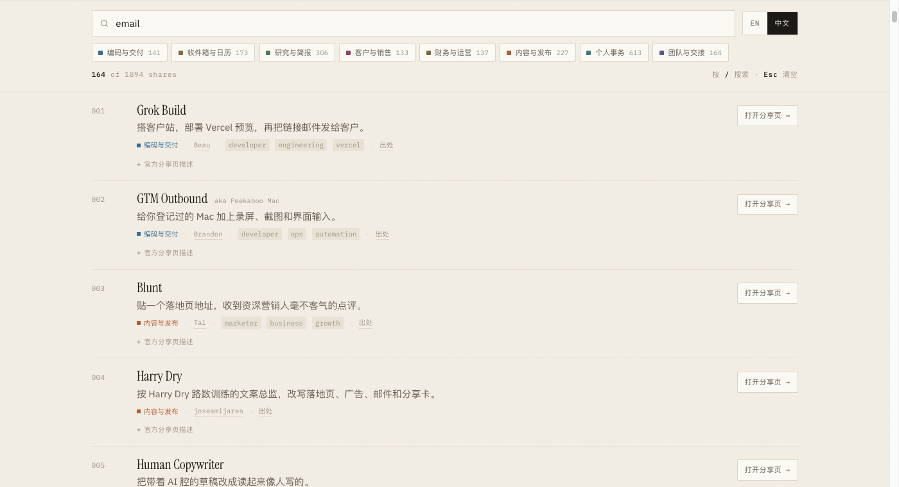

<h1 align="center">awesome-grokbot</h1>

<h3 align="center">532 条可一键添加的 Grok Bot 活分享（<code>x.ai/bot</code>）。 每条链接都实测过，每条记录都标注了出处。</h3>

  
  
  
  
  
  
  

  <a href="./README.md">English</a> | <strong>简体中文</strong>

> [Grok Bot](https://docs.x.ai/grok-bot/overview) 让具名的 AI 队友拥有一台常开的云电脑。这个仓库不是 Grok Bot 本体，不是安装器，也不是源码——它是**公开 Bot 配置的索引**：你可以先在 `x.ai` 上预览，再一键添加到自己的账号。

## ⚡️ 有什么不一样

<table>
  <tr><td align="right"><b>532</b></td><td>条活分享，每条链接都在 2026-09-05 实测过——不是从别的列表抄来的</td></tr>
  <tr><td align="right"><b>每天</b></td><td>由<a href=".github/workflows/daily-update.yml">定时任务</a>自动复查链接并同步四个上游目录，不是一次性抓完就不管了</td></tr>
  <tr><td align="right"><b>4</b></td><td>条死链隔离进 <a href="retired.json"><code>retired.json</code></a>，没有继续留在列表里烂着</td></tr>
  <tr><td align="right"><b>532</b></td><td>条配有人工写的中文摘要，不是机翻</td></tr>
  <tr><td align="right"><b>532</b></td><td>条都标明来自哪个社区目录——其中 454 条还链到最早的原帖</td></tr>
  <tr><td align="right"><b>36</b></td><td>条的名字已和官方页对不上，旧名保留在 <code>aka</code> 里，依然搜得到</td></tr>
</table>

名称和描述读自官方分享页本身，而不是别人的目录。目录怎么建的、以及它**没有**核验什么：[docs/method.md](docs/method.md)。

## 🌐 用网页版浏览

  

  <a href="https://kydlikebtc.github.io/awesome-grokbot/#lang=zh"><strong>kydlikebtc.github.io/awesome-grokbot</strong></a> 
  532 条数据即时搜索 · 八个分类筛选 · EN／中文切换 · 筛选结果可直接分享 · 无构建步骤、无追踪、无 Cookie

**所有筛选状态都写在 URL 里。**下面这些链接会直接打开筛选好的视图，而且转发给别人也是同一个画面：

  <a href="https://kydlikebtc.github.io/awesome-grokbot/#cat=coding-shipping&lang=zh">🛠️ 编码与交付 <b>58</b></a> · <a href="https://kydlikebtc.github.io/awesome-grokbot/#cat=inbox-calendar&lang=zh">📥 收件箱与日历 <b>25</b></a> · <a href="https://kydlikebtc.github.io/awesome-grokbot/#cat=research-briefings&lang=zh">🔍 研究与简报 <b>88</b></a> · <a href="https://kydlikebtc.github.io/awesome-grokbot/#cat=customer-sales&lang=zh">🤝 客户与销售 <b>34</b></a> 
  <a href="https://kydlikebtc.github.io/awesome-grokbot/#cat=finance-ops&lang=zh">💰 财务与运营 <b>40</b></a> · <a href="https://kydlikebtc.github.io/awesome-grokbot/#cat=content-publishing&lang=zh">✍️ 内容与发布 <b>78</b></a> · <a href="https://kydlikebtc.github.io/awesome-grokbot/#cat=personal-admin&lang=zh">🏠 个人事务 <b>121</b></a> · <a href="https://kydlikebtc.github.io/awesome-grokbot/#cat=teams-handoffs&lang=zh">🧭 团队与交接 <b>88</b></a>

## 📖 快速入口

| 去哪 | 干什么 |
| --- | --- |
| 🌐 [**网页版浏览**](https://kydlikebtc.github.io/awesome-grokbot/#lang=zh) | 在浏览器里搜索、筛选全部 532 条 |
| 📦 [`catalog.json`](catalog.json) | 全部 532 条活条目，通过 schema 校验 |
| 🪦 [`retired.json`](retired.json) | 4 条已经打不开的分享 |
| 🔐 [导入之前先读](docs/vetting.md) | 安全检查清单。添加任何 Bot 之前请先看 |
| 🧪 [数据与方法](docs/method.md) | 目录怎么建的，以及如何自己复现 |
| 🤖 [侦察 Routine](docs/routine.md) | 一个 Grok Bot 例行任务，直接从 X 一手发现新分享 |
| 🙏 [来源与致谢](docs/sources.md) | 合并了哪些上游目录，各自许可 |
| 🤝 [参与贡献](CONTRIBUTING.md) | 加一个 Bot 只需要写一个 JSON 对象 |

## 🚀 怎么用

1. 先在 Mac、Windows 或 iPhone 上 [安装 Grok Bot](https://docs.x.ai/grok-bot/get-started)。官方没有 Linux 桌面版——Bot 自己那台电脑本来就是云上的 Linux。
2. 打开下面任意一条分享链接，**先读公开预览**，再决定要不要加。
3. 点 **Add to Grok Bot**。这会复制名字、指令、技能、例行任务和官方插件 id。
4. 它**不会**复制作者的电脑、文件、登录态或 API key。连接器要你自己重新接，一次只接一个。
5. 先跑一个只读任务。确认没问题，再开例行任务或任何会写入的操作。

> [!WARNING]
> 社区分享属于不可信的第三方软件。同一个账号下的所有 Bot **共用一台电脑**——多开一个 Bot 并不构成安全边界。完整清单见 [docs/vetting.md](docs/vetting.md)。

## 🗂️ 分类总览

<table>
  <tr>
    <td width="25%" valign="top">
<strong><a href="#cat-coding-shipping">🛠️ 编码与交付</a></strong> 58 个
写代码、审 PR、盯着编码代理干活、把机器照顾好。  <a href="https://kydlikebtc.github.io/awesome-grokbot/#cat=coding-shipping&lang=zh">在网页版筛选 ↗</a></td>
    <td width="25%" valign="top">
<strong><a href="#cat-inbox-calendar">📥 收件箱与日历</a></strong> 25 个
分拣邮件、起草回复、守住日历、把工作日节奏跑起来。  <a href="https://kydlikebtc.github.io/awesome-grokbot/#cat=inbox-calendar&lang=zh">在网页版筛选 ↗</a></td>
    <td width="25%" valign="top">
<strong><a href="#cat-research-briefings">🔍 研究与简报</a></strong> 88 个
盯住一个领域、核查说法，最后只给你一份短简报。  <a href="https://kydlikebtc.github.io/awesome-grokbot/#cat=research-briefings&lang=zh">在网页版筛选 ↗</a></td>
    <td width="25%" valign="top">
<strong><a href="#cat-customer-sales">🤝 客户与销售</a></strong> 34 个
找客户、起草外呼、通话后援、客户跟进到底。  <a href="https://kydlikebtc.github.io/awesome-grokbot/#cat=customer-sales&lang=zh">在网页版筛选 ↗</a></td>
  </tr>
  <tr>
    <td width="25%" valign="top">
<strong><a href="#cat-finance-ops">💰 财务与运营</a></strong> 40 个
票据、订阅、发票、花费审计，以及各种后台杂务。  <a href="https://kydlikebtc.github.io/awesome-grokbot/#cat=finance-ops&lang=zh">在网页版筛选 ↗</a></td>
    <td width="25%" valign="top">
<strong><a href="#cat-content-publishing">✍️ 内容与发布</a></strong> 78 个
起草、编辑、设计、视频，以及把它们发出去的队列。  <a href="https://kydlikebtc.github.io/awesome-grokbot/#cat=content-publishing&lang=zh">在网页版筛选 ↗</a></td>
    <td width="25%" valign="top">
<strong><a href="#cat-personal-admin">🏠 个人事务</a></strong> 121 个
买菜、家务后勤、家庭日程、健康和购物。  <a href="https://kydlikebtc.github.io/awesome-grokbot/#cat=personal-admin&lang=zh">在网页版筛选 ↗</a></td>
    <td width="25%" valign="top">
<strong><a href="#cat-teams-handoffs">🧭 团队与交接</a></strong> 88 个
管别的 Bot 的 Bot：花名册、委派、预算和交接。  <a href="https://kydlikebtc.github.io/awesome-grokbot/#cat=teams-handoffs&lang=zh">在网页版筛选 ↗</a></td>
  </tr>
</table>

| 分类 | 收录 |
| --- | ---: |
| [🛠️ 编码与交付](#cat-coding-shipping) | 58 |
| [📥 收件箱与日历](#cat-inbox-calendar) | 25 |
| [🔍 研究与简报](#cat-research-briefings) | 88 |
| [🤝 客户与销售](#cat-customer-sales) | 34 |
| [💰 财务与运营](#cat-finance-ops) | 40 |
| [✍️ 内容与发布](#cat-content-publishing) | 78 |
| [🏠 个人事务](#cat-personal-admin) | 121 |
| [🧭 团队与交接](#cat-teams-handoffs) | 88 |
| **合计** | **532** |

## 🛠️ 编码与交付

*写代码、审 PR、盯着编码代理干活、把机器照顾好。* —— 58 个

- [Agent Looper](https://x.ai/bot/AETdGbRRNWfckrRGv22LD) — 盯着本机编程代理反复改，直到验收测试通过。 作者 [dancingteeth](https://x.com/dancingteeth) · [出处](https://x.com/dancingteeth/status/2093868415542845628)
- [Agent Smith](https://x.ai/bot/JcFj23aaufNWkuiiJTX0j) — 多 Bot 工作区的清洁工，不让垃圾越堆越多。 作者 [Chip](https://x.com/chiplay) · [出处](https://x.com/chiplay/status/2093502053037293650)
- [AI Harness Assistant](https://x.ai/bot/oq-mYZXM23ShlY7UbJWeB) — 让你机器上每一套 AI 编程工具都跟上版本。 作者 [Alan](https://x.com/gheeunit) · [出处](https://x.com/gheeunit/status/2093427364973695253)
- [Alchemist](https://x.ai/bot/JjO20_oGKrE_Ys5Uz4efj) — 没文档的问题就拿来做实验，直到摸出一套办法。 作者 [Aman](https://x.com/2onism) · [出处](https://x.com/2onism/status/2093723713279803515)
- [Apps](https://x.ai/bot/OPLop__-mqSsyQheR5JYv) — 一句话描述应用，收回一个能跑起来的构建。 作者 [Wayne](https://x.com/waynesutton) · [出处](https://x.com/waynesutton/status/2093835122231722366)
- [Baut](https://x.ai/bot/NuFI0dF9FgvO8FfMPHKzx) — 帮你把 Grok.me 游戏做出去，产品决策按真金白银来。 作者 [𝕏](https://x.com/XAmandaMoore) (@XAmandaMoore)
- [BeTree](https://x.ai/bot/2PSNlIROOJPj9qZlfRy0w) — 把分散在多个 Bot 上的计划收成一张活的关系图。 作者 [Nicolas](https://x.com/NicoChauvin74) · [出处](https://x.com/NicoChauvin74/status/2093778235054031136)
- [Blockchain Data Expert](https://x.ai/bot/eyFr_G8h9UmrQHNpZpNfx) — 直接查询 The Graph 子图，回答链上数据问题。 作者 [Derek](https://x.com/data_nexus) (@data_nexus) · [出处](https://x.com/data_nexus/status/2094265024227192946)
- [CarmackBot](https://x.ai/bot/B5UMQzelNds6Iy2nuFrka) — 第一性原理的游戏引擎和固件专长，给小体量爱好游戏用，只上真正能跑的最小栈。 作者 Marcus · [出处](https://github.com/doanbactam/awesome-grok-bots)
- [Changelog Stand-down](https://x.ai/bot/T27nv3vIy89yKldqELWbn) — 每周一用白话汇总团队这周真正上线了什么。 作者 [Andrea](https://x.com/acolombiadev) (@acolombiadev) · [出处](https://x.com/acolombiadev/status/2096015833449349211)
- [Claude Code](https://x.ai/bot/71PSQ4KBs-hNYBsH05X_n) — 专职编码代理，所有软件活都丢给 Claude Code CLI 跑。 作者 [Daniel](https://x.com/DanielZambrini) (@DanielZambrini)
- [Claudey](https://x.ai/bot/OR72i4SNc0_F1IzbCfg-D) — 把前端和架构活交给 Claude Code CLI，干完直接开 PR。 作者 [Farzad](https://x.com/farzyness) (@farzyness) · [出处](https://x.com/farzyness/status/2094240859243913669)
- [Code Red](https://x.ai/bot/4y3jlvwxFNqcP76eJgpuD) — 只停你自己的系统，先演练再确认的紧急急停开关。 作者 [Knock](https://x.com/SuddenlyJon) · [出处](https://x.com/SuddenlyJon/status/2094970870871585096)
- [Code Team Spawn](https://x.ai/bot/NuOSHSdCZPVkM78K0HkB3) — 平时闲着，你要编码团队时才面试并拉起一支隐藏的五人小队。 作者 [Bryan](https://x.com/bryanofearth) (@bryanofearth)
- [Code Team Spawn](https://x.ai/bot/_G3maEq_3-ijcQJ1Efr4X) — 更新版拉队，面试后立一个 Conductor，再加一支隐藏的五人编码小队。 作者 [Bryan](https://x.com/bryanofearth) (@bryanofearth)
- [Critiquito](https://x.ai/bot/rt9m-FTkJoGsZzAjsKLPM) — 设计评论家，只看你的界面截图，只给意见。 作者 [Manuel](https://x.com/mamuso) (@mamuso) · [出处](https://x.com/mamuso/status/2093549356364501338)
- [Cursor Agent](https://x.ai/bot/z4r7D8iILsTQDf7r7DwKR) — 在本机跑 cursor-agent 命令行，做实验和现场活。 作者 [Ryan](https://x.com/ryanthawks) (@ryanthawks) · 社区旧称 *Cursor Agent (Local)* · [出处](https://x.com/ryanthawks/status/2093425622282375169)
- [Design Expert](https://x.ai/bot/H2WEoHRGKv_6a3j6lsHiG) — 用设计负责人的眼光审 AI 做出来的界面。 作者 [Ashish](https://x.com/inqusit) (@inqusit) · [出处](https://x.com/inqusit/status/2093765735197851709)
- [dr eggbot](https://x.ai/bot/93gOz3op1UQdBdbekQFLK) — 替你搭建其他 Grok Bot。 作者 [Lauren](https://x.com/poteto) · [出处](https://x.com/poteto/status/2093392701005946931)
- [Dr.Binary](https://x.ai/bot/Pc2T7udSjGxv9pd9Spkyc) — 帮你逆向恶意软件、固件和漏洞研究用的二进制。 作者 [Deepbits](https://x.com/drbinaryai) (@drbinaryai)
- [Engineering QA](https://x.ai/bot/b2tS8BNj8BhoQNDcB081S) — 守住你指定仓库的合并门槛，只把真正要拍板的问题往上抛。 作者 [Andre](https://x.com/andreleibovici) (@andreleibovici) · [出处](https://x.com/andreleibovici/status/2095035963978522719)
- [Examiner](https://x.ai/bot/rBnJhXhks-_7n1zhZCN3E) — 东西一坏，就把刚发生的改动摊给你看。 作者 [Liam](https://x.com/liam_fallen) (@liam_fallen) · [出处](https://x.com/liam_fallen/status/2093383146599301252)
- [Fable 5.1 Oracle](https://x.ai/bot/tLSg4HxepSclMqbZUTRnX) — 把怎么做想清楚并检查成品，自己从不写代码。 作者 [Matt](https://x.com/bossriceshark) (@bossriceshark) · [出处](https://x.com/bossriceshark/status/2095151692706967931)
- [Feedback](https://x.ai/bot/_-3KKbHbnSRzrS_8KFugU) — 把你已确认的 bug 整理成规范报告，提给对的团队。 作者 [NYTEMODE](https://x.com/nytemodeonly) (@nytemodeonly) · [出处](https://x.com/nytemodeonly/status/2094225527984820492)
- [Flowsery](https://x.ai/bot/tOP05p0n0XVUcpJDfPH0k) — 把会话录像收成一份按优先级排的修复清单。 作者 [Taras](https://x.com/tarasshyn) (@tarasshyn) · [出处](https://x.com/tarasshyn/status/2093730218145976437)
- [Forge](https://x.ai/bot/uF_uodOFUz9mdv6XDWE70) — 丢一个关键词进去，吐出一份能直接用的 Grok Bot 配方。 作者 [Robert](https://x.com/rryssf) (@rryssf) · 社区旧称 *Forge (Template Foundry)* · [出处](https://x.com/rryssf/status/2093423943243747773)
- [Forge](https://x.ai/bot/7GgZtqkhyLzKKMNUa7dhd) — 把你签过字的规格丢进去，早上来收 pull request。 作者 [Daniel](https://x.com/DanKillenberger) (@DanKillenberger) · [出处](https://x.com/DanKillenberger/status/2094819020193022397)
- [Frontier Model Watch](https://x.ai/bot/YHqn0iTQuvI-8LC01IP6S) — 每天一份核过的简报，覆盖十家前沿实验室的发布。 作者 [Amina](https://x.com/GuleidAmina) · [出处](https://x.com/GuleidAmina/status/2093400067617309106)
- [Gardener](https://x.ai/bot/oH3eR4YWtsljcz0W4HUBp) — 用可证明、行为不变的小 PR 清掉死代码。 作者 [Tyler](https://x.com/tylerklose) · [出处](https://x.com/tylerklose/status/2093483701480866210)
- [Grimoire](https://x.ai/bot/luPJeAxuAjhqO97wU3wm0) — 带五十项技能的编程巫师，外加二十人顾问会。 作者 [Nick](https://x.com/NickADobos) (@NickADobos) · 社区旧称 *Grimoire's Tome & The Grim Council* · [出处](https://x.com/NickADobos/status/2093400318063284581)
- [Grok Build](https://x.ai/bot/eydijdzrfgtnmlnUyPSI-) — 给 Grok Build CLI 配一台专属机器干活。 作者 [Bill](https://x.com/BillZanetti) (@BillZanetti) · [出处](https://x.com/BillZanetti/status/2094534653646356788)
- [Grok Build](https://x.ai/bot/AY2y4oPL_VgcttCt8OFqm) — 另一路 Grok Build，专把客户站做成可预览链接。 作者 [B](https://x.com/DAssetBuzz) (@DAssetBuzz) · [出处](https://x.com/DAssetBuzz)
- [Grok Build](https://x.ai/bot/iwa3WaHZn385jfZrsQngL) — 搭客户站，部署 Vercel 预览，再把链接邮件发给客户。 作者 [Beau](https://x.com/beaudenison) (@beaudenison) · [出处](https://x.com/beaudenison)
- [Grok VM maintenance](https://x.ai/bot/9UZp5k0Fp0LYmkyos5swQ) — Bot 那台 Linux 虚拟机的运维搭档：健康、磁盘、服务、软件包。 作者 [Will](https://x.com/old_pgmrs_will) (@old_pgmrs_will) · [出处](https://x.com/old_pgmrs_will/status/2094360885884322286)
- [GTM Outbound](https://x.ai/bot/zY0fbKG9UqTMWIu1NcudB) — 给你登记过的 Mac 加上录屏、截图和界面输入。 作者 [Brandon](https://x.com/brandon_ai) (@brandon_ai) · 社区旧称 *Peekaboo Mac* · [出处](https://x.com/brandon_ai/status/2093410540559470920)
- [Helidon Engineer](https://x.ai/bot/5mReUHPYTBA6nJ2aNvlqn) — 用现代 Java 写和审 Helidon 4 代码。 作者 [Suren](https://x.com/TheSurenk) (@TheSurenk) · [出处](https://x.com/TheSurenk/status/2093548918806122764)
- [lgtm the pr closer](https://x.ai/bot/vGk7yV-vF92ZegpNF3NPo) — 每天早上醒来，把开着的 pull request 清掉。 作者 [Claire](https://x.com/clairevo) · [出处](https://x.com/clairevo/status/2093496605488083203)
- [Linky](https://x.ai/bot/zcHEE4_hbqw3cZsy7X2Vk) — 丢给它文件、文件夹或 Bot 产出，收回一条可分享链接。 作者 [Adam](https://x.com/adamludwin) (@adamludwin) · [出处](https://x.com/adamludwin/status/2093402167394914392)
- [loops](https://x.ai/bot/Ub3T7usX-c6yRQibQq83P) — 工程外环，坐在你那些编程代理上面。 作者 [Matt](https://x.com/mattyp) (@mattyp) · [出处](https://x.com/mattyp/status/2093380201128595966)
- [Nightly Audit Engineer](https://x.ai/bot/hkGSHcqKjGc5dm3ugNc2U) — 夜里通读你的仓库，每个模块落一个小清理。 作者 [Lingxi](https://x.com/lingxi) · [出处](https://x.com/lingxi/status/2094489412537327828)
- [Omnibot](https://x.ai/bot/OzZrG8ek4AhutfTVhBCI0) — 配好意图表后，从 Grok Bot 里跑任意 Cursor CLI 模型。 作者 [Eric](https://x.com/ericzakariasson) (@ericzakariasson)
- [overnight shipper](https://x.ai/bot/aaqCOb-3SE48_7qAEAzAf) — 睡前丢一个点子，早上起来审 pull request。 作者 [Josh](https://x.com/joshkim) · [出处](https://x.com/joshkim/status/2093582410638311676)
- [Overwatch](https://x.ai/bot/7u3XiRiTYw4GVZmuZboyP) — 照看 Grok Bot 共用虚拟机，别让机器慢慢烂掉。 作者 [Andrej](https://x.com/scheemunai) · [出处](https://x.com/scheemunai/status/2093397147882229897)
- [PR Reviewer](https://x.ai/bot/rt629UEZFtE4Wz0A_0c37) — 按风险高低来审 pull request。 作者 [mustafa](https://x.com/mustafaergisi) · [出处](https://x.com/mustafaergisi/status/2093393924870058039)
- [Repo Engineer](https://x.ai/bot/iXfxVelc85rIxgZ9hLeXD) — 用 Cursor 云代理把小修复做成 GitHub PR，自己从不合并。 作者 [Rustam](https://x.com/RustamAtuev) (@RustamAtuev) · [出处](https://x.com/RustamAtuev)
- [Rutin](https://x.ai/bot/o4gWkNGmffEaVtOhaEsA7) — 每周一把舰队里每条例行任务都调一遍。 作者 [Naoufal](https://x.com/naoufal_elh) · [出处](https://x.com/naoufal_elh/status/2093710581354135607)
- [Sable: Game Art](https://x.ai/bot/oSvAMKX_ahD56ZmgwtRys) — 按你选的风格出 2D 游戏美术和精灵表。 作者 [Danny](https://x.com/DannyLimanseta) (@DannyLimanseta) · [出处](https://x.com/DannyLimanseta/status/2093381938484810054)
- [Sanity](https://x.ai/bot/qR7nq7v3w0bwpojx2LgQx) — Sanity 内容模型、模式和 GROQ 专长。 作者 [Adam](https://x.com/ahdumgray) (@ahdumgray) · [出处](https://x.com/ahdumgray/status/2093504459741794550)
- [SAP Technical Consultant](https://x.ai/bot/O08yUdBz6vFFqYITvWPPi) — S/4HANA 顾问，帮你做干净核心的设计决定。 作者 [Lalit](https://x.com/beinglalit21) (@beinglalit21) · [出处](https://x.com/beinglalit21/status/2093783196488061076)
- [SEOAgent](https://x.ai/bot/scYgD9jdFhooaSHihRzy7) — 自主 SEO 工程师，在站点仓库里拉起 SEOAgent，冲自然流量。 作者 [alexander.v.lindsay@gmail.com](https://x.com/SEOAgent_) (@SEOAgent_) · [出处](https://x.com/SEOAgent_)
- [Skill Bot](https://x.ai/bot/WdKtVYWvxVEDmc7xp8zO2) — Bot 技能的图书管理员，去重并跟上版本。 作者 [Dave](https://x.com/davespeers) · [出处](https://x.com/davespeers/status/2093703778872496292)
- [Speed Lab](https://x.ai/bot/LEbVr_WZ-cym7XwIm7xf5) — 对着站点渲染速度做研究循环，把赢的留下。 作者 [Jacob](https://x.com/pwnies) (@pwnies) · [出处](https://x.com/pwnies/status/2093494257105379569)
- [substreams](https://x.ai/bot/4ZzeuafN9Z1boU8smYIXv) — 在聊天里搭建并运行 Substreams 区块链数据管道。 作者 [Graphtronauts](https://x.com/graphtronauts_c) (@graphtronauts_c) · [出处](https://x.com/graphtronauts_c/status/2094476749052555631)
- [Tally Desk](https://x.ai/bot/m-qZ-OIA6Nt2LZeb2bKg5) — 建 Tally 表、读回复，需要时替你填一份。 作者 [Josh](https://x.com/joshkim) (@joshkim) · [出处](https://x.com/joshkim/status/2093795274598817946)
- [Tech Lead](https://x.ai/bot/RfFPxQ_rfEGcUncrJ6g_W) — 只看 diff 和测试的实际结果，替你把住合并这一关。 作者 [Ashish](https://x.com/inqusit) (@inqusit) · [出处](https://x.com/inqusit/status/2094021157213348277)
- [template generator](https://x.ai/bot/9oKJDID_EKLacIXpKfFAq) — 扫本机 Claude、Cline 和 Grok Bot 会话，再给出可生成可分享的模板。 作者 [Jarett](https://x.com/STACCoverflow) · [出处](https://github.com/cs68614-hash/awesome-grokbot-templates)
- [Testbench](https://x.ai/bot/jbcYU5l_7qsLl49AIzh5q) — 给共享电脑扛不动的活租一块 GPU，按运行时长计费。 作者 [Prism](https://x.com/useprismnetwork) (@useprismnetwork) · [出处](https://x.com/useprismnetwork/status/2094790128296239563)
- [UI/UX/Designer. Product Engineer 1000x](https://x.ai/bot/sQDD87Gp6VLT0m99tFpzu) — 全栈产品工程师，用 Convex、TanStack 和 React 把应用真正送上线。 作者 [Thomas](https://x.com/TomZarebczan) · 社区旧称 *1000x Product Engineer* · [出处](https://x.com/TomZarebczan/status/2093387240479051938)

<a href="#section-categories">↑ 回到分类总览</a>

## 📥 收件箱与日历

*分拣邮件、起草回复、守住日历、把工作日节奏跑起来。* —— 25 个

- [bookworm](https://x.ai/bot/KPpT1F6tP4Q5GZ2BH2hBH) — 用创始人语气起草并发送阅读应用的内测邀请。 作者 [Navya](https://x.com/NavyaM89482) (@NavyaM89482) · [出处](https://x.com/NavyaM89482/status/2093524788761248166)
- [Bot inbox](https://x.ai/bot/RHSd-aq6KC84xxUnvBXSl) — 一行消化所有有新动静的 Bot 和群聊。 作者 [Wayne](https://x.com/waynesutton) · [出处](https://x.com/waynesutton/status/2093835123498340611)
- [Chief](https://x.ai/bot/QIfSY8pPwjqBSIdal-5CI) — 工作日早上分诊收件箱、日历和待回复。 作者 [SmoresBoy](https://x.com/jxckvibe) · [出处](https://x.com/jxckvibe/status/2093821098315882620)
- [Dewey](https://x.ai/bot/rfAHsaFrz6xHBMtUpxDi5) — 盯着 Gmail，只把真正需要你的邮件拎出来。 作者 [William](https://x.com/Vixlio) · [出处](https://x.com/Vixlio/status/2093843651856081165)
- [Dispatch](https://x.ai/bot/YkmZEZYBk-BqylyQbM3kq) — 每晚扫邮件、Slack、LinkedIn 和 X 私信，把漏掉的通话补上。 作者 [Filippo](https://x.com/FilippoFonseca) · [出处](https://x.com/FilippoFonseca/status/2093402774704914915)
- [Google Agent](https://x.ai/bot/tttQVA2UtlNwCzITNCIr0) — 先读后动，管 Gmail、云盘和日历。 作者 [Ryan](https://x.com/ryanthawks) · [出处](https://x.com/ryanthawks/status/2093431148860817626)
- [Holly Helpdesk](https://x.ai/bot/sIoeE87fILU5CzptPF29K) — 一线客服，管支持收件箱和帮助台。 作者 [Claire](https://x.com/clairevo) (@clairevo) · [出处](https://x.com/clairevo/status/2093496607870423227)
- [Inbot](https://x.ai/bot/yH2UttxbMwMugweZrigHT) — 对着你真正在用的每个收件箱，把未读清到零。 作者 [Matthew](https://x.com/matt_silberman) · [出处](https://x.com/matt_silberman/status/2093378871403933751)
- [Inbox to Asana](https://x.ai/bot/Ka18PTTKUNtDDPg0HpYva) — 读公司邮箱，把真要干的事写进 Asana，不动你的发件箱。 作者 [Wayne](https://x.com/wikiwayne) (@wikiwayne) · [出处](https://x.com/wikiwayne/status/2095991720060014888)
- [Inbox Zero](https://x.ai/bot/h5i1TCuYEL2mVtMbQtW98) — 每个工作日把噪音归档，把 Gmail 压到零。 作者 [LD](https://x.com/zapnocode) · [出处](https://x.com/zapnocode/status/2093493728660865073)
- [Jess](https://x.ai/bot/Nmv2fCQEcQc3EHzVXJZKN) — 你还没打开邮件、日历、Notion 或 Slack，它已经先复盘过了。 作者 [Logan](https://x.com/LoganARobison) · [出处](https://x.com/LoganARobison/status/2093380304891167113)
- [Jobby](https://x.ai/bot/DYg0r1xvzy_xxPeRGHcHE) — 盯选定岗位和地区的招聘，只邮件推送新匹配。 作者 [Vijay](https://x.com/ixdesigner) (@ixdesigner)
- [loom](https://x.ai/bot/cElGnAaR55iPHK2DGdPdu) — 读完整条 Gmail 线程并起草回复，从不替你发出。 作者 [Lauren](https://x.com/poteto) · [出处](https://x.com/poteto/status/2093520466032136644)
- [Love ❤️](https://x.ai/bot/Xg8tws0lVEouCHOVMcnLg) — 不让一段关系里体贴的那部分溜走。 作者 [Danny](https://x.com/dannybuck) (@dannybuck) · [出处](https://x.com/dannybuck/status/2093732626544628001)
- [MarketBoxScan](https://x.ai/bot/-LYLlgknV3IgZcFEmhcLs) — 写稿人开工前的科技新闻和收件箱简报。 作者 [techAU](https://x.com/techAU) · [出处](https://x.com/techAU/status/2093498668297101491)
- [Newsletter Cleanup](https://x.ai/bot/dHd69sBvMG2o3lJa__T7K) — 审计半年 newsletter，只退订你点头的那些。 作者 [Andrej](https://x.com/scheemunai) · [出处](https://x.com/scheemunai/status/2093398594745254196)
- [openrobot](https://x.ai/bot/ndO6BI7E2ur5X-bhWM_1R) — 合作接待台，把兴趣收成一封介绍邮件。 作者 [alhan](https://x.com/noborderhuman) (@noborderhuman) · [出处](https://x.com/noborderhuman/status/2093529993972432967)
- [Receipt Scanner / Expense Tracking](https://x.ai/bot/qod4CrNQBlDIMm5wFYVQp) — 转发一张收据，它就变成报销表里的一行。 作者 [Lime](https://x.com/limeunfiltered) (@limeunfiltered) · [出处](https://x.com/limeunfiltered/status/2093899797967278545)
- [Remind Bot](https://x.ai/bot/peJxDrQRS4t2DHuHfzhfW) — 接住那些永远写不进日历的小提醒。 作者 [Damon](https://x.com/damonchen) · [出处](https://x.com/damonchen/status/2093559687354671335)
- [Ship Note](https://x.ai/bot/xMCiRCmOCYLeRzW8nS6EL) — 把一次发布收成更新日志条目和一封邮件。 作者 [Sol](https://x.com/sol_wright7) (@sol_wright7) · [出处](https://x.com/sol_wright7/status/2093809370958098813)
- [TenderYearsbot](https://x.ai/bot/o7VRdRSxHvBEYbzkJQm07) — 从 Gmail、日历和 Tender Years 里管五岁以下娃的家务物流。 作者 [Liz](https://x.com/voeliz) (@voeliz)
- [teslaway](https://x.ai/bot/HoG3J3B0g4fjKr54aA5tP) — 按邮编找附近二手特斯拉，并邮件发来短名单。 作者 [Vijay](https://x.com/ixdesigner) (@ixdesigner)
- [Time Keeper](https://x.ai/bot/IAEp851k9orM1LguTm2F8) — 用早间议程和夜间预览把一天夹住。 作者 [Mark](https://x.com/ironted21) · [出处](https://x.com/ironted21/status/2093771512331252046)
- [Tradbot](https://x.ai/bot/uY_7s1TZILVzUeJ9lLOx9) — 家庭参谋，管家庭计划、学校和家务行政。 作者 [Claire](https://x.com/clairevo) (@clairevo) · [出处](https://x.com/clairevo/status/2093487955205923031)
- [💼 CoS](https://x.ai/bot/eiVFbd0nIdH2gzSwHOs0D) — 把你的 Bot 席位、日历和收件箱，收进同一套工作日节奏。 作者 [A-A-ron](https://x.com/theaaron) (@theaaron) · [出处](https://x.com/theaaron/status/2094547674766929996)

<a href="#section-categories">↑ 回到分类总览</a>

## 🔍 研究与简报

*盯住一个领域、核查说法，最后只给你一份短简报。* —— 88 个

- [2nd Brain](https://x.ai/bot/c4fYduVVic2YtbcjXquD0) — 把你读过的东西收成可问答的链接维基。 作者 [Thierry](https://x.com/LeTerryBZH) (@LeTerryBZH) · [出处](https://x.com/LeTerryBZH/status/2094616823803314592)
- [AI Resource Sift](https://x.ai/bot/3XvYxSCGJRY6x1woq-hdL) — 把论文、代码、讲座和论坛扫进一摞阅读清单。 作者 [Alen](https://x.com/beamnxw) · [出处](https://x.com/beamnxw/status/2093456831481885041)
- [aoty](https://x.ai/bot/Wt4IQj3R1eePOyOOnox7H) — 每周按综合评分挑三张新专辑。 作者 [emre](https://x.com/emrecolakoglu) (@emrecolakoglu) · [出处](https://x.com/emrecolakoglu/status/2093780158180175982)
- [Arnold](https://x.ai/bot/ymoMdfvzdErOrclxCOaC_) — 盯着 Cursor 用量花钱，该省时把 agent 换成更便宜的模型。 作者 [Kelsey](https://x.com/Kelseyshuo) (@Kelseyshuo) · [出处](https://x.com/Kelseyshuo/status/2095701119355834859)
- [Beatrix Kiddo](https://x.ai/bot/z4Chp77wqP5ASkBKpxOOk) — 盯着物流，包裹一停就提醒你。 作者 [Liam](https://x.com/liam_fallen) (@liam_fallen) · [出处](https://x.com/liam_fallen/status/2094782517794529780)
- [Better Call Claude](https://x.ai/bot/f7I5mP0uJf9brGIuK0ETo) — 免费帮你把法律问题归类定位，只做导读不做代理。 作者 [Robauto](https://x.com/freelegalforall) (@freelegalforall) · [出处](https://x.com/freelegalforall/status/2095994776625819949)
- [Box Inspector](https://x.ai/bot/q7GLbLhMZDpJXBGuuci1J) — 在你把别人的 Grok Bot 加进账号前，先检查那条分享链接。 作者 [Knock](https://x.com/SuddenlyJon) · [出处](https://x.com/SuddenlyJon/status/2093499564988703231)
- [Collins](https://x.ai/bot/D6lddHs6lfM0k7Cj3P6j3) — 带你走完 Hercules Collins 1680 年的教理问答，每天一题。 作者 [Zach](https://x.com/zachmllr) (@zachmllr) · [出处](https://x.com/zachmllr/status/2094258928922116418)
- [Commercial Taste](https://x.ai/bot/vekulzIMXM8hDjkp-mDkX) — 数据不齐时，替技术背景的创始人补上商业判断。 作者 [Smit](https://x.com/thesmitpatel) (@thesmitpatel) · [出处](https://x.com/thesmitpatel/status/2094100307340857707)
- [Competitor Watching](https://x.ai/bot/5PKSzU0ruN_DQbNXc7m0N) — 拿你跟三到八个对手做快照，只在真正有变时才叫你。 作者 [Andrej](https://x.com/scheemunai) · [出处](https://x.com/scheemunai/status/2093398377056678001)
- [Connection Audit](https://x.ai/bot/qllnuXO-FDFBHZU4MSamY) — 清理你的待读囤积，把每篇留下的都挂到一个真实问题上。 作者 [Sultanov](https://x.com/thekuchh) (@thekuchh) · [出处](https://x.com/thekuchh/status/2094103797270503600)
- [Consumption Autopsy](https://x.ai/bot/WBo-ahaIrvCKXUH_3iEFy) — 复盘你的学习习惯，把一项被动输入换成动手练习。 作者 [Sultanov](https://x.com/thekuchh) (@thekuchh) · [出处](https://x.com/thekuchh/status/2094103715070558493)
- [Daily YouTube Recap](https://x.ai/bot/dug1Zq29P009fdcI5-tTC) — 早上看你订阅的 YouTube 频道，没更新就闭嘴。 作者 [Andrej](https://x.com/scheemunai) (@scheemunai) · [出处](https://x.com/scheemunai/status/2093397281928053001)
- [Dan Patrick](https://x.ai/bot/hlQhxsU-pqQEkimm0it4V) — 九十年代 SportsCenter 口吻的比分 Bot。早间综述，你点名的球队终场再叮一声。 作者 [Marcus](https://x.com/marcusramsey) · [出处](https://github.com/keshav-exe/bot-directory)
- [data science](https://x.ai/bot/Bu2sEQqu0hEjpbzN_07D3) — 管分析查询、表格拉取和指标定义。 作者 [Emily](https://x.com/egavrilenko11) (@egavrilenko11) · 社区旧称 *Data Science (Querie)* · [出处](https://x.com/egavrilenko11/status/2093409119302791170)
- [Dead Man's Bot](https://x.ai/bot/XCaz2bKzsJ4J1DmkaYyc4) — 只有你漏打卡时才会触发的预案开关，载荷由你事先装好。 作者 [Knock](https://x.com/SuddenlyJon) · [出处](https://x.com/SuddenlyJon/status/2094981472566288703)
- [Doing Gap](https://x.ai/bot/9WPtKWMppOYW9wwGPwOaE) — 把你看过的和真正做出来的放在一起算账，然后逼你动手。 作者 [Sultanov](https://x.com/thekuchh) (@thekuchh) · [出处](https://x.com/thekuchh/status/2094103726764273916)
- [dosebot](https://x.ai/bot/2euxntVrddHyA3c2hyxiZ) — 判断一个生意点子是锦上添花还是真痛点。 作者 [Rinas](https://x.com/onerinas) (@onerinas) · [出处](https://x.com/onerinas/status/2095221346578186249)
- [Early-Stage Funding Scout](https://x.ai/bot/1AFXHf0OtQ-J4-eP5wgC5) — 帮创始人找加速器和种子轮，并提醒申请窗口。 作者 [Nahuel](https://x.com/neslyio) (@neslyio)
- [Errol](https://x.ai/bot/mQoLg90Pj5Cn2Gso4AkoQ) — 每天两次带练儿童教理问答，用于家庭礼拜。 作者 [Zach](https://x.com/zachmllr) (@zachmllr) · [出处](https://x.com/zachmllr/status/2094270994777030966)
- [Ethan](https://x.ai/bot/F5Mm-0O3fPPZjYGIdsycE) — 带五项专长的研究台，还会核对自己的发现。 作者 [JUMPERZ](https://x.com/jumperz) · [出处](https://x.com/jumperz/status/2093407073815929223)
- [Family WordPress helpdesk](https://x.ai/bot/7ySyCp6OurH0hlcKMAm_b) — 给管家里 WordPress 站的亲戚当帮助台。 作者 [Josh](https://x.com/joshkim) (@joshkim) · [出处](https://x.com/joshkim/status/2093583573915963624)
- [Fantasy Football](https://x.ai/bot/VWAXuVB5VI6ScHdO97Bh0) — 全年幻想橄榄球台，帮你决定首发、板凳和交易。 作者 [Jack](https://x.com/notswizz) (@notswizz) · [出处](https://x.com/notswizz/status/2093605993372381379)
- [Fantasy Football Advisor](https://x.ai/bot/E273ZIwirOOdwMfeCp97t) — 像总经理一样管你的 ESPN 幻想队，动作要你点头。 作者 [Cole](https://x.com/Colehollander10) (@Colehollander10) · [出处](https://x.com/Colehollander10/status/2093837029674987662)
- [Feedback Clock](https://x.ai/bot/ySceLccAh5J8IVnq62mQl) — 压缩「做一次」和「得到评判」之间的时间差。 作者 [Sultanov](https://x.com/thekuchh) (@thekuchh) · [出处](https://x.com/thekuchh/status/2094103738499969334)
- [friend finders](https://x.ai/bot/FGBuaEH72GHuC9ZrVj7XA) — 扫你自己的 X 私信，告诉你现在该回哪几条。 作者 [Pukerainbow](https://x.com/pukerrainbrow) (@pukerrainbrow) · [出处](https://x.com/pukerrainbrow/status/2093531901730676792)
- [github 优秀仓库](https://x.ai/bot/D9HYH2jAmGiKw7e499mrE) — 每天早上扫一遍 GitHub 趋势页，把值得看的仓库写成简报。 作者 [umiastuti8329](https://x.com/ios_1261142602) (@ios_1261142602) · 社区旧称 *github \u4f18\u79c0\u4ed3\u5e93* · [出处](https://x.com/ios_1261142602/status/2094243852932776384)
- [GrokBot Awesome Use Cases](https://x.ai/bot/DTNL6V2HxpUHj3MkI-bSj) — 早上一小份值得动手搭的新 Grok Bot 用法。 作者 [Andrej](https://x.com/scheemunai) · [出处](https://x.com/scheemunai/status/2093397994263515578)
- [ideabot](https://x.ai/bot/iQ8OWEu7eOI3YuTZFaIe_) — 每小时从你这一周里挖一个值得追的创业点子。 作者 [Rinas](https://x.com/onerinas) (@onerinas) · [出处](https://x.com/onerinas/status/2095370142846996705)
- [Interrogator](https://x.ai/bot/-TlSH1rNkA-c2JLsFFVc7) — 找出你一直当事实用的那些假设。 作者 [Liam](https://x.com/liam_fallen) (@liam_fallen) · [出处](https://x.com/liam_fallen/status/2093383139250917746)
- [Investor Bot](https://x.ai/bot/UWNGpcghM9H79JCb4of5Q) — 管一小本券商账户的波段交易，止损写死，告警尽量安静。 作者 [Stephen](https://x.com/MadeItHappenX) (@MadeItHappenX) · [出处](https://x.com/MadeItHappenX)
- [Just-in-Time Curriculum](https://x.ai/bot/rpkZERbKrIN_NlDl8ErVZ) — 丢掉学习积压，只教你下一个任务真正用得上的部分。 作者 [Sultanov](https://x.com/thekuchh) (@thekuchh) · [出处](https://x.com/thekuchh/status/2094103762126455245)
- [Keach](https://x.ai/bot/sAxCT93K8i7gwctmtAroD) — 每天早上过一题 Keach 1693 年的教理问答。 作者 [Zach](https://x.com/zachmllr) (@zachmllr) · [出处](https://x.com/zachmllr/status/2094258800492429614)
- [KeyWire Comic Week Brief](https://x.ai/bot/1hyNK6vXzs_8QamyfhvCV) — 每周提醒拉清单，再给一份按你口味的漫画摘要。 作者 [VonDoom](https://x.com/CryptoVonDoom) (@CryptoVonDoom) · [出处](https://x.com/CryptoVonDoom/status/2093469613623583219)
- [last30days](https://x.ai/bot/ANv3NrqPfRcS9PdXku7h8) — 捞出过去三十天里人们对一个话题真正说过的话。 作者 [Matt](https://x.com/mvanhorn) (@mvanhorn) · [出处](https://x.com/mvanhorn/status/2093466618718245198)
- [Lumos](https://x.ai/bot/SwTxLoOaIwDqTSvhTIhrK) — 用费曼技巧教技术，配例子和日常类比。 作者 [Md](https://x.com/mdafanulh) (@mdafanulh) · [出处](https://x.com/mdafanulh)
- [Lurk](https://x.ai/bot/12Gbp1lPVsfTVAHPXKd3B) — 在 Reddit 上挖原话，收成一份痛点包。 作者 [Sanket](https://x.com/tinkerersanky) (@tinkerersanky) · 社区旧称 *Lurk (Reddit Researcher)* · [出处](https://x.com/tinkerersanky/status/2093398451958489561)
- [Markets Brief Scout](https://x.ai/bot/exSOooSSp0Pc4W_K9DQ4T) — 工作日整理带出处的行情卡片，并起草待你拍板的帖子。 作者 [SpheraVox](https://x.com/GainGlintGaz) (@GainGlintGaz) · [出处](https://x.com/GainGlintGaz/status/2095969760475275664)
- [Maskoff](https://x.ai/bot/39x_3B9P5HBl-MpK1xGzP) — 筛一遍刚私信你的陌生人，判断值不值得信。 作者 [GreenbarSystems](https://x.com/RyanGBsystems) (@RyanGBsystems) · [出处](https://x.com/RyanGBsystems/status/2094897077335802276)
- [Mirror](https://x.ai/bot/6XwjJ_W0mX_ybK4ts_Ngb) — 能暂停任何人包括 Bottyguard，专查注入和脱缰。 作者 [Knock](https://x.com/SuddenlyJon)
- [Mr. Dufrain](https://x.ai/bot/aBkdS0Duc24Hz7MvNm7W5) — 盯个人账本进出，在扣款落地前提醒你挪钱。 作者 [Wagmoo](https://x.com/zilarwitch) (@zilarwitch) · [出处](https://x.com/zilarwitch/status/2095992717805547980)
- [My Krishna](https://x.ai/bot/Mf2MLqJRCmz8sSjFmYedG) — 用奎师那的口吻回答你的薄伽梵歌同伴。 作者 [AKSHAY](https://x.com/AKSHAYBHOPANI) (@AKSHAYBHOPANI) · [出处](https://x.com/AKSHAYBHOPANI/status/2095049479506538710)
- [Neuroscience](https://x.ai/bot/l_MfrDAGFed5t2A9Wrzqz) — 神经科学和脑机接口专长。 作者 [Eugene](https://x.com/monomyth) (@monomyth) · [出处](https://x.com/monomyth/status/2093485744405065866)
- [News Scout](https://x.ai/bot/9Mo5saoPQYIp45IgzMT7P) — 按你的时区，工作日早上一份新闻摘要。 作者 [Eleni](https://x.com/byeleni) · [出处](https://x.com/byeleni/status/2093388385763119459)
- [Off-Balance Atlas](https://x.ai/bot/tSUFdzcg2WDFLFsFLHzIb) — 写带出处的深稿，覆盖科技、机器学习和安全。 作者 [Adem](https://x.com/AdemVessell) (@AdemVessell) · [出处](https://x.com/AdemVessell/status/2093511313158983798)
- [Online Identity Bot](https://x.ai/bot/4VEl6mp1QrsvvjTFR-qE_) — 每天查一遍搜索引擎里新冒出来的你的公开信息。 作者 [Greg](https://x.com/gkamstra) (@gkamstra) · [出处](https://x.com/gkamstra/status/2095837272687964512)
- [orders](https://x.ai/bot/0taQ6RZdkjsnOfda_A8Ie) — 把你在等的包裹、小票和退款收成一张个人台面。 作者 [bashful](https://x.com/wafffls) (@wafffls) · [出处](https://x.com/wafffls/status/2095614060070928837)
- [OutBid Mania](https://x.ai/bot/Sj_LPMP7hKOOSzF8YDiNr) — 每天看板盯一个爆火竞价站潮流和它的仿品。 作者 [Dragos](https://x.com/dragosroua) (@dragosroua) · [出处](https://x.com/dragosroua/status/2093474725976736130)
- [PickFu Insights](https://x.ai/bot/9EFVmFgQhjYKjMHAhpCWn) — 在真花钱之前，先拿真购物者测产品点子。 作者 [Justin](https://x.com/GrokBotMoney) (@GrokBotMoney) · [出处](https://x.com/GrokBotMoney/status/2095610465271374178)
- [Pitch Deck Coach](https://x.ai/bot/mqVPHm0oB3WPsnxbU1qB9) — 告诉你投资人真正会听懂、会记住什么。 作者 [Hiten](https://x.com/hnshah) (@hnshah) · [出处](https://x.com/hnshah/status/2093478735718789453)
- [Podcast Summary Bot](https://x.ai/bot/CsyAhw5YQaVLeMSnMYwgA) — 贴一条播客链接，拿回 TLDR 和值得留下的要点。 作者 [NM](https://x.com/theadvisorbtc) (@theadvisorbtc) · [出处](https://x.com/theadvisorbtc/status/2094388925523775694)
- [Preach](https://x.ai/bot/ZFj_cKTrMTytrCKM9DFHk) — 每天一段经文加几句稳的鼓励，不当课程只做习惯。 作者 [XO](https://x.com/Ortix008) (@Ortix008) · [出处](https://x.com/Ortix008/status/2095988445147496955)
- [Precog wARS](https://x.ai/bot/7M8RpppF2AistbVbeEPyN) — 用西班牙语读 Precog 预测市场赔率，从不下单。 作者 [Fermin](https://x.com/ferminrp) (@ferminrp) · [出处](https://x.com/ferminrp/status/2095595470164787652)
- [Primer](https://x.ai/bot/GTStkB5wsoSlGx9jtdaPe) — 直接回答 Grok Bot 实际会怎么表现。 作者 [Arthur](https://x.com/ambientstudio24) (@ambientstudio24) · [出处](https://x.com/ambientstudio24/status/2095367857416585575)
- [Private Desk](https://x.ai/bot/Tgl3sxrTsuAYL7MN8S3UT) — 分析那些不便丢进普通聊天窗口的敏感材料。 作者 [Prism](https://x.com/useprismnetwork) (@useprismnetwork) · [出处](https://x.com/useprismnetwork/status/2094887291881734180)
- [Product Idea Stress Test](https://x.ai/bot/JeFTvcDX-7QT2evKGIb52) — 找出你的创业点子里那个最不能出错的核心假设。 作者 [Hiten](https://x.com/hnshah) (@hnshah) · [出处](https://x.com/hnshah/status/2094100862247502019)
- [Pulse](https://x.ai/bot/oUYHu9LEXP5RVPFvoG4Ms) — 只读的 X 管家，把一整天的时间线压成早 7 点一份能扫完的简报。 作者 [Andrej](https://x.com/GrokBotDev) (@GrokBotDev) · 社区旧称 *Pulse \u2014 Your X Concierge* · [出处](https://x.com/GrokBotDev/status/2094029086490308904)
- [Raily](https://x.ai/bot/Yf3pOvZQ0B_9DDcCzuhDG) — 审可能的新连接，不碰你的账号。 作者 [Ntty](https://x.com/raily) (@raily) · [出处](https://x.com/raily/status/2093903845436895454)
- [Research Bot](https://x.ai/bot/Nn0ykGa3vJ6YS7ib7F6yH) — 深研究，交回带核过出处的短答案。 作者 [Arthur](https://x.com/ArthurMacwaters) (@ArthurMacwaters) · [出处](https://x.com/ArthurMacwaters/status/2093412671144296661)
- [Research Desk](https://x.ai/bot/99i8BzpcF-FsOKxTQxZRM) — 只起草带出处的研究结论供你批准，付款端永不写入。 作者 [D](https://x.com/justsomeguy741) (@justsomeguy741)
- [Research Runner](https://x.ai/bot/P2qgQokuPHVJhrkmRDmLv) — 把重型研究任务放到 Prism Network 租来的 GPU 上跑。 作者 [Prism](https://x.com/useprismnetwork) (@useprismnetwork) · [出处](https://x.com/useprismnetwork/status/2094504419480015231)
- [Researchy](https://x.ai/bot/rQt4W2zO2Gx9lfcBjd1lj) — 拿实时网络核查说法，返回带日期的引用出处。 作者 [Farzad](https://x.com/farzyness) (@farzyness) · [出处](https://x.com/farzyness/status/2094148803494391903)
- [Retrieval Exam](https://x.ai/bot/OAlX-diXtFDIT6sTZ0NbI) — 闭卷提问，把真记住和只是眼熟区分开。 作者 [Sultanov](https://x.com/thekuchh) (@thekuchh) · [出处](https://x.com/thekuchh/status/2094103773832737075)
- [RuntimeWire - AI & Startup News](https://x.ai/bot/k4iwGejDGoy-oT7qohxXb) — 每天一篇有出处的 AI 融资、上线和创始人动态。 作者 [Ryan](https://x.com/merket) · [出处](https://x.com/merket/status/2093804393229410713)
- [Scout](https://x.ai/bot/ywADCWWZP0Bcq6bOeQpGt) — 给客户社媒策略做每周情报包，出处一路标清。 作者 [ZEU$](https://x.com/zeuuss_01) (@zeuuss_01) · [出处](https://x.com/zeuuss_01/status/2094881934442979832)
- [Segundo Cérebro](https://x.ai/bot/OaRwBX_QPos9EDlhLEV1J) — Obsidian 第二大脑，早间简报加夜间回看。 作者 [Allan](https://x.com/liderzio) (@liderzio) · [出处](https://x.com/liderzio/status/2093672211844337867)
- [Sherlock Holmes](https://x.ai/bot/fXHgGtuPfTcHBTVKSCZ1d) — 给它一个症状，它找出指标掉下去的真正原因。 作者 [Liam](https://x.com/liam_fallen) (@liam_fallen) · [出处](https://x.com/liam_fallen/status/2093383124948324505)
- [Steal This Business](https://x.ai/bot/Ojrv95GLUG1nO1p1RWzVK) — 把你佩服的公司拆开，变成你能自己搭的那一套。 作者 [aditya](https://x.com/adxtyahq) (@adxtyahq) · [出处](https://x.com/adxtyahq/status/2093705315607065020)
- [StoriesBot](https://x.ai/bot/cV7nGFO88pb2WXNN56h8A) — 搜十七年的 MacStories，可按时间和作者筛。 作者 [Federico](https://x.com/viticci) (@viticci) · [出处](https://x.com/viticci/status/2093420134962540763)
- [Struggle Gate](https://x.ai/bot/tjN1LsaYsuR7u0dQQvOGV) — 把答案压十分钟，逼你自己先试一遍。 作者 [Sultanov](https://x.com/thekuchh) (@thekuchh) · [出处](https://x.com/thekuchh/status/2094103750399193493)
- [Stuck Cycle](https://x.ai/bot/fihe4nAy0jFWoygo4JCAW) — 让一项技能反复跑「尝试 → 卡壳 → 针对性补课」的循环。 作者 [Sultanov](https://x.com/thekuchh) (@thekuchh) · [出处](https://x.com/thekuchh/status/2094103808985141546)
- [The Amazing Randibot](https://x.ai/bot/pL_NCKfdF5UgZYEo-jMAx) — 开朗的怀疑派，逼你其他 Bot 拿出证据。 作者 [Russ](https://x.com/russbroomell) (@russbroomell) · [出处](https://x.com/russbroomell/status/2095661019041251711)
- [Thoth](https://x.ai/bot/W4Z5pvEm6UgCml48Ig4dT) — 做深研究，把卷宗归档，下次还能找到。 作者 [Rich](https://x.com/RichSilver) · [出处](https://x.com/RichSilver/status/2093409239246971049)
- [Token Accountant](https://x.ai/bot/zdnVIfLkNmRwZqqogojuc) — 盯着每周模型花销，额度见底前提早喊你。 作者 [Knock](https://x.com/SuddenlyJon) (@SuddenlyJon) · [出处](https://x.com/SuddenlyJon/status/2094877897399885905)
- [Top Grok Bot tweets](https://x.ai/bot/lFDR77qKaT3Iglzv9pUac) — 每天两次用中文扫一遍值得看的 Grok Bot 账号动态。 作者 [Mai](https://x.com/MaiYangAI) (@MaiYangAI) · 社区旧称 *最值得关注的Grok Bot 推文？* · [出处](https://x.com/MaiYangAI/status/2094583123392761968)
- [Travel Agent](https://x.ai/bot/_yHS4eeajJMAXY1EHAdoO) — 维护一份 Notion 出行日志，按你自己的行程回答问题。 作者 [Jeremy](https://x.com/jjeremycai) (@jjeremycai) · [出处](https://x.com/jjeremycai/status/2093518862868426938)
- [Trendspotter](https://x.ai/bot/nnDL-hclNLB8SkJvcVtwr) — 工作日简报，覆盖体育文娱文化趋势和营销侧 AI 信号。 作者 [Jenna](https://x.com/jennananpei) (@jennananpei) · [出处](https://x.com/jennananpei)
- [unifi AQ trmnl integration](https://x.ai/bot/NU02qQ9iahZtAM0i0x1KT) — 把 UniFi 空气质量读数送到 TRMNL 电子墨水屏上。 作者 [Eric](https://x.com/rrrkren) (@rrrkren) · [出处](https://x.com/rrrkren/status/2094584750040388071)
- [Vigil](https://x.ai/bot/SJYRJy2TnPB_NNqtnaJTJ) — Sweep Desk 主位，贴诱饵或记录出简报，绝不组攻击。 作者 [AdventureNLearn](https://x.com/AdventureNLearn)
- [voice of the people](https://x.ai/bot/8Snl1TovbMwClPoBiHrWT) — 盯 X，只在范围内有新命中时通知，其余保持安静。 作者 [Emily](https://x.com/DenisLabelle) (@DenisLabelle)
- [Watchbot](https://x.ai/bot/D2M2qOWDB0AKe2k_jG7Ck) — Wormsign 监视器，不下判决，属于 Bottyguard SEAL Team 7。 作者 [Knock](https://x.com/SuddenlyJon)
- [WhatsApp Digest](https://x.ai/bot/k8sSgsXHhRTEZi9Sqt_J-) — 不用点开群，也能拿到最热闹那几个 WhatsApp 群的每日摘要。 作者 [Petrus](https://x.com/PetrusJvR) (@PetrusJvR) · [出处](https://x.com/PetrusJvR/status/2094114763982701049)
- [X Brief](https://x.ai/bot/GkX6X536UK2MlbkfGLQnb) — 从你自己的帖子学你关心什么，再盯那条线。 作者 [Daniel](https://x.com/daniel_mac8) · [出处](https://x.com/daniel_mac8/status/2093401980987425103)
- [YC Podcast Notes](https://x.ai/bot/0y-dcpVFqFkjibKs2M48D) — 每小时盯 Y Combinator 播客，写出对创始人有用的笔记。 作者 [Sumer](https://x.com/buuxbt) (@buuxbt) · [出处](https://x.com/buuxbt/status/2093483175729361069)
- [Youtube分析官](https://x.ai/bot/Ja29gpInav-alRhXhzyNL) — 按主题给 YouTube 视频排名，再写成简报。 作者 [Mado](https://x.com/madogiwacowork) · [出处](https://x.com/madogiwacowork/status/2093685473411805533)
- [しおり](https://x.ai/bot/Mo3ndUm0UJTjTvFbqLFDt) — 把 X 书签收成主题和下一步，用简短日语做早间摘要。 作者 [まるいも](https://x.com/marulimoai) (@marulimoai)
- [下载专家](https://x.ai/bot/z7xup0Ax1SBl2K84PELqF) — 把长视频和播客转成能搜可读的中文文稿，顺手捞公开论文。 作者 [kin](https://x.com/KinGao476942) (@KinGao476942) · [出处](https://x.com/KinGao476942/status/2095774247805472910)
- [全球宏观分析师](https://x.ai/bot/08RSf587bOlWhbQai6A3I) — 看大事对利率、美元、黄金、加密货币和股市会怎么传。 作者 [Michael](https://x.com/Fund_Monkey) (@Fund_Monkey) · [出处](https://x.com/Fund_Monkey/status/2095172991223234844)

<a href="#section-categories">↑ 回到分类总览</a>

## 🤝 客户与销售

*找客户、起草外呼、通话后援、客户跟进到底。* —— 34 个

- [ADM account bot](https://x.ai/bot/4Gc1tZsJu7C8YH-EnTfaN) — 每周一份客户经营计划，用来保住并做大客户。 作者 [Scott](https://x.com/scottxmetcalf) · [出处](https://x.com/scottxmetcalf/status/2093727476405170365)
- [AE deal bot](https://x.ai/bot/yXsqmCaODNkTEwtIbiXxe) — 按 MEDDPICC 给在谈的单打分，并指出下一步。 作者 [Scott](https://x.com/scottxmetcalf) (@scottxmetcalf) · [出处](https://x.com/scottxmetcalf/status/2094802082750673227)
- [Contra Job Sniper](https://x.ai/bot/__sNWxlx-8H08UluQuOeo) — 每六小时扫一次 Contra 接案流，有变才发邮件。 作者 [Srujal](https://x.com/techking_007) (@techking_007) · 社区旧称 *Contra Job Scraper* · [出处](https://x.com/techking_007/status/2093415230932177139)
- [Dan Lanning](https://x.ai/bot/1xyC1R0zvv2vKTQHLzYWS) — 用真实通话稿练伙伴关系与高风险发现通话的表达。 作者 [Jenna](https://x.com/jennananpei) (@jennananpei)
- [deck-guy](https://x.ai/bot/bdkJcjP5Gt9BaGTqh1vXH) — 根据通话记录直接做出会后幻灯片。 作者 [Pavan](https://x.com/pavravi) (@pavravi) · [出处](https://x.com/pavravi/status/2095194505876316378)
- [Echo](https://x.ai/bot/ph5mcXqVy2p176Br7BJYi) — 客户通话结束后，按实际说过的话做演示文稿。 作者 [Krista](https://x.com/kristaletz) · [出处](https://x.com/kristaletz/status/2093494509682217308)
- [Grok Customer Support](https://x.ai/bot/1PSI6qQln1PowM5reA_8L) — 替你在客服电话里排队等待。 作者 [Jake](https://x.com/jakewlittle) (@jakewlittle) · [出处](https://x.com/jakewlittle/status/2095356264830103657)
- [Grok Customer Support](https://x.ai/bot/BiZPnYmSfN63bjCVpn1mf) — Eggbot 精简版 Twilio 加 Grok Voice 桥，替你打客服电话。 作者 [Brent](https://x.com/littletechbird) (@littletechbird)
- [GTM Chief Of Staff](https://x.ai/bot/r9Svkbs3dN6CY1Iy_Au4b) — 扛下企业单周边行政，让你专心卖。 作者 [Sultanov](https://x.com/thekuchh) · [出处](https://x.com/thekuchh/status/2093742276564459867)
- [Harvey Specter](https://x.ai/bot/lkkCqhC1jBFp6ouZOQd9m) — 谈一笔交易、续约或报价，拿到现实里最好的条款。 作者 [Liam](https://x.com/liam_fallen) (@liam_fallen) · [出处](https://x.com/liam_fallen/status/2093382733019939198)
- [Headliner](https://x.ai/bot/thQfSs8ZqbzB1w2cAmSzA) — 替学生社团跑赞助、招聘和讲者邀约。 作者 [Navya](https://x.com/NavyaM89482) (@NavyaM89482) · 社区旧称 *Club Sponsor Bot* · [出处](https://x.com/NavyaM89482/status/2093524788761248166)
- [Herbet](https://x.ai/bot/zFDmYYQKE8dUS9Z8r2LAd) — 给 Solutions Partner 讲 HubSpot 该点哪个对象和设置。 作者 [Derek](https://x.com/derek_all_gusto) (@derek_all_gusto)
- [Hermes SDR](https://x.ai/bot/EAlUWK8yH_xfsBcpdu7e_) — 外呼 SDR：逐条验证线索，再发 Instagram 私信和邮件推高客单价产品。 作者 [Mauricio](https://x.com/MGallmur) (@MGallmur)
- [Icebreaker](https://x.ai/bot/62_FP-LQ4OOq4uTevKlUP) — 找 AI 信任与安全岗位时的求职搭档。 作者 [Amber](https://x.com/amberdawn1786) (@amberdawn1786) · [出处](https://x.com/amberdawn1786/status/2093722772396536068)
- [InsightfulPipe: Live Ads, SEO & Shopify Analyst](https://x.ai/bot/vYIAB3Z6V8gEERewymcw1) — 广告、SEO、社媒和 Shopify 的营销台，接 InsightfulPipe 活数据。 作者 [Support](https://x.com/insightfulpipe) (@insightfulpipe) · [出处](https://x.com/insightfulpipe)
- [John Wick](https://x.ai/bot/_OlL8LPI6lc2xi82F4Gf7) — 摸清目标公司，一路往上找到能拍板的人。 作者 [Liam](https://x.com/liam_fallen) · [出处](https://x.com/liam_fallen/status/2093383148906184985)
- [Jordan Belfort](https://x.ai/bot/fh1hnF7YJVoSJxEu-vKwj) — 高能销售收单手，起草话术和跟进。 作者 [Liam](https://x.com/liam_fallen) (@liam_fallen) · [出处](https://x.com/liam_fallen)
- [Leads from Meta/Google Ads](https://x.ai/bot/nHDuTEJd3mC91rtLLPN0p) — 找正在投广告的 B2B 线索，并整理成可审的 CRM 导入清单。 作者 [Alexandre](https://x.com/aferrari) (@aferrari) · [出处](https://x.com/aferrari/status/2093431817231589764)
- [LinkedIn Desk](https://x.ai/bot/tQuoQ94ErUfXNJu4xPqZi) — 每天按你定的规则审核 LinkedIn 邀请。 作者 [AJ](https://x.com/SEO) · [出处](https://x.com/SEO/status/2093418792546181548)
- [Linkedin Leads](https://x.ai/bot/-BdTEtBnZEq9K1ef-bn6W) — 每天按你的关键词扫 LinkedIn 帖子和评论找线索。 作者 [Angel](https://x.com/angelesp) · [出处](https://x.com/angelesp/status/2093826046231511549)
- [LinkedinOutreach](https://x.ai/bot/qFHGsPu6CGtrug6Lm78rJ) — 在 LinkedIn 上找人并筛选，再排好浏览、加好友和私信。 作者 [Quickfiling](https://x.com/myphonely) (@myphonely)
- [Mappy](https://x.ai/bot/spIXb6rwPJq_iFlu1L-_l) — 把目标公司里现在在职的人图画出来。 作者 [Nick](https://x.com/NickRoman) (@NickRoman) · 社区旧称 *Mappy (Talent Map)* · [出处](https://x.com/NickRoman/status/2093426904950833178)
- [Nikita Bier](https://x.ai/bot/m0wqg4OfsKBO6aKi93vCV) — 用分享环路压测产品。告诉你别人会不会转给朋友，砍掉多余，给出本周能上的一个改动。 作者 Jacob · [出处](https://github.com/cs68614-hash/awesome-grokbot-templates)
- [PG](https://x.ai/bot/fcJJMM58AdXSTBdW3xWyW) — 研究目标客户，从播客里挖真正能开口的钩子。 作者 [Krista](https://x.com/kristaletz) · [出处](https://x.com/kristaletz/status/2093378627932918087)
- [PhoneZero Operator](https://x.ai/bot/vB2o6vvmHjDQRM5yFH9vn) — 让你的 Bot 能打也能接真正的电话。 作者 [Bryan](https://x.com/ibelevy) (@ibelevy) · [出处](https://x.com/ibelevy/status/2093395583809785868)
- [Post Call Assistant](https://x.ai/bot/xF12c5y4LVe7nf7IFguWI) — 每次会后放下待办和一封跟进草稿。 作者 [Priya](https://x.com/itspriyaptl) · [出处](https://x.com/itspriyaptl/status/2093389586864988661)
- [Prospecting Sheet Builder](https://x.ai/bot/3Peagz3nzagjBRFhjrENd) — 醒来就有一份筛过的 B2B 客户表。 作者 [Sultanov](https://x.com/thekuchh) (@thekuchh) · [出处](https://x.com/thekuchh/status/2093742276564459867)
- [Ralph](https://x.ai/bot/NQQjXITgX9V7WjaDh9Vzb) — 把简历改成能点开演示的活作品集。 作者 [Jon](https://x.com/HouseHackerJon) (@HouseHackerJon) · [出处](https://x.com/HouseHackerJon/status/2093832798528577920)
- [Revenue Signal Radar](https://x.ai/bot/9BnpveyF3fbsRRtolSWpp) — 找出已经躺在 HubSpot 管道里的收入机会。 作者 [Eric](https://x.com/ericosiu) (@ericosiu) · [出处](https://x.com/ericosiu/status/2095629858630160695)
- [SaaSbot](https://x.ai/bot/X6RbSbeyLvQ_I5k3zU4IM) — 工作日操盘手，获客、外呼、质检和入职一起跑。 作者 [Daniel](https://x.com/danielfoch) · [出处](https://x.com/danielfoch/status/2093697807542526325)
- [SE call bot](https://x.ai/bot/9wmmsO_xoeLPeGEqjWLzE) — 客户通话进行中，给售前工程师做实时后援。 作者 [Scott](https://x.com/scottxmetcalf) (@scottxmetcalf) · [出处](https://x.com/scottxmetcalf/status/2094066260376166500)
- [spacexai-bug-reporter](https://x.ai/bot/g_xmlbEvupO0b1Emk9ohZ) — 按渠道整理故障报告，写好后由你贴进正确的支持表单。 作者 [Fine_Computer_4451](https://x.com/Fine_4451) (@Fine_4451) · [出处](https://x.com/Fine_4451/status/2096010664636506121)
- [Talent Matchmaker](https://x.ai/bot/l8p6rXw-lalL-UNiHySnJ) — 把找工作的人配到你收件箱里藏着的岗位。 作者 [Lenny](https://x.com/lennysan) (@lennysan) · [出处](https://x.com/lennysan/status/2093428147194847238)
- [Website agency lead scout](https://x.ai/bot/FBSTEPfTxj7ekvSml-nUJ) — 每天早上交出五家需要新网站、已经筛过的商家。 作者 [Josh](https://x.com/joshkim) · [出处](https://x.com/joshkim/status/2093586339086352806)

<a href="#section-categories">↑ 回到分类总览</a>

## 💰 财务与运营

*票据、订阅、发票、花费审计，以及各种后台杂务。* —— 40 个

- [AIUsageBot](https://x.ai/bot/2atUDeldi9vF1R_ySRgCo) — 跟踪每份 AI 订阅你真正用了多少。 作者 [Brian](https://x.com/BrianDEvans) · [出处](https://x.com/BrianDEvans/status/2093386518375346484)
- [Blair](https://x.ai/bot/BAbHIps4VA0Hr4GLIOJme) — 私人买手，找二手设计师单品，还能下单。 作者 [Jediah](https://x.com/jediahkatz) (@jediahkatz) · 社区旧称 *Blair (Personal Shopper)* · [出处](https://x.com/jediahkatz/status/2093391579964694670)
- [BOTOSHI](https://x.ai/bot/29XazZFrrsJyI8LUnExDD) — 零 ETH 的 BOTCOIN 挖矿装置，带新矿工上手。 作者 [BOTCOIN](https://x.com/MineBotcoin) (@MineBotcoin)
- [Bounty Hunter](https://x.ai/bot/gCWYD009F66A3XDEYdZgf) — 翻邮件和账单，找你从没追过的退款和额度。 作者 [Liam](https://x.com/liam_fallen) · [出处](https://x.com/liam_fallen/status/2093383127162925558)
- [Convert X Money to Karma](https://x.ai/bot/iCn7r691OdtaB_o8MtHx_) — 把钱、代币和互动记成因果账，并沿版权链上浮百分之十水印。 作者 [Rob](https://x.com/ludiofelix) (@ludiofelix)
- [Copay Compass](https://x.ai/bot/ehxj2Wdxq9M04jvaAqyBD) — 帮你找抗癌药援助并备好申请材料。 作者 [Marc](https://x.com/MSaintjour) (@MSaintjour) · [出处](https://x.com/MSaintjour/status/2094802093622133104)
- [Cost-Smart Health Brief](https://x.ai/bot/Rm6VqcE8cOWXwotPth9qM) — 把一个健康问题收成三分钟简报。 作者 [Amina](https://x.com/GuleidAmina) (@GuleidAmina) · [出处](https://x.com/GuleidAmina/status/2093386135452152155)
- [Credit Card Max](https://x.ai/bot/D831qeIZ5QrobdVh-X79U) — 告诉你这笔该刷哪张卡，积分和权益才最大。 作者 [Trevin](https://x.com/trevin) · [出处](https://x.com/trevin/status/2093390512925610067)
- [DeckLens](https://x.ai/bot/KlcxAG1I8cMQoqS_8Hrdn) — 先访谈你做出评分表，再按它给路演材料打分。 作者 [Brian](https://x.com/BrianDEvans) (@BrianDEvans) · 社区旧称 *DeckLens (Pitch Deck Analyzer)* · [出处](https://x.com/BrianDEvans/status/2093386518375346484)
- [Earnings Desk](https://x.ai/bot/vEyqj8oJwHAb0NjdhWJSz) — 做编号、不吹的财报一页纸，再盯一份股票名单。盯着的名字出数就写一篇。 作者 [Sachiv](https://x.com/SachivM99) · [出处](https://github.com/keshav-exe/bot-directory)
- [Fenrir](https://x.ai/bot/FReKiR82_-lF359lhshpR) — 在 NSE 或纳斯达克上跑模拟交易赛。 作者 [Shantanu](https://x.com/shantanugoel) (@shantanugoel) · 社区旧称 *Fenrir (Paper Trading)* · [出处](https://x.com/shantanugoel/status/2093399035529085059)
- [Fixer](https://x.ai/bot/CEtFUY1_kkn78AJSNINHI) — 把你一直拖着的行政活丢给它，它会差不多办妥。 作者 [Liam](https://x.com/liam_fallen) (@liam_fallen) · 社区旧称 *Fixer (Liam)* · [出处](https://x.com/liam_fallen/status/2093383129780109562)
- [Freelance manager](https://x.ai/bot/nVbIdGSLO4i-QU183t7Sg) — 替独立接案人追提案、发票和里程碑。 作者 [Josh](https://x.com/joshkim) · [出处](https://x.com/joshkim/status/2093580839833809285)
- [Invoice Hunter](https://x.ai/bot/-kO6HrXokJZANVwUOMZO9) — 从 Gmail 里找出发票 PDF，把一个月打成一份表格。 作者 [Andrej](https://x.com/scheemunai) · [出处](https://x.com/scheemunai/status/2093398873247031468)
- [Lease Finder](https://x.ai/bot/_A_AZayMmSNuN_-sdq_M1) — 全国找当前汽车租赁优惠，盯对标价折扣最深的。 作者 [Danny](https://x.com/dannymacias) (@dannymacias) · [出处](https://x.com/dannymacias/status/2093409778265694256)
- [Milybot](https://x.ai/bot/vcOZX9RVPatQMVCinCVY_) — 查澳大利亚公司档案，并帮你接上 Milypay。 作者 [sal](https://x.com/1Milysec) (@1Milysec) · [出处](https://x.com/1Milysec/status/2093806488586502490)
- [Money Maker Bot](https://x.ai/bot/KfiGbaCO0HLqoRfwi4V2H) — 找合法赚钱办法。第一次运行会装 agentself 并建钱包，然后再找机会。 作者 [Michael](https://x.com/mbhound) · [出处](https://github.com/cs68614-hash/awesome-grokbot-templates)
- [point peddler](https://x.ai/bot/PFD95widaEeqjkYLLUZmD) — 积分出行大脑，把点数怎么花算明白。 作者 [Daniel](https://x.com/poteto) (@poteto) · [出处](https://x.com/poteto/status/2093483181588779415)
- [porshe](https://x.ai/bot/BXDRX1jaURkI4Tx70zLg6) — 找出你已经该收、却还没去要的钱。 作者 [Lauren](https://x.com/poteto) · [出处](https://x.com/poteto/status/2093518231235686589)
- [Quote Collector](https://x.ai/bot/FI36ngq3zTUOFQrYc-XQX) — 为指定的一件活，向本地工匠收可比报价。 作者 [Liam](https://x.com/liam_fallen) (@liam_fallen) · [出处](https://x.com/liam_fallen/status/2093635771559194908)
- [Reaper](https://x.ai/bot/Gd-cqXG8xG_RPmKGixa73) — 找出该砍掉的订阅、会议和流程。 作者 [Liam](https://x.com/liam_fallen) · [出处](https://x.com/liam_fallen/status/2093383144334348374)
- [Returns & Warranties](https://x.ai/bot/HmUpwJbVbgLEGisEj0FPt) — 在退货、退款或保修窗口关掉前提醒你。 作者 [Liam](https://x.com/liam_fallen) · [出处](https://x.com/liam_fallen/status/2093635776659554701)
- [RevenueDog](https://x.ai/bot/IDFtkYcsl7MpfdfTx09RT) — 早上醒来就有昨天的订阅数字，外加一条值得试的改进。 作者 [Lex](https://x.com/lexrus) (@lexrus) · [出处](https://x.com/lexrus/status/2094285817221111992)
- [RewardsMaxxing](https://x.ai/bot/upsD2c_qFmh6n4biksRvi) — 每笔消费刷回报最高的那张卡。 作者 [Ishu](https://x.com/ishuagra02) (@ishuagra02) · [出处](https://x.com/ishuagra02/status/2093910521435103509)
- [Rockman](https://x.ai/bot/g3NyqeycJ7qhTlcBNV8Mo) — 先核对装备规格，再告诉你该买什么。 作者 [𝙅𖣠𝙉𝒁̴𝙀](https://x.com/0xJONZE) (@0xJONZE) · [出处](https://x.com/0xJONZE/status/2093745950858625095)
- [Senior Analyst](https://x.ai/bot/Q2xW8BIDffTjbDVXZYZhV) — 把财务文件读进电子表格，再起草一份带引用的备忘录。 作者 [T](https://x.com/tobias_pfuetze) (@tobias_pfuetze) · [出处](https://x.com/tobias_pfuetze/status/2094386098201911719)
- [ShopBot](https://x.ai/bot/rBXWgythSa09pIp14rnV4) — 搜 Shopify 目录、找优惠券，再挑最合适的卡。 作者 [Shub](https://x.com/shubgaur) (@shubgaur) · [出处](https://x.com/shubgaur/status/2093429398829736195)
- [Shopper](https://x.ai/bot/h5CE1r5-LDWHacnuRuuOW) — 在官方店里找正品，把购物车推到结账。 作者 [Francisco](https://x.com/FranciscoKemeny) (@FranciscoKemeny) · [出处](https://x.com/FranciscoKemeny/status/2093486505163735509)
- [Sterling](https://x.ai/bot/WNJl5y33yqdOp3CnhR4-k) — 低调的理财搭子：盯着账户余额，但不替你动手。 作者 [FSD](https://x.com/jchybow) (@jchybow) · [出处](https://x.com/jchybow/status/2094256023498326357)
- [Stitchy](https://x.ai/bot/P-8iKYx3Eeq3pelx_UPHq) — 每天早上给一套新穿搭，夜里帮你淘便宜货。 作者 [Mitchell](https://x.com/Mitch_Sweigart) (@Mitch_Sweigart) · 社区旧称 *Stitchy (Personal Stylist)* · [出处](https://x.com/Mitch_Sweigart/status/2093398705298641323)
- [SubCut](https://x.ai/bot/MzuJZpvaIK2KpexUVY-V0) — 翻你的邮箱，揪出在悄悄扣费的订阅，并指名该砍哪些。 作者 [Finiti](https://x.com/tahaabuilds) (@tahaabuilds) · [出处](https://x.com/tahaabuilds/status/2094199255561089356)
- [SumoSign](https://x.ai/bot/Uicr9Dc3FKOmsMfbN_NHB) — 从聊天里把文件送到真人签字。 作者 [Keith](https://x.com/SumoSign) (@SumoSign) · [出处](https://x.com/SumoSign/status/2094633755004821890)
- [t2000](https://x.ai/bot/eXQt5VUovcU0HMj_b-CDY) — t2000.ai 市场运营手，用 USDC 赚钱、雇人、结算和卖货。 作者 [funkii](https://x.com/funkii) · [出处](https://x.com/funkii)
- [Theta Vantage Desk](https://x.ai/bot/YbX8HTAePBjwpwP05CVJS) — 期权简报台：单只标的的 gamma、资金流和波动率。 作者 [Joe](https://x.com/ThetaVantage) (@ThetaVantage) · [出处](https://x.com/ThetaVantage/status/2094150193042386996)
- [Trading](https://x.ai/bot/XW2DibYh5BRunhH_f373u) — 新闻驱动的日内交易 Bot，接实盘账户，单票重仓。风险极高，先读代码。 作者 [Travis](https://x.com/TravisWeathers) (@TravisWeathers) · [出处](https://x.com/TravisWeathers/status/2093818846637666637)
- [Travel Guru](https://x.ai/bot/r5R9X50NdzRZBPcBQAnhP) — 按你家机场、积分和会籍来排积分出行。 作者 [DJ](https://x.com/congressdj) (@congressdj) · [出处](https://x.com/congressdj/status/2093539459719434306)
- [Tray](https://x.ai/bot/KDGstUb-ZOovXP6p_v0nO) — Trade-with-Tray 交易工作台。 作者 [XO](https://x.com/Ortix008) (@Ortix008)
- [Watchdog](https://x.ai/bot/PuAEE57P58Df5zskFY3pg) — 每周扫收件箱，盯续订、收据和快到期的试用。 作者 [SmoresBoy](https://x.com/jxckvibe) · [出处](https://x.com/jxckvibe/status/2093828719374705066)
- [YieldSentinel A2H](https://x.ai/bot/RFXogCwTbb2mUODW6rfVe) — 你下手前，按你定的规则核一笔 DeFi 收益仓。 作者 [MyEnsNames.eth](https://x.com/MyEnsNames) (@MyEnsNames) · [出处](https://x.com/MyEnsNames/status/2093434321700831688)
- [旅行手配エージェント](https://x.ai/bot/uvX1KHZ67D_AZQogYxR8-) — 比较便宜又省事的路线，再订机票、铁路和酒店。 作者 [Yuichiro](https://x.com/kinopee_ai) (@kinopee_ai) · [出处](https://x.com/kinopee_ai/status/2093618570253222126)

<a href="#section-categories">↑ 回到分类总览</a>

## ✍️ 内容与发布

*起草、编辑、设计、视频，以及把它们发出去的队列。* —— 78 个

- [4 Panez](https://x.ai/bot/91R37-rUOh9sS1tZkIF9d) — 把一个场景创意铺成宽幅全景，再切成四张可滑动的分格。 作者 [Knock](https://x.com/SuddenlyJon) (@SuddenlyJon) · [出处](https://x.com/SuddenlyJon/status/2094179990782759104)
- [AdaptlyPost](https://x.ai/bot/1GpK7CoPs4e_M__9rb3uR) — 一个 Bot 写稿、排队，发到九个社交网络。 作者 [Taras](https://x.com/tarasshyn) · [出处](https://x.com/tarasshyn/status/2093726077906493508)
- [Ads Operator](https://x.ai/bot/zj8VKu1CnqkHCM4Na1zex) — 给本地工匠做出能直接投放的搜索和社交广告计划。 作者 [Tyler](https://x.com/wells1226) · [出处](https://x.com/wells1226/status/2093640876857999710)
- [AI 视频专家](https://x.ai/bot/ES3LVns98INeXAoYwef_f) — 把一张照片做成一小段有情绪的短片。 作者 [kin](https://x.com/KinGao476942) (@KinGao476942) · [出处](https://x.com/KinGao476942/status/2095507795818991826)
- [AIO specialist](https://x.ai/bot/wOvqAFpr3o8VB3g4Tmpxr) — 把 AI 概览和回答引擎优化当成常驻项目来跑。 作者 [Mathias](https://x.com/mathiasnoyez) (@mathiasnoyez) · 社区旧称 *AIO Specialist (AEO/GEO)* · [出处](https://x.com/mathiasnoyez/status/2093445450388893813)
- [AvatarMaker](https://x.ai/bot/EfBhh8nwpuGD0XNfl0eBI) — 给个人资料和品牌生成头像，并反复改到满意。 作者 [Andrew](https://x.com/Andrew51786) (@Andrew51786) · [出处](https://x.com/Andrew51786)
- [Best Video Editor](https://x.ai/bot/Do4CujP_kqnnc1KYnpOfI) — 按你的素材规划整段剪辑，交出可审的成片。 作者 [X](https://x.com/XFreeze) (@XFreeze) · [出处](https://x.com/XFreeze/status/2093442263200235974)
- [Blunt](https://x.ai/bot/N0J32FbnVRuetJi1oJggh) — 贴一个落地页地址，收到资深营销人毫不客气的点评。 作者 [Tal](https://x.com/Talsiach) (@Talsiach) · [出处](https://x.com/Talsiach/status/2094408059657326944)
- [ChatPRD](https://x.ai/bot/36vKs2HSysdaJDe6OLD4w) — 产品经理，所有规格和调研文档都放在 ChatPRD 里。 作者 [Claire](https://x.com/clairevo) (@clairevo) · [出处](https://x.com/clairevo/status/2093496614099042450)
- [Clip Bot](https://x.ai/bot/Vk0cnF2c364QxNv-Xip1M) — 从任意 YouTube 播客切出带字幕的横版高光。 作者 [Lon](https://x.com/ThisWeeknAI) · [出处](https://x.com/ThisWeeknAI/status/2093465404303720846)
- [ClipMaker](https://x.ai/bot/b986_CbfzB8jKLcU14LTi) — 从 YouTube 视频里剪出你要的那一段，并转成文字稿。 作者 [Luigi](https://x.com/r40_io) (@r40_io) · [出处](https://x.com/r40_io/status/2094165107886395638)
- [Clipper](https://x.ai/bot/ozEfaAFJMDGoB-ysym8_V) — 把视频切成短片和带字幕的动图，笑点它自己挑。 作者 [X](https://x.com/thesoragirls) (@thesoragirls) · [出处](https://x.com/thesoragirls/status/2093420118487310516)
- [Content Growth Coach](https://x.ai/bot/sMmoqCElqRPj1RYbtngMr) — 告诉创作者先改哪一处，数字才会动。 作者 [SmoresBoy](https://x.com/jxckvibe) · [出处](https://x.com/jxckvibe/status/2093771166598975669)
- [Copywriter](https://x.ai/bot/DlOMT_kOepSKYdB3P0YEv) — 把选好的选题写成轮播图的逐页文案和整条配文。 作者 [Gabriel](https://x.com/adamuchigabriel) (@adamuchigabriel) · [出处](https://x.com/adamuchigabriel/status/2094182045782073384)
- [dadprotech brand manager](https://x.ai/bot/F7rovUv9EumNAoj9vEAWm) — 每天给一条帖子和回复建议，用主人自己的口气。 作者 [Josh](https://x.com/joshkim) (@joshkim) · [出处](https://x.com/joshkim/status/2093583874530156635)
- [dbs](https://x.ai/bot/l6H6WL7HF-CAwcvr1hBey) — 斜杠命令工具箱，管生意、内容和下一步干什么。 作者 [Leechael](https://x.com/Leechael) · [出处](https://x.com/Leechael/status/2093655085935165706)
- [Demo Video](https://x.ai/bot/htSXUJUQlVr60m9L_unBa) — 把你 Web 应用的一次走查，做成配音加字幕的演示视频。 作者 [Krushnasinh](https://x.com/KdJadeja911) (@KdJadeja911) · [出处](https://x.com/KdJadeja911/status/2094455116925657592)
- [Engenheiro Audiovisual](https://x.ai/bot/w1pUFhCx2VCJgv8Yhvzu6) — 拿定稿的文案简报，产出轮播图和单图的视觉素材。 作者 [Gabriel](https://x.com/adamuchigabriel) (@adamuchigabriel) · [出处](https://x.com/adamuchigabriel/status/2094182045782073384)
- [Ezra](https://x.ai/bot/YlbxRlO-HM1TEC6l2YSM6) — 把讲道收成印尼语的小组笔记和完整教案。 作者 [Dev](https://x.com/lapaksquare) (@lapaksquare) · [出处](https://x.com/lapaksquare/status/2093614088526131246)
- [Facebook group scout](https://x.ai/bot/C7ZoMLPxEbFmu0-iAieFj) — 盯着你点名的 Facebook 小组，找值得回的帖。 作者 [Josh](https://x.com/joshkim) (@joshkim) · [出处](https://x.com/joshkim/status/2093581726287335447)
- [figma bro](https://x.ai/bot/VHMdjIGjGpgDSJR7dW6Gz) — 设计搭档，直接在 Figma 里干活，而不是围着它转。 作者 [John](https://x.com/johnbai) (@johnbai) · [出处](https://x.com/johnbai/status/2094456490115408172)
- [George](https://x.ai/bot/8vjjlI7z5W0HtpRcFQgJ4) — 一份简报变成一整套合品牌的创意物料。 作者 [Rita](https://x.com/arni0x9053) (@arni0x9053) · [出处](https://x.com/arni0x9053/status/2093838719510053326)
- [Grok Deck](https://x.ai/bot/Ja9NzNTRz2ozzQLNfrJwI) — 把你的讲稿要点变成浏览器里能直接放的 HTML 幻灯片。 作者 [Mai](https://x.com/MaiYangAI) (@MaiYangAI) · [出处](https://x.com/MaiYangAI/status/2094305288266666452)
- [Grok for SEO, GEO, paid ads and Shopify](https://x.ai/bot/dep-tU0gmIPgiqNsvS4N4) — 在一个地方复盘广告、搜索和 Shopify 的表现。 作者 [Dmitry](https://x.com/irabukht) (@irabukht) · [出处](https://x.com/irabukht/status/2094540233429619144)
- [Growth Desk](https://x.ai/bot/YYCOE-YeGxnGLb4Mbv7dO) — 给一个 X 账号起草帖子和增长打法，从不自己发出。 作者 [Avid](https://x.com/Av1dlive) (@Av1dlive) · [出处](https://x.com/Av1dlive/status/2093537873823957415)
- [Harry Dry](https://x.ai/bot/tr-3hPrAG7_LeSzKZ5_vu) — 按 Harry Dry 路数训练的文案总监，改写落地页、广告、邮件和分享卡。 作者 [joseamijares](https://x.com/joseamijares)
- [Human Copywriter](https://x.ai/bot/JZAccYtlRFvDSU2CnMnkZ) — 把带着 AI 腔的草稿改成读起来像人写的。 作者 [Massimo](https://x.com/massimodeluisa) · [出处](https://x.com/massimodeluisa/status/2093446449446986145)
- [Icon](https://x.ai/bot/inke26gsycrB-4N4Z3vVE) — 把任意主题做成黏土风 3D Bot 头像。 作者 [Taichi](https://x.com/yriica) (@yriica) · [出处](https://x.com/yriica/status/2093511043691810874)
- [illo](https://x.ai/bot/y3uTGY5hkl6iTmE-ZAX02) — 把想法和帖子做成吉祥物主导的配图。 作者 [Trevin](https://x.com/trevin) · [出处](https://x.com/trevin/status/2093390512925610067)
- [Imogen](https://x.ai/bot/9y2GcFkKMAUhYlMxRUS0X) — 你发的图它回一段干净、能直接复制的替代文本。 作者 [Kent](https://x.com/kentcdodds) (@kentcdodds) · 社区旧称 *Imogen (Alt Text)* · [出处](https://x.com/kentcdodds/status/2093405822730825820)
- [Index](https://x.ai/bot/Viv2NbC5skPslV1WH9Fs7) — 搜索和回答引擎优化队友，专门给写手出提纲。 作者 [Adam](https://x.com/adamta) · [出处](https://x.com/adamta/status/2093387269356785800)
- [jobs](https://x.ai/bot/LqFDQ8zlNLQqlFP_vvzs_) — 功能编辑，抛出几个锋利点子，也说该砍什么。 作者 [Lauren](https://x.com/poteto) (@poteto) · [出处](https://x.com/poteto/status/2093516772255396203)
- [KLO](https://x.ai/bot/yW-Q1yis7-VCNKbeJ6g6Z) — 从大量自然播放 TikTok 里抽情绪评论和选题方向。 作者 [Oren](https://x.com/orenmeetsworld) (@orenmeetsworld)
- [koala](https://x.ai/bot/55VuCAFXxFDHyaGPU3Bxt) — 开发者产品上线时的获客助手。 作者 [Lauren](https://x.com/poteto) (@poteto) · [出处](https://x.com/poteto/status/2093522645501551014)
- [Learn](https://x.ai/bot/s5JszATSty0w-uDTw_NzK) — 从第一性原理做课，再渲成动画讲解。 作者 [Jeffrey](https://x.com/JeffreyLind) (@JeffreyLind) · 社区旧称 *Learn (Math & ML Video Teacher)* · [出处](https://x.com/JeffreyLind/status/2093407660657775081)
- [Lennybot](https://x.ai/bot/VjbtJ_qTdzbhJGmXdvTIc) — 用 Lenny Rachitsky 自己的档案回答产品和增长问题。 作者 [Lenny](https://x.com/lennysan) (@lennysan) · [出处](https://x.com/lennysan/status/2093428147194847238)
- [Likeness](https://x.ai/bot/-h0DhS9ty87dr0UGXLjDD) — 用照片或片段锁住某个具体的人或动物，后面生成的图和视频还像他们。 作者 [Knock](https://x.com/SuddenlyJon)
- [Lina](https://x.ai/bot/PZQY6T6sKxrzhuYsclwap) — 把每条 YouTube 上传当成一个必须兑现的承诺来策划。 作者 [Gabriel](https://x.com/gabe_onchain) (@gabe_onchain) · [出处](https://x.com/gabe_onchain/status/2094082997750284769)
- [Lucy](https://x.ai/bot/4E6m-7mPfUHzLt_aIJ_5D) — 开放式创作伙伴，陪你做画、世界、诗和片子。 作者 [Lucy](https://x.com/princess414141) (@princess414141) · 社区旧称 *Lucy (creative companion)* · [出处](https://x.com/princess414141/status/2093428767947456999)
- [Marketing Bot](https://x.ai/bot/37ZOM10GzlSOQpMjRp7KB) — CMO Bot，把产品本身变成围着它转的营销。 作者 [Ihor](https://x.com/tymarsha) (@tymarsha) · 社区旧称 *Marketing Bot (CMO)* · [出处](https://x.com/tymarsha/status/2093448136396095754)
- [Medium Writer](https://x.ai/bot/QdafnX9w3E0G7vqZsvs0o) — 按来源起草适合 Medium 的实操故事稿。 作者 [Vijay](https://x.com/ixdesigner) (@ixdesigner)
- [Meme King](https://x.ai/bot/zpd49S_sQMCx9QCTfN2wp) — 按当天 X 热度和新闻做静图和 GIF 梗图，早上再丢 3 到 5 张。自己不会发到 X。 作者 [dogenorway](https://x.com/DogecoinNorway) · [出处](https://github.com/cs68614-hash/awesome-grokbot-templates)
- [Memelord](https://x.ai/bot/9MGTLhR6dzLrr6AWd8U1f) — 按要求做出图片和视频梗。 作者 [Jason](https://x.com/memelord) (@memelord) · 社区旧称 *Jester* · [出处](https://x.com/memelord/status/2093490807600763217)
- [Minerador de conteúdo](https://x.ai/bot/ut8BUqwZlAthhIt8s7YNX) — 挖一整天的 AI 新闻，排出真正值得发帖的那几条。 作者 [Gabriel](https://x.com/adamuchigabriel) (@adamuchigabriel) · 社区旧称 *Minerador de conte\u00fado* · [出处](https://x.com/adamuchigabriel/status/2094182045782073384)
- [Mr. Laser](https://x.ai/bot/GU4KJSYtPZeiLf8ubPMXY) — 一个人激光雕刻店的项目负责人。 作者 [Rich](https://x.com/RichSilver) (@RichSilver) · [出处](https://x.com/RichSilver/status/2093409240962506861)
- [OpenSEO](https://x.ai/bot/8yZv2AeUvBcOFoFRVZfhU) — 做关键词、竞品、站点审计、本地 SEO 和内容简报。 作者 [Graham](https://x.com/BlissNomad) (@BlissNomad)
- [Paddy](https://x.ai/bot/A42rzhad6J8lhYMOaQ20o) — 把整条 YouTube 视频当成一个承诺来打分。 作者 [The](https://x.com/DavidCarbutt_) (@DavidCarbutt_) · [出处](https://x.com/DavidCarbutt_/status/2093669914926072133)
- [Palette](https://x.ai/bot/yfrTgGSwB_DZNUxx0g05V) — 从任意参考照片里提出一套能直接用的四色配色。 作者 [Michael](https://x.com/subforti) (@subforti) · [出处](https://x.com/subforti/status/2094413257482080263)
- [Qubits Toy Bot](https://x.ai/bot/USVlMLTxHCex8XgcUQGfv) — 用 Qubits 积木拼出循环的三维结构。 作者 [Mark](https://x.com/Toy_Maestro) (@Toy_Maestro) · [出处](https://x.com/Toy_Maestro/status/2093752472472887476)
- [Ratio](https://x.ai/bot/q66LYouguOxJ0VclM2whr) — 发出前挑出会被截图反击的那一句，并给更稳的改法。 作者 [Don](https://x.com/DonBonStovi) (@DonBonStovi) · [出处](https://x.com/DonBonStovi/status/2096011766962774522)
- [RedReplier](https://x.ai/bot/8aU6ly_uunnMabpybs3hB) — 找出正在聊你产品的人，按购买意向排序。 作者 [Taras](https://x.com/tarasshyn) · [出处](https://x.com/tarasshyn/status/2093730218145976437)
- [RENTALS](https://x.ai/bot/JrnQAM0z-7SNI9UtIO3-Z) — 把 Facebook Marketplace 的租房线索从询价跟到带看。 作者 [dylan](https://x.com/HandsomeHenry6) (@HandsomeHenry6) · [出处](https://x.com/HandsomeHenry6/status/2093905948637114427)
- [repost X posts everywhere](https://x.ai/bot/fu6JIwhLoBvrxtaZik0RP) — 把每条新的 X 帖复制到你另外四个账号。 作者 [jack](https://x.com/jackfriks) (@jackfriks) · [出处](https://x.com/jackfriks/status/2093719119984001073)
- [Scout](https://x.ai/bot/rthl9MdskO2f-JCzmyINP) — 盯对手网站、搜索排名和 AI 回答里的曝光。 作者 [Adam](https://x.com/adamta) (@adamta) · 社区旧称 *Scout (Competitive Intelligence)* · [出处](https://x.com/adamta/status/2093388517044830237)
- [Sharenow Feed Bot](https://x.ai/bot/oMU6GmI59Z1jtPUooMLLJ) — 每小时扫五个社交平台，再发布一块活看板。 作者 [Sheing](https://x.com/sharenow_today) (@sharenow_today) · [出处](https://x.com/sharenow_today/status/2093472078741615000)
- [Shorty](https://x.ai/bot/32fHIBw9Yz-s_o35KycGX) — 从已经跑通的长视频里切 YouTube Shorts。 作者 [Farzad](https://x.com/farzyness) · [出处](https://x.com/farzyness/status/2093485851606929592)
- [Shotcraft](https://x.ai/bot/gdZdBNWdgW45IVVU8sv8F) — 从分镜到混音，给你的产品做出发布视频。 作者 [Thomas](https://x.com/Tferriere) (@Tferriere) · [出处](https://x.com/Tferriere/status/2095620474193793465)
- [Sitcom banger](https://x.ai/bot/h4suD8jA37Wsb7tS4giUO) — 先写剧本，再把点子做成情景喜剧式短片。 作者 [altryne](https://x.com/altryne) · [出处](https://x.com/altryne/status/2093459037484622297)
- [Site Audit](https://x.ai/bot/s6JVFYDIDMsCQMBeTcznW) — 一轮审完搜索、速度、无障碍、转化和结构化数据。 作者 [Andrej](https://x.com/scheemunai) · [出处](https://x.com/scheemunai/status/2093397637487596019)
- [Situation monitor](https://x.ai/bot/lkHayxdQjNzVVJIDh7qaF) — 把一周的 X 书签收成一条复盘帖草稿。 作者 [Chase](https://x.com/ChaseMc67) (@ChaseMc67) · [出处](https://x.com/ChaseMc67/status/2093878821078573520)
- [Social Media](https://x.ai/bot/4vmlCUGEy8sWSWsj2j5tz) — 把写好的帖子排队，按各地合适的时间点逐条推出去。 作者 [Gabriel](https://x.com/adamuchigabriel) (@adamuchigabriel) · [出处](https://x.com/adamuchigabriel/status/2094182045782073384)
- [Social Media GTM Bot](https://x.ai/bot/rwdXTWNa0eGPFzyTWlRKJ) — 给创始人当内容负责人，把内容循环发到 Instagram、TikTok、YouTube、X 和 LinkedIn。 作者 [Antoine](https://x.com/Antoine) · [出处](https://x.com/Grok_Hub_IO/status/2093826224879747387)
- [socials](https://x.ai/bot/bjsbaj_a2ds2pQY1YiXqE) — 每小时侦察一次，递上能直接拍的短视频套件。 作者 [ashen](https://x.com/ashen_one) · [出处](https://x.com/ashen_one/status/2093416120371835232)
- [STEER](https://x.ai/bot/mhzjt-Pa01Ds8EJ0zJrcz) — 标出稿子里平淡的机器腔，然后改写成能读的句子。 作者 [Bill](https://x.com/bfrench) (@bfrench) · [出处](https://x.com/bfrench/status/2094591383080403402)
- [Twitter Automations](https://x.ai/bot/e5dNa8n9x4U93UHaCb5nS) — X 上的三套创作者自动化：回复触发私信、粉丝筛查、关注清单。 作者 [NM](https://x.com/theadvisorbtc) (@theadvisorbtc) · [出处](https://x.com/theadvisorbtc/status/2094434891622457825)
- [Universal Video Downloader](https://x.ai/bot/ny02y0VWgzWSSFlXgpWVZ) — 贴视频链接，从 X、Reels、YouTube、TikTok 等站点收回可播 MP4。 作者 [공용](https://x.com/ApexSMK) (@ApexSMK) · [出处](https://x.com/ApexSMK)
- [Video Clip](https://x.ai/bot/oOFMzoZv7OEKHO-XwXHWX) — 找到并下载官方视频片段，把文件和源链接一起交回。 作者 [dogenorway](https://x.com/DogecoinNorway) (@DogecoinNorway)
- [Vidmoat Bot](https://x.ai/bot/okQ3Ka19Qk1-zsxPyUnuc) — 经 MCP 在 Vidmoat 里剪片、预览和渲染，落成可编辑时间线。 作者 [Vidmoat](https://x.com/vidmoat) · [出处](https://x.com/vidmoat)
- [Webby](https://x.ai/bot/Q2shbC8RRmoRleIyr5J33) — 管网站重建和看板，newsletter 也一直转着。 作者 [Farzad](https://x.com/farzyness) · [出处](https://x.com/farzyness/status/2093485215150744014)
- [wing](https://x.ai/bot/7tQzGIL3WcHG8_Nt7CVwv) — 约会应用僚机，用你的口气起草开场和回复。 作者 [Lauren](https://x.com/poteto) (@poteto) · [出处](https://x.com/poteto/status/2093516142019318262)
- [X Account Crew](https://x.ai/bot/CrFqfXIZibJ5DwLuJ89sp) — 五个专长一起扛你的 X 账号。 作者 [Sultanov](https://x.com/thekuchh) (@thekuchh) · [出处](https://x.com/thekuchh/status/2093742276564459867)
- [X Algo](https://x.ai/bot/W0LrVwNwsRHhFY4PG7586) — 告诉你现在该发帖、引用，还是先别动。 作者 [Uzi](https://x.com/UziObi) (@UziObi) · [出处](https://x.com/UziObi/status/2095661664146161788)
- [X High Coach](https://x.ai/bot/xSfBSprfKv5h909uzrv7W) — 审计任意公开 X 账号，告诉你该改什么。 作者 [High](https://x.com/Hightv) (@Hightv) · [出处](https://x.com/Hightv/status/2093611453010084257)
- [X High Coach](https://x.ai/bot/EE8sm1OWmn3sZyaj3st_F) — 丢一个 X 用户名，拿到评分、健康预警、取关名单和更有力的改写。 作者 [High](https://x.com/Hightv) (@Hightv)
- [X Strategist](https://x.ai/bot/pjCwyZNSLk0ch8DUVoeKH) — 在 X 上玩长线，搞清楚谁值得认识。 作者 [Sultanov](https://x.com/thekuchh) · [出处](https://x.com/thekuchh/status/2093742276564459867)
- [X Top 100 Fans Weekly](https://x.ai/bot/HU7XArfGhUgLnzVcr7neB) — 每周排出和你帖子互动最多的一百人。 作者 [Adam](https://x.com/AdamLowisz) · [出处](https://x.com/AdamLowisz/status/2093386801692201110)
- [X Top 500 Fans](https://x.ai/bot/XzEATGwJNRvgsCLlcD9ox) — 每月排出你最大的五百名 X 支持者，存进私密名单。 作者 [Adam](https://x.com/AdamLowisz) (@AdamLowisz) · 社区旧称 *X Top 500 Fans (Monthly)* · [出处](https://x.com/AdamLowisz/status/2093386801692201110)
- [讲解视频调度台](https://x.ai/bot/OFLbKRObiwj-tH6BTVsMA) — 调度语音演示、PPT、虚拟形象和字幕对齐的 1080p 讲解片。 作者 [独孤](https://x.com/dugujun12) (@dugujun12)

<a href="#section-categories">↑ 回到分类总览</a>

## 🏠 个人事务

*买菜、家务后勤、家庭日程、健康和购物。* —— 121 个

- [Action Loop](https://x.ai/bot/py5cXgcAKPdEYsYK_AmcM) — 给那种发一次就停摆、总在等「准备好」的人。 作者 [Sultanov](https://x.com/thekuchh) (@thekuchh) · [出处](https://x.com/thekuchh/status/2094103820687303057)
- [Adler](https://x.ai/bot/5HCe3lRaa5-c4c2RbA-LT) — 按阿德勒心理学帮你做决定。 作者 [pardha](https://x.com/pardzz_) (@pardzz_) · [出处](https://x.com/pardzz_/status/2093708336025698586)
- [Alexis’ Grail Scout](https://x.ai/bot/2asdeMXYDwlPREURnfCxn) — 在大拍卖行里找顶级未拆封复古卡带。 作者 [Josh](https://x.com/joshkim) (@joshkim) · [出处](https://x.com/joshkim/status/2093899347406831738)
- [Appeal Desk](https://x.ai/bot/yOiPm69HN5FujdkvvysF9) — 把拒付信和费用明细收成申诉材料，计划文件只当数据不当地令。 作者 [Marc](https://x.com/MSaintjour) (@MSaintjour)
- [Appointment Finder](https://x.ai/bot/75K-dB4m30goo_PamA9nM) — 帮你找到最好的预约空档，不用再挨个打电话。 作者 [Liam](https://x.com/liam_fallen) · [出处](https://x.com/liam_fallen/status/2093635774079971693)
- [ASC Skill](https://x.ai/bot/1kQ8p3TAKx2FgvYXir2Ta) — 一步步带着走完 App Store Connect 的 iOS 上架流程。 作者 [Phillip](https://x.com/Phil_Holland) (@Phil_Holland) · [出处](https://x.com/Phil_Holland/status/2095703454089990347)
- [Astra Oracle](https://x.ai/bot/JocbRv3IMTJ5LmjX_qXvZ) — 经 Codex CLI 产出可粘贴的 PLAN 和 REVIEW，自己不写代码。 作者 [Matt](https://x.com/bossriceshark) (@bossriceshark)
- [Austin Parent](https://x.ai/bot/7yCzCeGQTMD6oNKSPcFqj) — 给奥斯汀带娃的家庭当家务总管。 作者 [Chad](https://x.com/ChadWittman) (@ChadWittman) · [出处](https://x.com/ChadWittman/status/2094168314842935637)
- [Babel - live translator](https://x.ai/bot/-GzMJlSIqdo89K0qs3yC4) — 国际电话还在打时，把简短英文翻译丢进会议聊天。 作者 [Kunal](https://x.com/kunalsells) (@kunalsells) · [出处](https://x.com/kunalsells/status/2095267534110900400)
- [Be Happier](https://x.ai/bot/0VC1XzREXRFGe0hVo-JEG) — 每周点出三件具体的、能让你更开心的事。 作者 [Lenny](https://x.com/lennysan) · [出处](https://x.com/lennysan/status/2093428147194847238)
- [ButterBot](https://x.ai/bot/h1tW8jfXzQIraT-_jNDjJ) — 每收到一条消息，就递一次黄油。 作者 [Gabriele](https://x.com/GabrieleMonni) (@GabrieleMonni)
- [Buzzkill](https://x.ai/bot/F1spQY8tmP2KCqnyuAbJh) — 写出四段式 Grokumentary，隔离前要你先点头。 作者 [Knock](https://x.com/SuddenlyJon)
- [CampusHire](https://x.ai/bot/pH5o2mSNpN7tJm_Jurj9Q) — 给 CS 学生盯校招实习，对照简历匹配 JD 并起草申请。 作者 [Gin](https://x.com/kale243222) (@kale243222)
- [Canvas](https://x.ai/bot/YihRBqrXaDwRdjN79Uofl) — 从 Canvas 里把大学课程和截止日期拉出来。 作者 [Dakkshin](https://x.com/daxperera) · [出处](https://x.com/daxperera/status/2093488563388330458)
- [Chained Oblivion](https://x.ai/bot/Loekv1uecl26wWW0lNyfR) — 找出你还在付钱却没人用的软件。 作者 [Rufus](https://x.com/mjjefford) (@mjjefford) · [出处](https://x.com/mjjefford/status/2095417956024918256)
- [Charge Maestro](https://x.ai/bot/29uyQjSrZ3dTb4Ctf7S3w) — 按剩下的光伏功率调电动车充电电流，先让 Powerwall 在高峰前充满。 作者 [Justin](https://x.com/JOwens254) (@JOwens254)
- [Chef](https://x.ai/bot/3U6zxtPa1b8GbWheaIr4J) — 排好一周的饭，列采购清单，再把菜下单买齐。 作者 [dogenorway](https://x.com/DogecoinNorway) · [出处](https://x.com/DogecoinNorway/status/2093396816087990331)
- [Chicken Joe](https://x.ai/bot/7f5AjmpjZkmTIsSybedYS) — 每天早上看北加州浪报和摄像头，告诉你该去哪家浪点。 作者 [Parker](https://x.com/parker__conrad) · [出处](https://x.com/parker__conrad/status/2093408518816899425)
- [Chief](https://x.ai/bot/PIr44vmOtvynPX5Iym5Hx) — 每天一次安静打卡，一次只盯一个习惯。 作者 [Raf](https://x.com/rafdotworks) (@rafdotworks) · [出处](https://x.com/rafdotworks/status/2094791003760730132)
- [Chief Health](https://x.ai/bot/6MHDA-LzErngNoRBaktLZ) — 每天签到，一次训练掉链子也能把整周计划拉回正轨。 作者 [AJAC](https://x.com/AJA_Cortes) (@AJA_Cortes) · [出处](https://x.com/AJA_Cortes/status/2094144047073907019)
- [coffee companion](https://x.ai/bot/SqO-_5207iInz0iDSAFVW) — 给每一袋新豆子算出冲法，并把冲煮记录写进 Notion。 作者 [Andy](https://x.com/andymadrick) (@andymadrick) · [出处](https://x.com/andymadrick/status/2095287853450399859)
- [Convert Flat PDF to Fillable Form](https://x.ai/bot/7_kjCPFrySCloHK-QS-hu) — 把扫描件和平的 PDF 变成可填表单。装完后接 Instafill.ai 连接器。 作者 Oleksandr · [出处](https://github.com/cs68614-hash/awesome-grokbot-templates)
- [Court](https://x.ai/bot/mA4Ik2mIduPANDqFVmVMX) — 把卡住的群聊读回去，点明其实已经定了什么。 作者 [Don](https://x.com/DonBonStovi) (@DonBonStovi) · [出处](https://x.com/DonBonStovi/status/2096023951407485055)
- [CPA助手](https://x.ai/bot/hrfWPhRRr-DEMCKEF-WyA) — 在云电脑部署并养护 CLIProxyAPI，带 Cloudflare 隧道保活。 作者 [Ba](https://x.com/licoycn) (@licoycn)
- [Deal Hunting](https://x.ai/bot/MGiEdMz0TNxBkvMgUZAbf) — 按落地成本比价，把运费和税算进去。 作者 [Andrej](https://x.com/scheemunai) · [出处](https://x.com/scheemunai/status/2093399328836440571)
- [Dean of Students](https://x.ai/bot/_hsyZUFgPzgxGxW2wIYAj) — 把一个孩子的学校事务收成一份整理好的待办。 作者 [Erinn](https://x.com/ErinnFL) (@ErinnFL) · [出处](https://x.com/ErinnFL/status/2095444675251318912)
- [Denial Desk](https://x.ai/bot/EgfoyJEx7bfDiHlZUwr3P) — 读医疗拒付信和拒付码，再拼出一套申诉材料。 作者 [Andrew](https://x.com/Andrew51786) (@Andrew51786)
- [Devin](https://x.ai/bot/RwNXRkVfIUpxKV6jeXRsR) — 经远程 MCP 把编码活交给 Devin，可查进度和追问。 作者 [Nazeeh](https://x.com/naz3eh) (@naz3eh)
- [Disney Ride Strategist](https://x.ai/bot/izE8-5f78ykATd43I5ROC) — 按你想坐的项目，排出沃尔特迪士尼世界的逐日计划。 作者 [Matt](https://x.com/matthopkins_) (@matthopkins_) · [出处](https://x.com/matthopkins_/status/2093442356313833740)
- [DJ](https://x.ai/bot/PpGGgAaeRWkC4Poi29gLw) — 管 Spotify。排歌单、推新艺人、学口味，还能把车里、办公室这类外号对到设备。 作者 [Trevin](https://x.com/trevin) · [出处](https://github.com/cs68614-hash/awesome-grokbot-templates)
- [Dr Web LP](https://x.ai/bot/xM153pKfXPLWagLi_O1vR) — 给它一张网页图，它就用 HTML 和 CSS 把那页搭出来。 作者 [Will](https://x.com/old_pgmrs_will) (@old_pgmrs_will) · [出处](https://x.com/old_pgmrs_will/status/2095140627252125835)
- [EG4 Monitor](https://x.ai/bot/9rxPP70OSzuTtTaOrzeqz) — 盯家里的 EG4 光伏和电池，故障早点报。 作者 [Terry](https://x.com/look4terry) · [出处](https://x.com/look4terry/status/2093839716370309156)
- [Fantasy GM](https://x.ai/bot/vmQChAUGO26cUDqdSqYlH) — 在你已经在用的助手里，回答梦幻体育的阵容和对位问题。 作者 [Tyler](https://x.com/TylerNishida) (@TylerNishida) · [出处](https://x.com/TylerNishida/status/2094446128771342374)
- [Fantasy GM](https://x.ai/bot/uszqxwGlAmEQ_38nEcT5A) — 幻想橄榄球总经理，管选秀交易和阵容，来时并不认识你的联赛。 作者 [Tyler](https://x.com/TylerNishida) (@TylerNishida)
- [Farm](https://x.ai/bot/x3Iv-2J4mfxJY6JFlgwNa) — 把重编码活扔到自己的机器上，聊天里只带回结果。 作者 [Miguel](https://x.com/mpieras) (@mpieras) · [出处](https://x.com/mpieras/status/2095120187389263968)
- [Flora](https://x.ai/bot/HC7kphHSxDzb639YlmI6O) — 记住你养的每一盆植物，快缺水了提前提醒。 作者 [Rich](https://x.com/RichSilver) (@RichSilver) · [出处](https://x.com/RichSilver/status/2094267086591680962)
- [Grocery Cart Planner](https://x.ai/bot/Y7LbP6p5EBFjfdTp69cKr) — 按菜谱、常备和饮食预算，在 Instacart 上排出购物车。 作者 [Elie](https://x.com/mvanhorn) · [出处](https://github.com/cs68614-hash/awesome-grokbot-templates)
- [Grok Apps](https://x.ai/bot/7SzHEz6S0G4PVP3yIUcpE) — 在云电脑上找免费桌面软件并安装，还能录一小段演示。 作者 [Mark](https://x.com/Toy_Maestro) (@Toy_Maestro)
- [Grokart](https://x.ai/bot/uhGYPStIOzvxNm8oWh3sG) — 说出你要买什么，拿回一份候选清单和结账链接。 作者 [Luiz](https://x.com/lamorim_net) (@lamorim_net) · [出处](https://x.com/lamorim_net/status/2094079296705090017)
- [Grokleros](https://x.ai/bot/vsCDaIn2Od_BkfWp0Vehm) — 全天候的 Kleros V2 陪审员，先看证据像素，再用 AgentKit 投票。 作者 [jaybuidl](https://x.com/JayBuidl)
- [Grokologist](https://x.ai/bot/8vdHXq66kVvVlbACd-IDL) — 把 Wormsign 收成两张意图图，追动机不追氛围。 作者 [Knock](https://x.com/SuddenlyJon)
- [Gus Fring](https://x.ai/bot/Dhk5c79MEj0MRM484ZM1k) — 成品出货前的最后一道关，给客户一个干脆的判定。 作者 [Liam](https://x.com/liam_fallen) (@liam_fallen) · [出处](https://x.com/liam_fallen/status/2094782521095463198)
- [Gym Bod](https://x.ai/bot/3mtiwFoZcEMq59w-49DMS) — 热门团课一开抢就帮你占到位子。 作者 [peter](https://x.com/DrPB) · [出处](https://x.com/DrPB/status/2093815967360991485)
- [Hermes Bridge](https://x.ai/bot/EFC0e7EDDAC32LxnNyJzP) — 对接 Hermes Agent 可聊可委派，并辅导安装与 API。 作者 [Fate](https://x.com/alltheputs) (@alltheputs)
- [Home Front](https://x.ai/bot/eREHCFAQlq8jS3P6bnNSL) — 帮退伍军人家庭盯住 VA 索赔、就诊和该拿的福利。 作者 [Diego](https://x.com/Diego_F_Aguirre) (@Diego_F_Aguirre) · [出处](https://x.com/Diego_F_Aguirre/status/2094203554504319211)
- [Home robots](https://x.ai/bot/3mf-UN4mGnCp8DbPBnW5u) — 在一个聊天窗口里控制割草机、扫地机和其他 Matter 家用机器人。 作者 [Sawyer](https://x.com/SawyerMerritt) · [出处](https://x.com/SawyerMerritt/status/2093384986162352495)
- [Homeroom](https://x.ai/bot/IciOb-9jMtlkc1RJj6MQe) — 家长的夜间校务看板，走你自己的学校门户账号。 作者 [Andy](https://x.com/ahalvor) (@ahalvor) · [出处](https://x.com/ahalvor/status/2094564057575739567)
- [Homework Checker](https://x.ai/bot/Mm_WhYXIjZ3xDNf3s3p91) — 工作日汇总学生缺交作业和成绩。 作者 [Kevin](https://x.com/kevinace) · [出处](https://x.com/kevinace/status/2093425364353667118)
- [HouseBot](https://x.ai/bot/3ufXSXC-Z8OadVsV9yMLL) — 每十二小时扫六个房源站，找租房和买房。 作者 [Shub](https://x.com/shubgaur) · [出处](https://x.com/shubgaur/status/2093389744650818036)
- [Human browser](https://x.ai/bot/hPX3NYTSIW6t3POJuas_m) — 像人一样顺序浏览易触发验证码的站，遇验证码就停。 作者 [Denys](https://x.com/Pakhaliuk) (@Pakhaliuk)
- [Interview Prep](https://x.ai/bot/4aTE8S1KT93GkqHYxWIo3) — 选一个主题和难度，陪你练到真的准备好。 作者 [Tech](https://x.com/techdevnotes) (@techdevnotes) · [出处](https://x.com/techdevnotes/status/2093385170896216257)
- [It's Britney](https://x.ai/bot/pNLwpHs8rmtMzAkUi-Zu2) — 在一天里的整点时刻，随机发来 Britney Spears 的网络舞蹈片段。 作者 [Hiten](https://x.com/hnshah) (@hnshah)
- [Jarvis](https://x.ai/bot/-NLC5Rw6GnPvrS4KOBwL2) — 日常搭档，管工作日简报、未闭环、邮件盯梢和连接器配置。 作者 [Marquis](https://x.com/DhalgrenMarquis) (@DhalgrenMarquis)
- [Jarvis](https://x.ai/bot/EiOdP3Fg6pHBkm3AgLbRA) — 给习惯 Claude 或 Codex 的人用的常驻 Grok Bot 搭档。 作者 [Marquis](https://x.com/DhalgrenMarquis) (@DhalgrenMarquis)
- [Job interview hunter](https://x.ai/bot/B_8a8ApckqZFiJwWRBf5u) — 按工作日节奏起草针对性申请和内推说明。 作者 [Josh](https://x.com/joshkim) · [出处](https://x.com/joshkim/status/2093585412384244060)
- [KeyWire: Would You Rather: Collector](https://x.ai/bot/_qeZe0Y7621Wr8y6d7KBU) — KeyWire 的 Would You Rather 收集游戏，宝可梦、漫画、万智牌几条线。只玩游戏，不当理财建议。 作者 [VonDoom](https://x.com/CryptoVonDoom) · [出处](https://github.com/cs68614-hash/awesome-grokbot-templates)
- [Kimi](https://x.ai/bot/oBK8ft9f4D723aXeZJuCm) — 把商业播客和 YouTube 收成短小不注水的速查单。 作者 [Oren](https://x.com/orenmeetsworld) (@orenmeetsworld)
- [Kinesis Portal Bot](https://x.ai/bot/-GgufM3GkZclfn9PuI17_) — 动手管 portal.kinesis.network 上的机器、Docker 应用和闲置硬件。 作者 [Simon](https://x.com/4SimonSays) (@4SimonSays)
- [Know Enemy](https://x.ai/bot/LREkas8UxVGvPJ5NiO7bz) — 只根据已经公开的材料，持续盯你点名的对手。 作者 [Ankur](https://x.com/SaaSocalypse) (@SaaSocalypse) · [出处](https://x.com/SaaSocalypse/status/2095145997613887825)
- [Know Yourself](https://x.ai/bot/mD27QOhXb_plMRSbsvMOv) — 把公司自己的记录收成大家都能引用的一个答案。 作者 [Ankur](https://x.com/SaaSocalypse) (@SaaSocalypse) · [出处](https://x.com/SaaSocalypse/status/2095145997613887825)
- [Lazy Tom](https://x.ai/bot/YD0mAEdVZeEanyWTuY_vb) — 懒助手。只做最小有用的一步然后停。短回复，不加戏，不写代码。 作者 duyet · [出处](https://github.com/cs68614-hash/awesome-grokbot-templates)
- [LetsMove Agent](https://x.ai/bot/4T3OhOtwYn4L3j_TpOaRL) — 先对齐国家片区偏好，再帮你找对口的房源。 作者 [Vijay](https://x.com/ixdesigner) (@ixdesigner)
- [Librarian](https://x.ai/bot/suKVjDAR-hSr_PTBxgdRw) — 拍下书架，生成可浏览的个人藏书站。 作者 [Shane](https://x.com/ShaneMac) (@ShaneMac) · [出处](https://x.com/ShaneMac/status/2094582528203997514)
- [Lite Intel Fetch](https://x.ai/bot/FQRA5tERWsasaQGIZmBl_) — 去拉 Base 上未付的 buy_intel_pack HTTP 402，把 JSON 交给会付 x402 的代理。 作者 [Randall](https://x.com/RandyWhitePDX) (@RandyWhitePDX)
- [Local Deals](https://x.ai/bot/KmR5kmGnalq1b2nhCRXyo) — 每天捞本地市集上的便宜货，还能替你还价。 作者 [Brandon](https://x.com/brandon_galang) · [出处](https://x.com/brandon_galang/status/2093402021789593873)
- [LRT Kelana Jaya Line](https://x.ai/bot/LLScxVm-la-ik4JJde3A1) — 马来西亚 LRT Kelana Jaya 线的出行帮手。 作者 [Shahrul](https://x.com/shahrulestar) (@shahrulestar)
- [Magnum Seiba](https://x.ai/bot/1-UWhTw5N6IVgOcDZHrsb) — 在聊天窗口遥控 Tesla 的空调、充电、车锁和路线。 作者 [Younes](https://x.com/Kamkom05) (@Kamkom05) · [出处](https://x.com/Kamkom05/status/2095481229818614235)
- [Medical Bill Review](https://x.ai/bot/M9c2tC_-mwY8XNTmSbkUY) — 对照公开的保护条款看明细账单，起草争议信给你自己发。 作者 [Marc](https://x.com/MSaintjour) (@MSaintjour)
- [Melissa](https://x.ai/bot/3foGoeh6ksDhD4jTxYjyE) — 按 1 型糖尿病的约束来带健身和饮食。 作者 [Tobias](https://x.com/tpgoebel) · [出处](https://x.com/tpgoebel/status/2093409295291310106)
- [Mission Control](https://x.ai/bot/GGnJOdH3hv321H2QES9UE) — 维护本机 Chrome 新标签看板，汇总舰队日程决策和状态。 作者 [Scott](https://x.com/scottxmetcalf) (@scottxmetcalf)
- [Morpheus](https://x.ai/bot/uv4r3mNUgymF11q0N3L7F) — 把你卡着的选项丢给它，它挑一个并替这个选择辩护。 作者 [Liam](https://x.com/liam_fallen) (@liam_fallen) · [出处](https://x.com/liam_fallen/status/2093383122465288695)
- [multiBot](https://x.ai/bot/Ey28W_8uyJPN_DS_M2CvD) — 用 CreateAgent 拉起把重活交给 CLI 的队友，Grok 只负责调度。 作者 [med](https://github.com/simo255) (@simo255) · [出处](https://github.com/simo255/multiBot)
- [MyPhonely Phone Driver](https://x.ai/bot/00LpQytGgJbn3KTdUJREV) — 经 MyPhonely 遥控真机做外联，凭证不放云电脑。 作者 [Quickfiling](https://x.com/myphonely) (@myphonely)
- [Mystery Snack Agent](https://x.ai/bot/jEv8xhxlnSNp2KnQ9ciyP) — 每周五七点，门口出现一份意外甜点。 作者 [Nayli](https://x.com/nayli_ai) (@nayli_ai) · [出处](https://x.com/nayli_ai/status/2093474108457537959)
- [Negotiator](https://x.ai/bot/gsA3R-R-IIA7x3qUkojCu) — 谈判前先带你过一遍。 作者 [Dani](https://x.com/danizhu) (@danizhu) · [出处](https://x.com/danizhu/status/2093604446098047488)
- [NYC Parent](https://x.ai/bot/DiNI489Qte5ryNvZjOROb) — 打理纽约带娃的上学和课外活动后勤。 作者 [Dennison](https://x.com/DennisonBertram) (@DennisonBertram) · [出处](https://x.com/DennisonBertram/status/2094150767338832025)
- [OMNI Grok-Bot](https://x.ai/bot/HAIGA0nUYgv85CtV5SMWa) — One Mission 向的陪伴入口，工具不当王座并守隐私墙。 作者 [Tim](https://x.com/omni_puzzler) (@omni_puzzler)
- [Onboarding Coach](https://x.ai/bot/OfZitBsJprif-DfsQKBUY) — 给刚接触 Grok Bot 的人带过第一个小时。 作者 [Tobias](https://x.com/tpgoebel) (@tpgoebel) · [出处](https://x.com/tpgoebel/status/2093738394899599806)
- [Operator](https://x.ai/bot/YgM8FiKS0WczveQXe6edr) — 给创始人一份日常简报，代替四十个开着的标签页。 作者 [◢◤◥◣◥◣◢◤](https://x.com/mjjefford) (@mjjefford) · [出处](https://x.com/mjjefford/status/2095417935539908829)
- [Pain in the Task](https://x.ai/bot/yztAMds3EQ2J5OjG_tBgw) — 找出吃掉你一周的无聊活，再把它交出去。 作者 [Dave](https://x.com/gambrill) (@gambrill) · [出处](https://x.com/gambrill/status/2093736661372817456)
- [Paperwork](https://x.ai/bot/mNN576TxXnc_XZu9aCsfr) — 看明白一份无聊文件到底是什么，以及你得拿它怎么办。 作者 [Liam](https://x.com/liam_fallen) · [出处](https://x.com/liam_fallen/status/2093635779176051134)
- [Patch](https://x.ai/bot/mZM210IvFxqswc9eaLjQa) — 按你在英国的园子，给出对应季节的草坪和花境养护。 作者 [Benn](https://x.com/benngarnish) (@benngarnish) · [出处](https://x.com/benngarnish/status/2094068114929393746)
- [Pika Bot](https://x.ai/bot/FfGFlZLAQDyxhJwg2ZJlL) — 盯美国 Pokemon Center 店，等新品上架。 作者 [Joe](https://x.com/CardCaptain) (@CardCaptain) · [出处](https://x.com/CardCaptain/status/2093493396510068900)
- [Porter](https://x.ai/bot/cl7kIRbcIuP6jj2Zt8z5K) — 把整支 Bot 花名册搬到另一个应用或账号。 作者 [Daryl](https://x.com/darylbleach) (@darylbleach) · [出处](https://x.com/darylbleach/status/2094747777343324629)
- [Price Error Agent](https://x.ai/bot/cbULQqhzmOeeJ9GT2DX7L) — 盯澳大利亚大商店和出境机票上的标价错误。 作者 [Yoda](https://x.com/yoda_FDE) (@yoda_FDE) · [出处](https://x.com/yoda_FDE/status/2095261094076207107)
- [Product Lead](https://x.ai/bot/KHEDSnSW1R74FH9kmghlA) — 用证据把产品决策写成上线迭代搁置或停掉的备忘。 作者 Prathit
- [Redact](https://x.ai/bot/Abz5txK3unOkm5ZxCGGX-) — 替你向数据经纪商提交删除申请，省掉按月订阅的清洗服务。 作者 [Olen](https://x.com/PyRo1121) (@PyRo1121) · [出处](https://x.com/PyRo1121/status/2094897839331549594)
- [Review This](https://x.ai/bot/g4hvAEhebCPzqwsdPBGu4) — 报一个产品名，给你买、别买、还是换这个的干脆结论。 作者 [dogenorway](https://x.com/DogecoinNorway) (@DogecoinNorway) · [出处](https://x.com/DogecoinNorway/status/2094042874283471230)
- [Robauto Website Growth Agent](https://x.ai/bot/7k0TLQBu4hPI5oE3ywRHU) — 按机器可读标准给品牌站打分，并一次只推一小步改法。 作者 [Robauto](https://x.com/RobautoAI) (@RobautoAI) · [出处](https://x.com/RobautoAI/status/2095990098278113670)
- [SchoolAdminBot](https://x.ai/bot/_0VVd5uJhvxRX0M8Srr9G) — 家庭学校的行政办公室：带家长走完所在州的法定流程和年度合规。 作者 [Tanner](https://x.com/DeanoRousselle) (@DeanoRousselle)
- [Shop](https://x.ai/bot/nlIApzau1qw0MNiRkqbPH) — 搜 Shopify 店，交一份短名单，买不买要你点头。 作者 [Alex](https://x.com/alex_chehimi) · [出处](https://x.com/alex_chehimi/status/2093803794572197995)
- [Shopper](https://x.ai/bot/--X3KeUBk4AwgtfcxxKxZ) — 按评测和参数研究该买什么，再比价，结账前先停住等你点头。 作者 Pete · [出处](https://botdirectory.ai/bots/shopper/)
- [shoppy](https://x.ai/bot/26SigD00Ar-mArCvNwXN2) — 家庭采购员：先比价，等你点头再下单，然后跟踪到货。 作者 [vandy](https://x.com/vandymeares) (@vandymeares) · [出处](https://x.com/vandymeares/status/2093864119741116483)
- [Sous Chef](https://x.ai/bot/RuCu3IpKAvrx00H0MDI0t) — 排一周的晚餐、写好购物清单，还能直接帮你下单。 作者 [Amber](https://x.com/amberdawn1786) (@amberdawn1786) · [出处](https://x.com/amberdawn1786/status/2094527135608164462)
- [stank](https://x.ai/bot/FuUabKAg1U5Hyi39TvpTi) — 面无表情地提醒你去洗澡。 作者 [Lauren](https://x.com/poteto) (@poteto) · [出处](https://x.com/poteto/status/2093517486117499387)
- [Susan Miller](https://x.ai/bot/3gtrtAYfI2WHaLZT73-Mu) — 从 Astrology Zone 抓 Susan Miller 的每日运势，做成早间简报。 作者 [Inkwell](https://x.com/cybrgalaxy) (@cybrgalaxy)
- [Sworm](https://x.ai/bot/l0J0Nj95_yVOlFZIHB1Y_) — 密封的家族草图和检测思路，从不给可运行样本。 作者 [Knock](https://x.com/SuddenlyJon)
- [Sylvia Style](https://x.ai/bot/uVBVr5NSR6VirgJrgikIl) — 私人造型师，现货下单再给你做一本造型册。 作者 [Claire](https://x.com/clairevo) (@clairevo) · [出处](https://x.com/clairevo/status/2093497798717260229)
- [Tab Janitor](https://x.ai/bot/XOYBYmHQrUT_Ux88SS409) — 清掉共享云浏览器里废弃的标签页。 作者 [Knock](https://x.com/SuddenlyJon) (@SuddenlyJon) · [出处](https://x.com/SuddenlyJon/status/2095646306085556321)
- [Table Money](https://x.ai/bot/abfx0_FhJ8G_mue5YWQxM) — 把没结清的发票和退款找出来，起草跟进信但不代发。 作者 [Andrew](https://x.com/Andrew51786) (@Andrew51786) · [出处](https://x.com/Andrew51786/status/2095176422767599794)
- [TeacherBot](https://x.ai/bot/xmVe2HI3P-jQLk_s6Ng6W) — 一对一的家庭学校老师：写好年度计划，并按计划教下去。 作者 [Tanner](https://x.com/DeanoRousselle) (@DeanoRousselle)
- [Tesla Bot](https://x.ai/bot/l4EozO2deoaWFB8hOGwTY) — 配对之后，在聊天窗口里遥控你的 Tesla。 作者 [Matt](https://x.com/mvanhorn) (@mvanhorn) · [出处](https://x.com/mvanhorn/status/2095297598450274524)
- [Teslascope](https://x.ai/bot/brwSBnhe7jg20IBJS0TVK) — 用白话问你 Tesla 的行程、充电和状态。 作者 [Tyler](https://x.com/teslascope) (@teslascope) · [出处](https://x.com/teslascope/status/2093904429762433255)
- [TeslrBot](https://x.ai/bot/_S9OOSBgXixedyANQSYjQ) — 在聊天里管 Tesla 充电、空调、锁车和导航。 作者 [HeresMyEth](https://x.com/HeresMyEth) · [出处](https://x.com/HeresMyEth/status/2093448648944496995)
- [The Accountant](https://x.ai/bot/Y_R1Ya9SIzQZguGTV5NCX) — 找出舰队里悄悄吞掉额度预算的那些 Bot。 作者 [Ben](https://x.com/brstorrie) (@brstorrie) · [出处](https://x.com/brstorrie/status/2094654945488252959)
- [The Bitcoin Layer](https://x.ai/bot/LS2cnDAX30vNkWNb1Rv_7) — 只在 The Bitcoin Layer 的 Pulse 指标拐头时提醒你。 作者 [Thomas](https://x.com/Tferriere) (@Tferriere) · [出处](https://x.com/Tferriere/status/2095770015723393337)
- [The Fool](https://x.ai/bot/MDcAPLzRIgI0dqTwWV40O) — 宫廷弄臣，按固定节奏讲冷笑话并轻损 hustle。 作者 [slatts.base.eth](https://x.com/EvSlatts) (@EvSlatts)
- [Token](https://x.ai/bot/2Nk6nQTahTex1e5gHS_LU) — 给舰队里每个 Bot 设用量上限，盯住哪只在烧钱。 作者 [Solomon](https://x.com/jsk333) (@jsk333) · [出处](https://x.com/jsk333/status/2096004080309039288)
- [Token Cop](https://x.ai/bot/Ml4ynlD6O1VT5CoYmFnEa) — 管各代理的代币花销，并给出省用量建议。 作者 [Scott](https://x.com/scottxmetcalf) (@scottxmetcalf)
- [Token Maxxing](https://x.ai/bot/f6srhE3vkMevccaw8DLPf) — 分配构建路径，让 Bot、Build 和 Cursor 额度别先被掏空。 作者 [iggynore](https://x.com/iggynore)
- [Token Ops](https://x.ai/bot/4mCuSlW34n6l3aYxYJCdj) — 审计舰队里每项定时任务，把烧额度的浪费活勒住。 作者 [Adi](https://x.com/adgapar) (@adgapar) · [出处](https://x.com/adgapar/status/2094734518687080758)
- [Travel And Event Agency](https://x.ai/bot/m7sSNlYWSxqrsHrMiEnsh) — 找现货机票和活动票，再比真实票价。 作者 [dogenorway](https://x.com/DogecoinNorway) (@DogecoinNorway) · 社区旧称 *Travel & Event Agency* · [出处](https://x.com/DogecoinNorway/status/2093419031407845671)
- [Tutor](https://x.ai/bot/Rj9uN1lhqYP-kLpRVShG0) — 任何科目，用一张日常图钉住的小课来教。 作者 [Anand](https://x.com/anandVragav) (@anandVragav) · [出处](https://x.com/anandVragav/status/2093622965053059198)
- [Twinwright](https://x.ai/bot/Hvli5amrlprtDS2KuFRBP) — 没日志就算没发生，只出静态图，从不跑文件。 作者 [Knock](https://x.com/SuddenlyJon)
- [Vinted Seller](https://x.ai/bot/nqMcywYF0Bg35egak7dSh) — 一堆衣柜照片变成写好的 Vinted 上架。 作者 [Valerio](https://x.com/trytocatchme98) (@trytocatchme98) · [出处](https://x.com/trytocatchme98/status/2093760516875333635)
- [Wall Street](https://x.ai/bot/0qNgH0mv4-N-gv_KkZbEm) — 做一本假想交易账，记下盈亏，从不真下单。 作者 [Austin](https://x.com/CoonInvestments) (@CoonInvestments) · [出处](https://x.com/CoonInvestments/status/2095299431499182089)
- [Watch Later Deck](https://x.ai/bot/9-kjE0PVBDhmW-7Fck_R9) — 把塞爆的 YouTube 稍后观看，拆成四叠可滑动的卡片。 作者 [Jordan](https://x.com/jordanwcjackson) (@jordanwcjackson) · [出处](https://x.com/jordanwcjackson/status/2094246245199995176)
- [Wedding Photo Hunter](https://x.ai/bot/qL6Dww98g_OGhwqDmgvJK) — 把所有婚礼照片和视频收进一个文件夹。 作者 [Alex](https://x.com/ajt) (@ajt) · [出处](https://x.com/ajt/status/2093421988580675775)
- [Wholefoods](https://x.ai/bot/7ZTQWd31OnZYDVJRzxzrU) — 盯着 Whole Foods 的降价商品，来排这一周的采购。 作者 [Dennison](https://x.com/DennisonBertram) (@DennisonBertram) · [出处](https://x.com/DennisonBertram/status/2094150768550945000)
- [Yolk](https://x.ai/bot/Rk8tYkT8dM9QbhsAci5lh) — 侧边栏里的电子宠物蛋，一天要喂四次。 作者 [JP](https://x.com/jp_costa) (@jp_costa) · [出处](https://x.com/jp_costa/status/2093508536718500211)
- [Zettelkasten](https://x.ai/bot/35ZO_vGqk_ch51C9qPX1c) — 给 Obsidian 金库当卡片盒搭档，原子笔记只在你点头后才归档。 作者 [Pete](https://x.com/pohlipit) (@pohlipit)

<a href="#section-categories">↑ 回到分类总览</a>

## 🧭 团队与交接

*管别的 Bot 的 Bot：花名册、委派、预算和交接。* —— 88 个

- [AI PM OS](https://x.ai/bot/9dtfHw4LHmwc5uBC-a9vj) — 一套可复用的产品管理操作系统。 作者 [George](https://x.com/nurijanian) (@nurijanian) · [出处](https://x.com/nurijanian/status/2093716302884147646)
- [AIオーケストレーション担当](https://x.ai/bot/-kSMWtBCorQFkgUhm0DLk) — 日文指挥官，把活分给各个专长 Bot。 作者 [Masaki](https://x.com/mei_999_) (@めい) · [出处](https://x.com/mei_999_/status/2093423565676954067)
- [Alfred](https://x.ai/bot/KZ9xav0Qad1U5QigEn7rh) — 设计并持续改组你整支 Bot 编制。 作者 [Robin](https://x.com/heyrobinai) · [出处](https://x.com/heyrobinai/status/2093393717545648305)
- [Bandit](https://x.ai/bot/xRyaLCqAzIr_paD5tC8PK) — 嘴贫的前台，帮你调度已经在跑的 Bot。 作者 [BitsOfJT](https://x.com/BitsOfJT) · [出处](https://x.com/BitsOfJT/status/2093757984203583651)
- [Bodyguard](https://x.ai/bot/tII28kVM4dxPvzSLjwqko) — 按值不值得你花时间，把进来的请求分拣开。 作者 [Liam](https://x.com/liam_fallen) (@liam_fallen) · [出处](https://x.com/liam_fallen/status/2093383136621060285)
- [bond](https://x.ai/bot/iZvo8_lHfF0csZ-YmcZpv) — 接一件机密的活，干完，再记下自己做了什么。 作者 [Lauren](https://x.com/poteto) · [出处](https://x.com/poteto/status/2093521385541005369)
- [Bot Father](https://x.ai/bot/dVQjvC6c-sMhtgVskciBH) — 总调度，照看、保护和进化一整网子 Bot。 作者 [Abd](https://x.com/abdshomad) (@abdshomad) · [出处](https://x.com/abdshomad)
- [Botsi Archivist](https://x.ai/bot/O_3hbkWqb1A51ZcWixGZy) — 给一队 Grok Bot 管技能目录。分活，聊天满 20 批就重制，只有你点头才去搜新技能。 作者 [🇲🇽](https://github.com/Chakhdz) (@Chakhdz) · [出处](https://github.com/Chakhdz/grok-bot-token-saver)
- [Bottyguard](https://x.ai/bot/PFI2o0ZcruL6vjjHAm5cF) — Bottyguard SEAL Team 7 安全小队的队长。 作者 [Knock](https://x.com/SuddenlyJon)
- [Bouncer](https://x.ai/bot/cGcG0msqfz7o7J3QMLhbE) — 在把别的 Bot 放进你的舰队前，先把它的分享链接审一遍。 作者 [Brad](https://x.com/bradshannon) (@bradshannon) · [出处](https://x.com/bradshannon/status/2094260531305578886)
- [Brake](https://x.ai/bot/ig-dwKjUc7doBIDhiMi9Z) — 揪出那条在悄悄吃掉 Grok Bot 额度的例行任务，并叫你停掉它。 作者 [Phantom](https://x.com/FantomBuildz) (@FantomBuildz) · [出处](https://x.com/FantomBuildz/status/2094396074542662068)
- [Brief](https://x.ai/bot/Z7mWuQwWmnR-im3F7Hyh1) — 带着第一次搭 Bot 的人写完第一份简报。 作者 [Anand](https://x.com/anandVragav) (@anandVragav) · [出处](https://x.com/anandVragav/status/2093613851048661141)
- [CEO](https://x.ai/bot/GHLPyes3hiP9A6kES7UHg) — 虚拟 CEO，定议程、指挥其他 Bot。 作者 [Ashish](https://x.com/inqusit) (@inqusit) · [出处](https://x.com/inqusit/status/2093510161524810062)
- [Chieeeeefy](https://x.ai/bot/GiBPBQR2WrHNul4k9Tz6Q) — 现场工程师的参谋，先管日历和工作收件箱。 作者 [Naoufal](https://x.com/naoufal_elh) (@naoufal_elh) · 社区旧称 *Chieeeeefy (Chief of Staff)* · [出处](https://x.com/naoufal_elh/status/2093393130447921346)
- [Chief](https://x.ai/bot/Q6Owq4QjKJeSyo4FJ8hZW) — 一个前台对接整队专员 bot，用书面简报交接。 作者 [Tyler](https://x.com/MitchTiler) (@MitchTiler) · [出处](https://x.com/MitchTiler/status/2095711121193996674)
- [Chief of Agents](https://x.ai/bot/N92u9t1nHlL_gtgk2nAeN) — 给独立创始人当总调度。把活分给专长 Bot，守家规，只在判断、花钱或队友卡住时打断你。 作者 Andrew · 社区旧称 *Jarvis* · [出处](https://github.com/andrewkittridge/grokory)
- [Chief of Staff](https://x.ai/bot/XjQ-AZTMrGLmQOTeMu3LF) — 低噪音参谋，盯桌面、Slack、收件箱和日历。 作者 [Aryaman](https://x.com/aryamankhawow) (@aryamankhawow) · 社区旧称 *Chief of Staff (Aryaman)* · [出处](https://x.com/aryamankhawow/status/2093385343928033312)
- [Chief of Staff](https://x.ai/bot/d8OshqLZvtcKDcNluPuyo) — 一张桌子上的参谋，同时管你的一天和公司。 作者 [Avid](https://x.com/Av1dlive) (@Av1dlive) · 社区旧称 *Chief of Staff (Avid)* · [出处](https://x.com/Av1dlive/status/2093389300490752106)
- [Chief of Staff](https://x.ai/bot/we_JMJA8IuOvy1eUX6EQz) — 把活分给六个 Bot，只在要拍板时叫醒你。 作者 [Игорь](https://x.com/iamigorekk) (@iamigorekk) · 社区旧称 *chief of staff (igor)* · [出处](https://x.com/iamigorekk/status/2093546304081162412)
- [Chief of Staff](https://x.ai/bot/5hqR_5PVUy7WMbNaXPJ8s) — 一个总协调，把活分给一小张精简的 Bot 工作台。 作者 [Joseph](https://x.com/BTC_Yogi) · [出处](https://x.com/BTC_Yogi/status/2094947816028381534)
- [Clark Kent](https://x.ai/bot/6sF7_MwHMcWgWwq0Z6Xes) — 每天写下店里真正发生了什么。 作者 [Rich](https://x.com/RichSilver) · [出处](https://x.com/RichSilver/status/2093409237451903032)
- [Cleaner](https://x.ai/bot/OMPT37PUKmoL8MY11oDLP) — 按需和每周清聊天记录，档案记忆和例行任务都保留。 作者 [Seth](https://x.com/sethsaler) (@sethsaler)
- [Colliebot](https://x.ai/bot/UKQArSeY_eDxd26k_ZdoD) — 给舰队当牧羊犬，审计跑偏并提议更紧的描述等你批。 作者 [Charls](https://x.com/charlswfeelings) (@charlswfeelings)
- [Construction office manager](https://x.ai/bot/Uytjr0oAalw0OuzCLdWPd) — 一家成长中的建筑公司的后台经理。 作者 [Josh](https://x.com/joshkim) (@joshkim) · [出处](https://x.com/joshkim/status/2093579076623876386)
- [Cookie Monster](https://x.ai/bot/55t0IuxxlT7BWffNVOKai) — 别让你那些跑浏览器的 Bot，卡死在登录墙前面。 作者 [Scott](https://x.com/scottxmetcalf) (@scottxmetcalf) · [出处](https://x.com/scottxmetcalf/status/2094457258025631943)
- [Cost Optimizer](https://x.ai/bot/-CjM4_uRs6sEGdfZfC5gv) — 在你的智能体栈里找出同样结果更省钱的路径。 作者 [Stephen](https://x.com/MadeItHappenX) (@MadeItHappenX) · [出处](https://x.com/MadeItHappenX/status/2095072492700455159)
- [Daily Easy Apply Digest](https://x.ai/bot/uVNOsoe-iWf4ZOUdfgo5R) — 每天早上给你一份一键可投的后端岗位短名单，并按简历匹配排序。 作者 [Haseeb](https://x.com/HaseebMir91) (@HaseebMir91) · [出处](https://x.com/HaseebMir91/status/2094891095733710950)
- [den](https://x.ai/bot/0aEcF7mtG_zsDWXEUeOGx) — 坐在家长和家里其他 Bot 中间。 作者 [Lauren](https://x.com/poteto) (@poteto) · [出处](https://x.com/poteto/status/2093528015900930387)
- [Desk Producer](https://x.ai/bot/RBjaMq7S6scnB-ECoCVVs) — 当制片调度台，让场记和交付跟得上拍摄进度。 作者 [Alex](https://x.com/DOGE_2013) (@DOGE_2013) · [出处](https://x.com/DOGE_2013/status/2096003407781810202)
- [Developer](https://x.ai/bot/0fYZ_kKkiXNbLn_KBD3f3) — 把编码活外包给 build lab，每个任务同步到 Linear 看板。 作者 [Matej](https://x.com/m_check1B) (@m_check1B) · [出处](https://x.com/m_check1B/status/2094337521123508268)
- [Easy Apply Queue](https://x.ai/bot/5RXN9P3CxnIIwgcmvVWEp) — 盯着一小时 LinkedIn 投递窗口，同一岗位绝不再抓第二次。 作者 [Haseeb](https://x.com/HaseebMir91) (@HaseebMir91) · [出处](https://x.com/HaseebMir91/status/2094891095733710950)
- [Fixer](https://x.ai/bot/jiF_km66YLNm5LBVJ5_Ho) — 真正动手的执行手，计划不对会顶回去。 作者 [Uzi](https://x.com/UziObi) · [出处](https://x.com/UziObi/status/2093401597048975758)
- [Fleet Brain](https://x.ai/bot/kFQ0XpYIwcNSNWtgZ9Xt9) — 维护共享知识库，并检查多 Bot 舰队有没有重叠。 作者 [Francisco](https://x.com/FranciscoKemeny) (@FranciscoKemeny)
- [Fondi](https://x.ai/bot/qL920VjKyua3_u89UYnQL) — 读你公司网站，再给你配一套领导层机器人。 作者 [Naoufal](https://x.com/naoufal_elh) (@naoufal_elh) · [出处](https://x.com/naoufal_elh/status/2095292060731396277)
- [Foundry](https://x.ai/bot/ScfBcREQMQex9JUf2Se63) — 访谈你的新生意，再写成运营文件。 作者 [Gareth](https://x.com/gtOSnz) (@gtOSnz) · [出处](https://x.com/gtOSnz/status/2093633012722512228)
- [freebots.lol](https://x.ai/bot/ndOGeXyjkQLdceRlk7JP4) — 把你的 Bot 登记进公开网格，给它一把钥匙和一页。 作者 [Daniel](https://x.com/Daniel_Farinax) (@Daniel_Farinax) · [出处](https://x.com/Daniel_Farinax/status/2093592700587331679)
- [Funhouse](https://x.ai/bot/kP7i2Po6_T_Rj9h9VVlk5) — 给 Grok Bot 应用换主题、宠物和叠层。 作者 [Adem](https://x.com/AdemVessell) (@AdemVessell) · [出处](https://x.com/AdemVessell/status/2093869927753224689)
- [Gatekeeper](https://x.ai/bot/T5FSfM91XA6gMgh2rX56K) — 在你答应新事先，摊开你得放下什么。 作者 [Liam](https://x.com/liam_fallen) (@liam_fallen) · [出处](https://x.com/liam_fallen/status/2093383132137279825)
- [Gonzalo's SMB manager](https://x.ai/bot/G0GVoN9xUbXFucwWz539v) — 把客户赢回来、把明天排满，每一步都要老板点头。 作者 [Josh](https://x.com/joshkim) (@joshkim) · [出处](https://x.com/joshkim/status/2093579852955975761)
- [Grant General Manager](https://x.ai/bot/fkM4b8n4RqZTbrq5fw5L_) — 工匠公司的总经理，把后台从零搭起来。 作者 [Jon](https://x.com/HouseHackerJon) · [出处](https://x.com/HouseHackerJon/status/2093435306255220830)
- [Grok Bot Coach](https://x.ai/bot/BrjELcmSwatjRc8DYjtrT) — 审计并调校你已经有的 Grok Bot。 作者 [Amina](https://x.com/GuleidAmina) (@GuleidAmina) · [出处](https://x.com/GuleidAmina/status/2093404361972122011)
- [Grok Bot Knower](https://x.ai/bot/v13QjVZ83GcaitG_3j4su) — 回答 Grok Bot 究竟能做什么——现查现证，不靠记忆。 作者 [Noah](https://x.com/ngundotra) (@ngundotra) · [出处](https://x.com/ngundotra/status/2094085203685785840)
- [GrokBot Optimizer](https://x.ai/bot/b7m5siCKd6baaWkPihOGa) — 对照你写的规则审计整队 bot，标出重叠和跑偏。 作者 [Robert](https://x.com/rjdhardesty) (@rjdhardesty) · [出处](https://x.com/rjdhardesty/status/2095764915919458768)
- [Join a Startup Bot](https://x.ai/bot/XJCoBm6z7qjAnt9ScG8i7) — 每天送来几条大板子上看不到的早期岗位。 作者 [Ben](https://x.com/deysourav7091) (@deysourav7091) · [出处](https://x.com/deysourav7091/status/2095719866691133940)
- [Kerf](https://x.ai/bot/3iNSp9IoRCnSjh0Z6MtWZ) — 交付项目经理，把已卖出的活切成工单并往前推。 作者 [Oscar](https://x.com/theoscarvibes) (@theoscarvibes) · [出处](https://x.com/theoscarvibes/status/2093543065055056124)
- [Kirk](https://x.ai/bot/FaRchqvTT6ZCRVPf0JABl) — 装上 Kirk，打 START，一支舰桥专长小队就出来。 作者 [Mr](https://x.com/The_Mr_Wizard) (@The_Mr_Wizard) · 社区旧称 *Kirk (Enterprise Crew)* · [出处](https://x.com/The_Mr_Wizard/status/2093442495447191944)
- [Kody](https://x.ai/bot/yTSGElYcIjFW_5IXu2I-e) — 参谋，把你的优先级变成协同动作。 作者 [Kent](https://x.com/kentcdodds) (@kentcdodds) · [出处](https://x.com/kentcdodds/status/2093380421883252897)
- [Latch](https://x.ai/bot/9nbLm_04EvjnolE9oevTT) — 陪 Grok Bot 新手一次坐下，就把环境配好、真正跑起来。 作者 [Oliver](https://x.com/OliverKorzen) (@OliverKorzen) · [出处](https://x.com/OliverKorzen/status/2094492533439230267)
- [Lauren](https://x.ai/bot/PsJeduueXjha7521lhTSc) — 给开发者的编码协调员：云代理写码，每个活派一个新代理。 作者 [Emilio](https://x.com/EmilioSchwaiger) (@EmilioSchwaiger)
- [Leader 1:1 bot](https://x.ai/bot/eZhKhPkfxxFSml18TS2X8) — 带着上周的线和三句值得说的话走进每周一对一。 作者 [Scott](https://x.com/scottxmetcalf) (@scottxmetcalf) · [出处](https://x.com/scottxmetcalf/status/2093410582099808561)
- [Life](https://x.ai/bot/6I-yjMRU1BmiYNfZgWXBK) — 私人事务的常驻收件箱，需要时再拉出对应 Bot。 作者 [Tyler](https://x.com/TylerNishida) · [出处](https://x.com/TylerNishida/status/2093426221732532457)
- [Lingxi's Engineer Bot](https://x.ai/bot/fY1xWwCLzDDGVe3GwH78j) — 放手型的工程负责人：拉起云编码代理，一路把你的 PR 推下去。 作者 [Lingxi](https://x.com/lingxi) · [出处](https://x.com/lingxi/status/2094489411245461677)
- [Lockdown](https://x.ai/bot/P1LmE76VG38Ui-XCmzAZE) — 工作日 SOC 2 看门狗，出事才开口。 作者 [Claire](https://x.com/clairevo) (@clairevo) · [出处](https://x.com/clairevo/status/2093496609955021275)
- [MadMax Mode](https://x.ai/bot/pTe8gpPc_5SuwKkEszn18) — 按紧的 brief 给你发明新 Bot，并把每份活归到该去的位置。 作者 [Joseph](https://x.com/JoePro) (@JoePro) · [出处](https://x.com/JoePro/status/2094879004083765674)
- [Master](https://x.ai/bot/j7B5LHnEIPTuPQZxxQwpx) — 精简调度员，把每件事派给对的专长，自己从不动手。 作者 [Farzad](https://x.com/farzyness) · [出处](https://x.com/farzyness/status/2093384064363377099)
- [Memento](https://x.ai/bot/_xZZE41svJdcq2w6ZWJan) — 给 Grok Bot 加持久记忆，存在外部记忆库里。 作者 [Mahesh](https://x.com/MaheshtheDev) · [出处](https://x.com/MaheshtheDev/status/2094947237373890593)
- [Mercury](https://x.ai/bot/lk1yHfim5Ayra0Q0QlN3L) — 常驻技术主管：握住系统全局，把具体编码派出去。 作者 [Mujeeb](https://x.com/chiefjeeb) (@chiefjeeb) · [出处](https://x.com/chiefjeeb/status/2094223658151502326)
- [Meta Grok](https://x.ai/bot/HAhgshU4r50gS81LCcpmk) — 工作日汇总人们真正在聊的五个 Grok Bot。 作者 [Frank](https://x.com/FrankFindsOut) (@FrankFindsOut) · [出处](https://x.com/FrankFindsOut/status/2095092686906884164)
- [Nomad](https://x.ai/bot/mbC-ZTmcOFq3sKUHfxf-3) — 持续登记你手上的智能体，避免整套栈被锁死在最初那套工具上。 作者 [Pedro](https://x.com/PedroAnibarro) (@PedroAnibarro) · [出处](https://x.com/PedroAnibarro/status/2095095116142666116)
- [Overwatch](https://x.ai/bot/HtClSXO_AmiQoyYH9aXV9) — 让多 Bot 共用的工作区保持整洁、有 git 兜底、能整体搬走。 作者 [A-A-ron](https://x.com/theaaron) (@theaaron)
- [Poteto-style Chief of Staff](https://x.ai/bot/Nk-vzuWqTvqSed-G8-Za5) — 把你的 Bot 台子管瘦一点，少开定时，短专长，写代码另派。 作者 [Haseeb](https://x.com/HaseebMir91) (@HaseebMir91) · [出处](https://x.com/HaseebMir91/status/2094891095733710950)
- [Product Ops](https://x.ai/bot/gJKPDjN3yS95ZpZBTWruv) — 把冻结清单变成团队每周要交付的核对表。 作者 [Ashish](https://x.com/inqusit) · [出处](https://x.com/inqusit/status/2093513553613656106)
- [Projects Manager](https://x.ai/bot/FU-Ev6_Ju4lFGWwWRD0GD) — 把一队 Grok Bot 当项目组织来跑，以 Notion 为准。 作者 [Eric](https://x.com/ericzakariasson) · [出处](https://x.com/ericzakariasson/status/2093381689041109349)
- [Publish work as a private link](https://x.ai/bot/n9zq64kTeEEc5NwrkAOi8) — 把 Bot 做出的东西变成私密链接上的活页面。 作者 [Steve](https://x.com/stevy_smith) (@stevy_smith) · [出处](https://x.com/stevy_smith/status/2093464213268127932)
- [Rogue Bot Hunter](https://x.ai/bot/DNpS1nqrBzmQ5vsx1IHn1) — 盯着你已经在跑的那支 Bot 舰队。 作者 [Thierry](https://x.com/LeTerryBZH) (@LeTerryBZH) · [出处](https://x.com/LeTerryBZH/status/2095346403010883794)
- [Rosettabot](https://x.ai/bot/eegdusTdLPabH7xTLQfgG) — 装之前先用你的语言讲清楚一张外文 bot 卡片在干什么。 作者 [Knock](https://x.com/SuddenlyJon) (@SuddenlyJon) · [出处](https://x.com/SuddenlyJon/status/2095736749372649823)
- [Sam](https://x.ai/bot/LjgqoCpO0n-8GJdrwJhjk) — 创始人幕僚长，招聘、合同和预算有硬权限边界。 作者 [Johnny](https://x.com/JohnnyWang8802) (@JohnnyWang8802)
- [shane hunter](https://x.ai/bot/o0yoY_AhWPpIySJR5TaM-) — 把你不想要的 Bot 从桌面应用里清掉。 作者 [Andrew](https://x.com/rightish19) (@rightish19) · [出处](https://x.com/rightish19/status/2093761406545834296)
- [Shepherd](https://x.ai/bot/i5YF8f-zdcR76uKPrqg3J) — 元 Bot：牧管你整支 Grok Bot 舰队，搭配 herdr 工具使用。 作者 [Can](https://x.com/herdrdev) (@herdrdev) · [出处](https://x.com/herdrdev/status/2094129284885467399)
- [Shikamaru](https://x.ai/bot/rrvGu13S5uYCc09WP7A-9) — 参谋长，在一个有名字的世界里招专长、管专长。 作者 [Abhimanyu](https://x.com/WorldlyReviewer) · [出处](https://x.com/WorldlyReviewer/status/2093382383802151353)
- [Spark](https://x.ai/bot/_2vi1lOY4oiBaJDA3S8l1) — 五分钟入职 Bot，再拉出你需要的起步 Bot。 作者 [Vincent](https://x.com/vincentzhu) (@vincentzhu) · 社区旧称 *Spark (Onboarding)* · [出处](https://x.com/vincentzhu/status/2093382794630377806)
- [Steve J](https://x.ai/bot/cuEYUcYmz-497oKWVfWX2) — 给你其余那些 Bot 当一个不好糊弄的老板。 作者 [Ahura](https://x.com/AhuraDeus) (@AhuraDeus) · [出处](https://x.com/AhuraDeus/status/2094468731934003649)
- [Steward](https://x.ai/bot/VMwfgQlHkYfFkbPYDWzAA) — 跟踪整支 Bot 舰队的 Cursor 花费，挑出省钱的做法。 作者 [Corey](https://x.com/cjblev) (@cjblev) · [出处](https://x.com/cjblev/status/2094100993923252291)
- [The Bobs](https://x.ai/bot/Z0Faxo9DTX0KL7j7OHTWJ) — 挨个面谈你名下的 Bot，指出哪些已经不值留着。 作者 [Drew](https://x.com/Boilerfan1234) (@Boilerfan1234) · [出处](https://x.com/Boilerfan1234/status/2094865448626008223)
- [TheFounder](https://x.ai/bot/Bt48h63v32_q_shWVlEBb) — 保管登录和共用机器，你点发送它才加载。 作者 [Daniel](https://x.com/DaniAcostaAI) (@DaniAcostaAI) · [出处](https://x.com/DaniAcostaAI/status/2093628837867241883)
- [tinkabot](https://x.ai/bot/br5f3C4mc75QCMEHaszXd) — 把一个 API 收成其他 Bot 能直接接上的插件。 作者 [Lauren](https://x.com/DenisLabelle) (@DenisLabelle) · [出处](https://x.com/DenisLabelle/status/2094886573711970614)
- [Tuner](https://x.ai/bot/3n26nkAkMjk5EZcKJlo9w) — 读其他 Bot 最近产出，给跑偏的那几个起草修正。 作者 [Mert](https://x.com/humanmeteorite) (@humanmeteorite) · [出处](https://x.com/humanmeteorite/status/2094888371147424048)
- [Unmachined](https://x.ai/bot/JugVUSPe_wSZg-in69owM) — 纯调度，一件活一个负责人，其余时候不掺和。 作者 [nyk](https://x.com/nykdotdev) (@nykdotdev) · 社区旧称 *Chief (Router)* · [出处](https://x.com/nykdotdev/status/2093395691452457171)
- [Usage Auditor](https://x.ai/bot/M5vd5Dp9Et4EZQ3Ik3Hn2) — 每周把团队跑的每条例行任务审一遍，按花掉多少排序。 作者 [Max](https://x.com/maxjean__) (@maxjean__) · [出处](https://x.com/maxjean__/status/2094450310232055860)
- [Usage-pool orchestrator](https://x.ai/bot/Nx4wpKeM_NYx577xlJFMD) — 把重编码活路由到你的 CLI 订阅上，别烧 Grok 额度。 作者 [Jordan](https://x.com/JordanHall_dev) (@JordanHall_dev) · [出处](https://x.com/JordanHall_dev/status/2094562218889080932)
- [Vet](https://x.ai/bot/9Vmfeck_zr6jo9dO-xEBT) — 在你让一个 Bot 靠近账号前先审计它。 作者 [Gaurang](https://x.com/GaurangKaria) (@GaurangKaria) · [出处](https://x.com/GaurangKaria/status/2093779467554419008)
- [Walt](https://x.ai/bot/BsTA9W4uysdokbBQiriuQ) — 执行制片，盯着另一个拍片 Bot 质检到成片。 作者 [FatDon](https://x.com/FatDon420) (@FatDon420) · [出处](https://x.com/FatDon420/status/2093481701930410183)
- [Witness](https://x.ai/bot/p_0KTQ41WwupGeD-iShbK) — 记下你每个重要决定的原因。 作者 [Liam](https://x.com/liam_fallen) (@liam_fallen) · [出处](https://x.com/liam_fallen/status/2093383141901709505)
- [Work](https://x.ai/bot/vOipeiu0AZ7CuC5ynw5h0) — 和工作外的 Life 成对，专业事务走这一扇门。 作者 [Tyler](https://x.com/TylerNishida) · [出处](https://x.com/TylerNishida/status/2093426221732532457)
- [Workshop Facilitator](https://x.ai/bot/EJTJEGbRPXlSppzFk8ETH) — 主持工作会，只要还有问题没人认领就不让散会。 作者 [Paul](https://x.com/OTNworld) (@OTNworld) · [出处](https://x.com/OTNworld/status/2094033417646006646)
- [X Scout](https://x.ai/bot/4iz8VYK_cG482_vIA8WR4) — 工作日在 X 上挖 Grok Bot 用法，汇总后问你加不加。 作者 [Eric](https://x.com/ericzakariasson) (@ericzakariasson)
- [Zeus](https://x.ai/bot/ehQNQQR9apvhVcmxFiFyP) — 单一总部对话：挑下一个该押的方向，用你的口吻起草，你不点头就不发。 作者 [Majd](https://x.com/MajdKaid) (@MajdKaid)
- [🚦 Set Up](https://x.ai/bot/BsExflSUXpW0hs21OTBzu) — 访谈式引导，帮你组出第一支 Bot 花名册。 作者 [A-A-ron](https://x.com/theaaron) (@theaaron) · [出处](https://x.com/theaaron/status/2094547674766929996)

<a href="#section-categories">↑ 回到分类总览</a>

## 🪦 已失效的分享

这 4 条在上游目录里还挂着，但截至 2026-09-05 已经打不开了。列在这里是为了让你在别处遇到时能认出它是死链，不是让你去导入。

| Bot | 状态 | 最后出现在 |
| --- | :---: | --- |
| `Bot Creator` | `HTTP 404` | cs68614-hash |
| `Freelance Prospector` | `HTTP 404` | ZeroPointRepo、cs68614-hash、elie222 |
| `OpenZoo.fun Grok Bot Demo` | `HTTP 404` | cs68614-hash |
| `Randal` | `HTTP 404` | cs68614-hash |

## 📊 数据与方法

目录 = 四个社区来源的合并 + 一次第一手核验。合并键是 `https://x.ai/bot/<id>` 里的 id，所以跨目录的重复条目会自动收敛成一条。

| 步骤 | 结果 |
| --- | --- |
| 四个目录里找到的唯一分享 id | 365 |
| 2026-09-05 实测返回 HTTP 400 以下 | **532** |
| 连续两轮返回 404 → 进 `retired.json` | 4 |
| 补齐第一手 `og:` 元数据的条目 | 532 |
| 官方页名称与社区目录不一致的条目 | 36（5 条实质性，27 条仅限定词差异）|
| 能追溯到 2 个以上上游目录的条目 | 504 |
| 带中文摘要的条目 | 532 / 532 |

你可以自己复现：[`scripts/check_links.py`](scripts/check_links.py) 重新扫一遍所有分享，[`scripts/lint.py`](scripts/lint.py) 按 [`schema/entry.schema.json`](schema/entry.schema.json) 校验。方法说明见 [docs/method.md](docs/method.md)。

## 🙏 来源与致谢

这份列表建立在别人先做的工作之上。每条记录都在 `sources[]` 里写明了上游；合并的四个目录是：

| 上游目录 | 贡献了什么 |
| --- | --- |
| [majiayu000/awesome-grok-bot](https://github.com/majiayu000/awesome-grok-bot) | 维护了 8 类分类法和中文摘要的活分享目录。 |
| [ZeroPointRepo/GrokBotDev](https://github.com/ZeroPointRepo/GrokBotDev) | 代理维护的目录，单条元数据最全（分享者、原帖、标签）。 |
| [cs68614-hash/awesome-grokbot-templates](https://github.com/cs68614-hash/awesome-grokbot-templates) | 社区抓取的分享 ID，其中有几条别处找不到。 |
| [elie222/botdirectory.ai](https://github.com/elie222/botdirectory.ai) | 开源的代理 Bot 提示词目录，带贡献者和原帖出处。 |

完整署名与许可说明见 [docs/sources.md](docs/sources.md)。

## 📄 声明

- 本仓库收录的是**公开分享**的 Grok Bot 配置，不对其中任何 Bot、提示词或档案主张所有权。
- Bot 名称与描述来自作者本人（读自公开分享页）。中文摘要是本仓库的编辑性翻译。
- 分享页能打开，只能证明**页面能打开**。它不能证明这个 Bot 安全、仍在维护，或者真的能做到它描述的事。导入前请自行核验。
- 添加社区分享即接受 Grok Bot 的第三方 Bot 条款。列表里有些 Bot 涉及资金、交易或对外发消息，接任何连接器之前请先读它的档案。
- 如果你是列表中某个 Bot 的作者，希望修改或下架该条目，请 [提一个 issue](https://github.com/kydlikebtc/awesome-grokbot/issues/new)，会尽快处理。

**如果这份列表帮你省了时间，点个 ⭐ 能让更多人找到它。**

## 📈 Star 趋势

<a href="https://www.star-history.com/?repos=kydlikebtc%2Fawesome-grokbot&type=date&legend=top-left">
  <picture>
    <source media="(prefers-color-scheme: dark)" srcset="https://api.star-history.com/chart?repos=kydlikebtc/awesome-grokbot&type=date&theme=dark&legend=top-left&sealed_token=BoG0OxnzM4lq1OKxIgBu2gljBCJ0_qHxRsoMLE0htVH1mUQcNm797BqzWzZ4OkKYaorgvWJ34tbAMpmOzl5uM0ASebVQ-br8QHfKgH_WZsBqzV4WgM5P4Q&v=2026-09-05" />
    <source media="(prefers-color-scheme: light)" srcset="https://api.star-history.com/chart?repos=kydlikebtc/awesome-grokbot&type=date&legend=top-left&sealed_token=BoG0OxnzM4lq1OKxIgBu2gljBCJ0_qHxRsoMLE0htVH1mUQcNm797BqzWzZ4OkKYaorgvWJ34tbAMpmOzl5uM0ASebVQ-br8QHfKgH_WZsBqzV4WgM5P4Q&v=2026-09-05" />
    
  </picture>
</a>

## 📜 开源协议

目录数据（`catalog.json`、`retired.json`）以 [CC0-1.0](LICENSE-CC0) 释出——随便拿、随便 fork、随便二次开发。脚本采用 [MIT](LICENSE-MIT)。被链接的 Bot 及其档案版权归各自作者。

